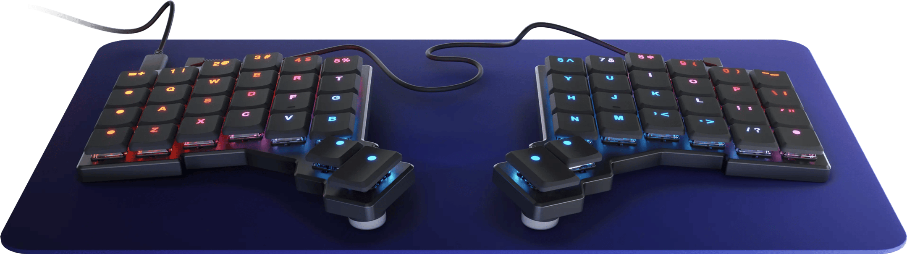
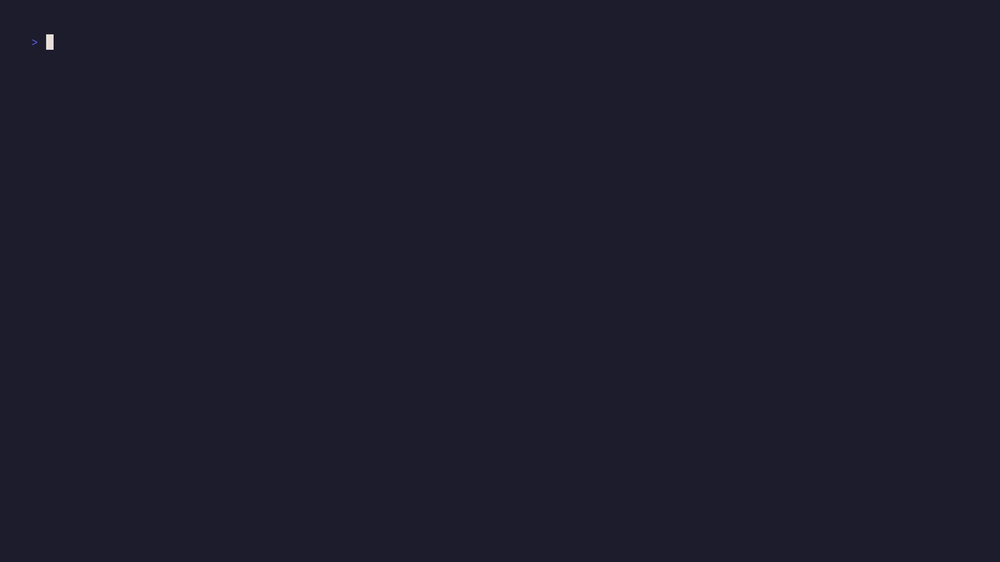

I did one of these last year, and thought why not do another quick year in review. Catch people up with what I've been
up to. This year was not nearly as transformative as my previous year in terms of changes I made to my workflow.

I am still using Nix and NixOS, I am still using Neovim. I moved onto from tmux to zellij mainly because I just like
the floating terminal it provides. But other than that, it's basically the same as the end of last year.

## Split Keyboard

This time last year, I had just bought a split keyboard. Now after using it for a year, I am typing even quicker than
I was with a normal keyboarding on my monkey type setting. I was getting about 65 WPM now I am at 75 WPM.

For me, it's been really great, in particular around accessing those difficult to reach symbols we need for programming or vim.
Think shift, alt, ^ etc. If you can afford to get one I would give it a try.
Also, as an aside, people think it looks "cool" and you'll get many questions at work.

## OptiNix

I finish my CLI tool [OptiNix](https://gitlab.com/hmajid2301/optinix). Which was one made to practice some more Golang
in my spare time, and build a tool I could actually use. Find Nix options from the CLI. There are a few issues
people have raised with it, which I need to go back and tidy up. But it was a good side project which probably
dragged on for too long.

It was nice to build a CLI, which I've never done before and the bubble tea library made it super easy to create
an easy to use (T)UI. So I could focus on writing the business logic and not worry how to present my app on the
terminal. As I say there are plenty of optimisations I can still make and should try later this year to tidy it up.

## Home Lab

I also got way more into home labbing, and self-hosting lots of my own services. The two most useful being

- GitLab Runner (Especially 400 minute limit now)
- Jellyfin Media Server (used by family and friends)
  - Identity management; managed by Authentik
  - Setup to use a local NAS
- k3s
  - Kubernetes cluster for learning
  - deployed banter bus my side project here

It's been a great way to learn more about infrastructure, and in particular about Kubernetes and flux CD (git ops).
I have deployed my own side project, Banter Bus, there as well. Alongside looking how the flux image automation works.
To automatically pick up changes for banter bus.

Most recently, I have been looking at learning more about monitoring with Prometheus, Grafana stack and also otel.
Exporting metrics, traces from my services but also pulling metrics from the pods themselves.

One big change I did make was trying to manage the entire thing with k3s and moving to managing apps on bare metal
with NixOS, where possible. Also keeping key stateful infrastructure like Redis and Postgres running on the bare metal
rather than Kubernetes. Which it wasn't really intended to (easily), I know there are ways you can do it.

But essentially, my main issue was how much config I needed to just deploy any app. Where in NixOS it was often maybe
100 lines of code. You can see my NixOS home lab config [here](https://gitlab.com/hmajid2301/nixicle/-/blob/main/systems/x86_64-linux/ms01/default.nix?ref_type=heads) and k3s config [here](https://gitlab.com/hmajid2301/k3s-config).

Currently, I am only running it all on a single server basically and a few key apps on a tiny s100 from miniforum.
Low powered PC. Which is always on and runs apps like:

- Gotify for notifications
- Uptime Kuma for tracking the uptime of my apps
- Home Assistant mainly to turn off and on my home lab, so I don't waste electricity

And finally, I have a small VPS on hetzner to make it easier for other people to access Jellyfin and I don't
have issues streaming video over say a Cloudflare tunnel.

In the new year, I want to consolidate my learning into a nice document, maybe a material mkdocs site.
Though, the boundary of what goes there vs my second brain vs my blog is always a bit confusing personally for myself.
In theory, I could make a blog post for everything I learn, currently it's a messy document in the nixicle repo
above. At least something down on paper.

## Banter Bus

Main big main side project of the year, I started YouTube series about the development of this web app. Which I
Unfortunately, didn't really keep up, but will kick-start in the new year. But essentially this is my 3rd crack at
making a multiplayer browser game. Similar to say Jack Box, or Skribl.io etc.

I have got a lot further with this version because one I have my learnings from the previous versions and also
The main part I would lose motivation is writing frontend code, especially JS/TS. This time I've tried to keep it to
a minimum. Basic stack for the frontend, using HTMX, Alpine where I need interactivity and tailwind CSS.
The HTML is returned from the server and generate using templ.

For a backend developer like myself this really simplifies everything and makes it much easier for me to focus on the
business logic and state managed almost entirely in the backend and I don't have to worry about how to do that in the
frontend, which I don't have much experience doing. Note this is my own opinion, not saying this is the only way to
create web apps. I just noticed I would often lose motivation in my own side projects when I had to work on the
frontend.

Which is the part you sometimes need to make neat and tidy to convince people to use your app. Anyway I've made some
good progress this year. I wanted to try to get something out by the end of the year, didn't manage. I kept getting
distracted by random things like improving CI, learning more about Kubernetes deployment, telemetry (otel) and other
little things. I am hoping to have a mostly working version by the end of January which I can release and share with
friends and family.

I think it would really be cool to have a multiplayer game that I made that I play with my friends. Overall, I have
a lot of fun making. The main thing I want to focus on is working on the unhappy path side of the code, as it's pretty
fragile at the moment.

- Link to repo [here](https://gitlab.com/hmajid2301/banterbus)
- Link to app [here](https://banterbus.games/)

## Conference Talks

This year I was lucky enough to do two conferences talks, basically the same talk about using Nix to create
development environments in [Go](https://www.youtube.com/watch?v=bdGfn_ihHOk&list=PLSCmmmcxRB6DilKhSz09JL9F4CVl7Vyd3&index=4).

I wrote some [tips here](/posts/2024-12-15-speaking-tips-i-ve-learnt/) that I've learnt speaking at conferences
and other people have told me.

But essentially, it's a great way to get a free ticket to conference. Which is a great way to network with people, you'd
never normally interact with. But more importantly, a great way I found to force me to learn a topic way deeper
than I normally would. You know what they say, the best way to learn something deeply is to teach it to others. If you
can explain it clearly, it shows you must know the topic pretty well.

## YouTube

I also started a YouTube channel this year, it started off well, but my last few videos didn't get very many views.
I want to keep up the YouTube channel but focusing on really improving the quality of my videos and finding my
own style of video. The main thing I would like to improve is the audio quality. I think there are many things I've
learnt making Banter Bus and would love to share (a few videos I have already done), to do give people ideas and show
how I set up things like:

- templ, templating
- i18n
- Kubernetes deployments
- flux image automation

But currently I am losing motivation towards the end of the year, didn't really keep up the dev vlogs for Banter Bus
like I wanted to. I need to pivot a bit in the channel.

I think, similarly to this blog, work out what do I want from it. How can I better advertise the channel, without being?
Obnoxious.

## Neovim back to Lua

As a smaller point, I was managing my nvim configuration in Nix using [NixVim](https://github.com/nix-community/nixvim), which is a great project if you want
just manage everything in Nix. I think towards the end of the year I decided for config that's very complicated i.e.
many files, I would prefer to manage it in the native language, i.e. Lua.

So I swapped my config over to use [nixcats](https://github.com/BirdeeHub/nixCats-nvim). Which allow us to do
this. Still manage dep using Nix but config via Lua, while still having the ability to pass variables from Nix to Lua.

I found learning the abstraction on top Lua, i.e. the nix, way annoying. I think it's fine for simple config. But
my Neovim config being multiple files and having Lua stringified, losing out on the LSP. I decided to have a crack
at keeping in Lua and would make it easier to follow tutorials. I could also do lazy loading, which I'm not sure you
can do it in NixVim.

## Aims for this year

- Release a working version of Banter Bus by end of January
- Try to release say 20ish YouTube videos next year
  - Find my own styles
  - With excellent audio quality
    - Fewer umms and arr
  - Useful and catchy titles
  - Advertise the channel to improve get more views
    - I would to average say 1k views per video
- Look at making some money from my side projects
  - I was thinking about Banter Bus, but I don't really know how
    - Besides maybe a donate button
    - Again, I want to provide a high value for the customer
  - If it was easy, everyone would do it right?

P.S. I also got around to finally playing baldurs gate and finally completing it. I didn't really enjoy the combat
the first time around. Even though I was such a big of Larian's previous game divinity original sin 2. But eventually
I gave it another go and had a lot more fun with it.
