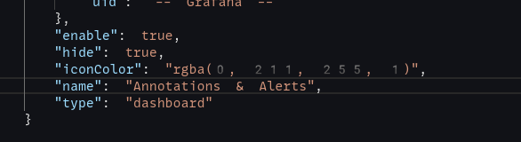
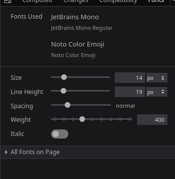

I was some issues with the ways some fonts were rendering in Nix/NixOS machines. It seemed to specifically effect
a few apps, mainly Firefox and only certain webpages. Sometimes numbers would render like below:



## Debugging Steps

This occurred off and on over the course of a few weeks. My font setup was primarily done using
[stylix](https://github.com/danth/stylix) and a bit of NixOS option config.

I noticed this only seemed to happen when the CSS on the page include a font-family like so "monospace" i.e.
the monospace font in quotes. But without quotes, the font would render fine.

I made a few posts to ask for help, as I was confused, why this was happening, and found a similar issue,
you can find here: https://old.reddit.com/r/NixOS/comments/1fha5hl/firefox_font_problem/.

Anyway, I didn't get any reply, so I decided to use fc-match to see what font my system was returning.

```bash
blog on  2025-01-20-how-to-fix-firefox-rendering-emoji-font-black-bold-numbers-issue [$?] via 🐹 v1.22.10 via ❄  impure (nix-shell-env) took 19s
❯ fc-match monospace
MonoLisa-Regular.ttf: "MonoLisa" "Regular"

blog on  2025-01-20-how-to-fix-firefox-rendering-emoji-font-black-bold-numbers-issue [$?] via 🐹 v1.22.10 via ❄  impure (nix-shell-env)
❯ fc-match '"monospace"'
NotoSans[wdth,wght].ttf: "Noto Sans" "Regular"
```

I thought I'd found the smoking gun, ohh it was trying to use the San font to render it. I asked someone to share their
working config from an Ubuntu machine and theirs also seemed to be similar to mine.

```bash
╰─ fc-match "monospace"
DejaVuSansMono.ttf: "DejaVu Sans Mono" "Book"

╰─ fc-match '"monospace"'
DejaVuSans.ttf: "DejaVu Sans" "Book"
```

Then whilst looking up stuff specific to how Firefox renders fonts, I realised in the DevTools there is a page for
fonts, it's just a bit hidden. I mean, it makes sense, of course there is.



So looking at this I realised it wasn't bold text it was rendering, but it was falling back and rendering the numbers
as emojis.

I then had a closer look at my font config in Nix and realised it wasn't doing what I thought it was doing.

```xml
<?xml version="1.0"?>
<!DOCTYPE fontconfig SYSTEM "fonts.dtd">
<fontconfig>
    <alias binding="weak">
        <family>monospace</family>
        <prefer>
            <family>emoji</family>
        </prefer>
    </alias>
    <alias binding="weak">
        <family>sans-serif</family>
        <prefer>
            <family>emoji</family>
        </prefer>
    </alias>
    <alias binding="weak">
        <family>serif</family>
        <prefer>
            <family>emoji</family>
        </prefer>
    </alias>
</fontconfig>
```

What I had done by copying and pasting some config I didn't fully understand (tut tut tut) is if the character was
available in the emoji font use that instead, i.e. the numbers or certain symbols like TM.
So after deleting that config and reloading Firefox, it was rendering properly as expected.

That's it! As expected, remember, to make sure you understand what your code is doing. I thought it was allowing emojis
to be rendered with the monospace font, not replacing it or preferring it.

Relevant commit resolving the above issue: https://gitlab.com/hmajid2301/nixicle/-/commit/3168db8df339d79e838c98f8675eb21a23452d4e
