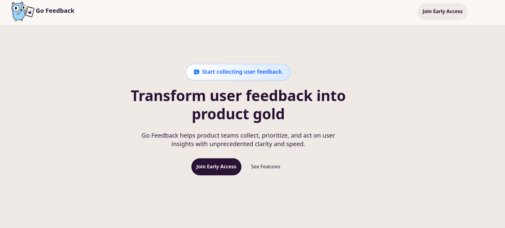

## Background

Last year, I worked on two main side projects:

- OptiNix: CLI tool to easily find nix options.
- Banter Bus: My third attempt at building a browser based multi-player game.

Whilst Banter Bus is not fully done, I got it to an almost working state and at some point will go back and fix a bunch
of the bugs and add some new features.

However, I finally decided I wanted to try my hand at building something that I could try to make some money from.
Whilst also learning more about business, product design etc. How can I launch an actual product vs building something?
Purely for fun.

So I decided to build [Go Feedback](https://gofeedback.app), a tool which makes it easier to collect user feedback.
For once, it's also not open source, i.e. anyone can view my code (for now). Which is not something I've really
done.

Either way, my thinking was, I wanted to build something and just learn. If nothing else, I can likely re-use the existing
code I write. Such as the auth, subscription logic or even the structure of the landing page.

Funnily enough, at the beginning of the year, I really wanted to dive into game dev. But gave myself one month to finish
Banter Bus (end of Jan). In that time, my passion of game dev died down, which is probably proved my heart wasn't in it.

Being a backend developer by working on this "micro-saas" there is a lot I can learn from building my own app vs
making a game which I cannot really incorporate in my day-to-day job.

## Week 1

The first week I build out the landing page, I am great at frontend dev. I decided to use HTMX, alpinejs and tailwindcss.
I ended up using [tailwindai](https://www.tailwindai.dev/) to help create the page. I also ended up choosing to use
a theme similar to the Daisy UI cupcake theme.

I put down all the big features/ideas I had that businesses might find useful and created mock-ups for them again
mostly using AI to help me. Due to inexperience in front-end development, and to be honest, currently my lack
of interest to learn it properly.

I added a fake door as a waitlist to gauge interest, which currently only me and my friends have used.

## Week 2

This week I spent mostly building out the auth part, i.e. login, signup and logout. I wanted to try to use the magic
link email flow. To make it as easy as possible for the user to sign up without needing a password. They just need
click a link in an email they are sent.

I was originally going to use [clerk](https://clerk.com/), but had issues (could just have been me) integrating cleanly with my backend
and ended up moving over to [wristband.dev](https://www.wristband.dev/). Whilst I have experience maintaining auth
services, I haven't really ever had to build it out myself for a web app. So it was a good learning experience for me.

I also learnt about other random things like CSRF and how to avoid that.

## Building in public

I want to try to build in public, to collect feedback and to keep myself honest. It would also be a nice diary
to track my own progress. I don't really want to use Twitter, which lots of the "indie hacker" builder community
seem to use. So I am going to try to use:

- peerlist
- bluesky

And maintain weekly blog posts, maybe even YouTube or TikTok videos to show off the progress. Some weeks there will likely
be nothing to really show off.

