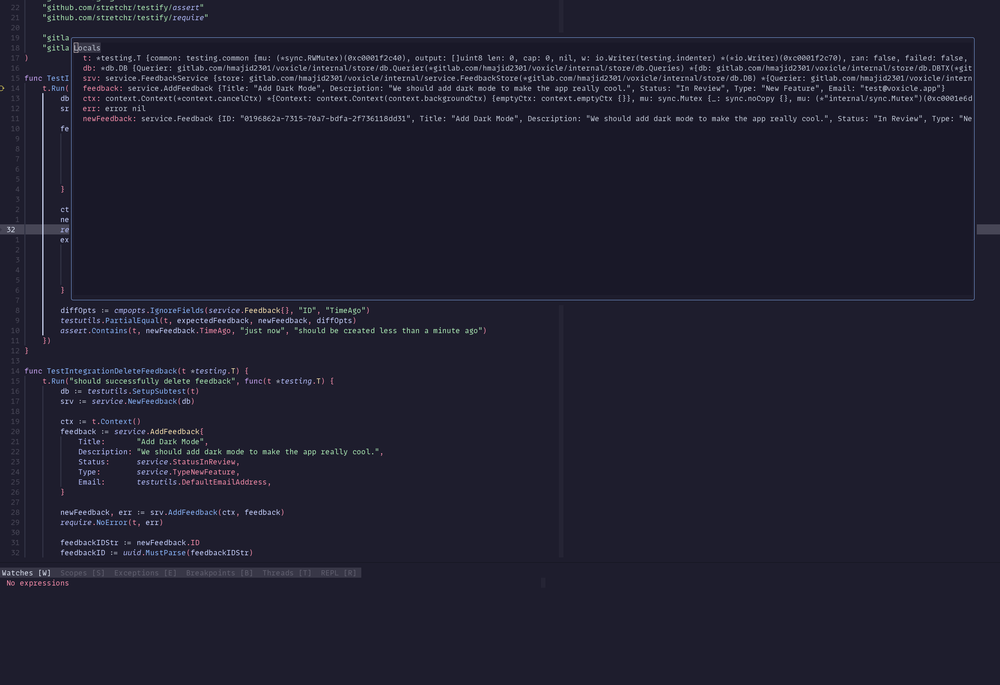

After another 5 months (again) I'm finally back blogging about my development setup, opps!

## What is Neovim?

Neovim is a text editor, that you can run in your terminal. Much like `vim` and `vi` or `nano`. So we would run
this inside our terminal emulator and Zellij. It differs from vim because you can configure it using lua vs vimscript
. Some of the other unique features it had, you can now do in vim (I believe). Such as tree sitter support and LSPs.

## Why Neovim?

So why Neovim, good question! Before Neovim, I was using VS Code, and I was mostly pretty happy. But in 2023,
I decided to give Neovim a go:

- As most things with me and using Linux, I like to be able to customise and personalise things for myself
- Requires fewer resources to run compared with my old editor
- Runs in the terminal so can use it with tmux
- Forced me to learn my tools a lot better

I was already using vim binding since 2013, someone at university told me to learn vim, and I never looked back.
This then fit so well and let me include tmux/Zellij in my workflow, and things became a lot clearer. In terms of
one project per session.

Some less known plugins

- oil.nvim
- headlines.nvim
- nvim-treesitter-textobjects
- grug-far.nvim
- dropbar.nvim

## How I configured it?

Until recently, I used NixVim which was all my Neovim config in Nix. Whilst this meant everything was in Nix
and that was nice. However, it created a single lua file, and meant I had to like lua code in strings, losing the LSP.

So I decided to move my config to NixCats, where we can install our dependencies using Nix so we get all the benefits
of Nix. Then our config is `lua`, I think when you have so many files and complex structure it makes sense to write
in the language the config should be in. Not via Nix as this sorta of proxy.

The config is pretty messy and needs a tidy up, many to-dos, but it works and was basically feature parity with
my old config. It also made me more familiar with setting up Neovim in lua itself.

### dependencies

Due to how NixCats works, we can split our dependencies into categories, then enable and disable as we need.

```nix
lspsAndRuntimeDeps = {
    general = with pkgs; [ universal-ctags ripgrep fd stdenv.cc.cc ];
    css = with pkgs; [
      stylelint
      prettierd
      rustywind
      tailwindcss-language-server
    ];
    docker = with pkgs; [
      dockerfile-language-server-nodejs
      docker-compose-language-service
      hadolint
    ];
    html = with pkgs; [
      htmlhint
      rubyPackages_3_4.htmlbeautifier
      htmx-lsp
      vscode-langservers-extracted
    ];
    go = with pkgs; [
      go
      golangci-lint
      delve
      gopls
      go-tools
      gotools
      gotestsum
    ];
}

# ...

optionalPlugins = {
    debug = with pkgs.vimPlugins; [
      nvim-dap
      pkgs.neovimPlugins.nvim-dap-view
      nvim-dap-go
    ];
    test = with pkgs.vimPlugins; [
      neotest
      neotest-golang
      nvim-coverage
      vim-dotenv
    ];
    lint = with pkgs.vimPlugins; [ nvim-lint ];
    format = with pkgs.vimPlugins; [ conform-nvim ];
}

```

### Setup

We can then set up different versions of our Neovim config, here we are bundling the config with the Neovim script.
So to introduce changes to config we need to rebuild our config. Which makes it more reproducible. But can be annoying
when we are testing out changes and don't want to do a full rebuild every time (`wrapRC`).


```nix
  # see :help nixCats.flake.outputs.packageDefinitions
  packageDefinitions.replace = {
    nixCats = { pkgs, ... }: {
      settings = {
        wrapRc = true;
        suffix-path = true;
        suffix-LD = true;
        aliases = [ "vimCat" ];
        configDirName = "nixCats-nvim";
      };
      categories = {
        general = true;
        go = true;

        ai = true;
        diagnostics = true;
        editor = true;
        debug = true;
        test = true;
        lint = true;
        format = true;
        git = true;
      };
    };
```

To deal with this issue, we can do something like this, where we pass the unwrappedCfgPath where our lua config is.
We can reload it by closing Neovim and opening it up again, vs doing a full rebuild of say home-manager.

```nix
regularCats = { pkgs, ... }: {
  settings = {
    wrapRc = false;
    suffix-path = true;
    suffix-LD = true;
    unwrappedCfgPath =
      "${config.home.homeDirectory}/nixicle/modules/home/cli/editors/neovim";
    configDirName = "nixCats-nvim";
    aliases = [ "nvim" ];
    neovim-unwrapped =
      inputs.neovim-nightly-overlay.packages.${pkgs.system}.neovim;
  };
};
```

So you can some of this is installing tooling, some of it installing plugins. Which we can then lazy load later.
These dependencies are all installed with Nix. So we get all of those benefits, such as reproducibility. We can
easily share our Neovim config that anyone could use on their machine. In my case, if you have flakes
you can try my Neovim config like so:

`nix run .#homeConfigurations."haseeb@workstation".config.nixCats.out.packages.nixCats`

### Custom Plugins

Sometimes we have plugins that aren't in nixpkgs yet, and it can be a while before your PR gets accepted.
Or you could create your own package that you keep updated. NixCats provides an easy way to manage this.

We can add this to our `flake.nix` in the input section:

```nix
plugins-gx-nvim = {
  url = "github:chrishrb/gx.nvim";
  flake = false;
};
```

NixCat will automatically make any input starting with `plugins-` available to us. Where we can then install like any
other plugin doing it like so.

```nix
pkgs.neovimPlugins.gx-nvim
```

Then this input will update normally when we do `nix flake update`, so we don't have to worry about keeping it up to
date ourselves.

Now onto more generic Neovim, how I have configured it. How you could set it up no matter the package manager.

### lint & formatting

I use nvim-lint for linting, we just need to specify which linter we want to use for which file types. These tools
have all been installed using Nix in our case, so they should be available inside Neovim.

```lua
require("lint").linters_by_ft = {
    docker = { "hadolint" },
    go = { "golangcilint" },
    html = { "htmlhint" },
    lua = { "luacheck" },
    nix = { "statix" },
    javascript = { "eslint" },
    typescript = { "eslint" },
    sql = { "sqlfluff" },
}

vim.api.nvim_create_autocmd({ "BufWritePost" }, {
    callback = function()
        require("lint").try_lint()
    end,
})
```

Then for formatting I use conform-nvim, where again we specify the formatters per file type. The full list can be found
on to conform README. You can even set up your own formatter that is not currently supported. We can also add our own
arguments to those formatters, i.e. `goimports` passing in my own local packages.

```lua
local conform = require("conform")

conform.setup({
    format_on_save = {
        lsp_format = "fallback",
        timeout_ms = 500,
    },
    formatters = {
        goimports = {
            command = "goimports",
            args = { "-local", "gitlab.com/hmajid2301" },
        },
        yamlfmt = {
            args = { "-formatter", "retain_line_breaks_single=true" },
        },
    },
    formatters_by_ft = {
        css = { "prettierd" },
        go = { "gofmt", "goimports" },
        lua = { "stylua" },
        templ = { "rustywind", "templ" },
        html = { "htmlbeautifier", "rustywind" },
        nix = { "nixfmt" },
        python = { "isort", "black" },
        javascript = { "prettierd" },
        typescript = { "prettierd" },
        sql = { "sqlfluff" },
        yaml = { "yamlfmt" },
    },
})
```

### LSP

One of the most important features of my editor is to use the language server protocol (LSP) to be able to get
code completions, auto import and also show docs for functions/methods.

Here are some example images


Like most people, I use the nvim lspconfig plugin, which comes with a bunch of sane defaults for almost every LSP,
you might want to use.

Having a look at example of go where set some of my own options. Like setting build tags so that it runs correctly
where tests have build tags.

```lua
{
    "gopls",
    for_cat = "go",
    lsp = {
        settings = {
            gopls = {
                buildFlags = { "-tags=unit,integration,e2e,bdd,dind" },
                staticcheck = true,
                directoryFilters = { "-.git", "-.vscode", "-.idea", "-.vscode-test", "-node_modules" },
                semanticTokens = true,
                codelenses = {
                    gc_details = false,
                    generate = true,
                    regenerate_cgo = true,
                    run_govulncheck = true,
                    test = true,
                    tidy = true,
                    upgrade_dependency = true,
                    vendor = true,
                },
                hints = {
                    assignVariableTypes = false,
                    compositeLiteralFields = false,
                    compositeLiteralTypes = false,
                    constantValues = true,
                    functionTypeParameters = true,
                    parameterNames = true,
                    rangeVariableTypes = false,
                },
                analyses = {
                    assign = true,
                    bools = true,
                    defers = true,
                    deprecated = true,
                    tests = true,
                    nilness = true,
                    httpresponse = true,
                    unmarshal = true,
                    unusedparams = true,
                    unusedwrite = true,
                    useany = true,
                },
            },
        },
    },
},
```

I also have some key maps for navigating, such as `<leader>gd` for going to where something is defined, i.e. a function
in the stdlib which will go and find the code.

```lua
nmap("<leader>cr", vim.lsp.buf.rename, "[R]e[n]ame")
nmap("<leader>gd", vim.lsp.buf.definition, "[G]oto [D]efinition")

nmap("<leader>gr", function()
    require("telescope.builtin").lsp_references()
end, "[G]oto [R]eferences")

nmap("<leader>gi", function()
    require("telescope.builtin").lsp_implementations()
end, "[G]oto [I]mplementation")

nmap("<leader>ds", function()
    require("telescope.builtin").lsp_document_symbols()
end, "[D]ocument [S]ymbols")

nmap("<leader>ws", function()
    require("telescope.builtin").lsp_dynamic_workspace_symbols()
end, "[W]orkspace [S]ymbols")
```

### debugging

Another important feature is being able to debug, again like LSP, there are a debugging protocol we can use DAP.

I am using
  - nvim-dap
  - nvim-dap-go
  - nvim-dap-view

Where some of the config looks like this, to show automatically show dap-view when the debugger starts.

```lua
local dap, dv = require("dap"), require("dap-view")

dap.listeners.before.attach["dap-view-config"] = function()
    dv.open()
end
dap.listeners.before.launch["dap-view-config"] = function()
    dv.open()
end
dap.listeners.before.event_terminated["dap-view-config"] = function()
    dv.close()
end
dap.listeners.before.event_exited["dap-view-config"] = function()
    dv.close()
end

vim.fn.sign_define("DapBreakpoint", { text = " ", texthl = "DapBreakpoint", linehl = "", numhl = "" })
vim.fn.sign_define(
    "DapBreakpointCondition",
    { text = " ", texthl = "DapBreakpointCondition", linehl = "", numhl = "" }
)
vim.fn.sign_define(
    "DapBreakpointRejected",
    { text = " ", texthl = "DiagnosticError", linehl = "", numhl = "" }
)
vim.fn.sign_define("DapLogPoint", { text = " ", texthl = "DapBreakpoint", linehl = "", numhl = "" })
vim.fn.sign_define(
    "DapStopped",
    { text = "󰁕 ", texthl = "DapStopped", linehl = "DapStopped", numhl = "DapStopped" }
)
```


Some of you may be wondering why I am not using the dap-ui plugin that most people use. I couldn't find a layout
that worked for me, so hence I decided to go with a simpler dap-view plugin. Then some key maps to hover the
current values of variables.



I use the built-in widgets to do it, I don't think this toggle is quite working, so I might just remove all this code.
We can close that panel with the variables by doing `ZZ` (and other ways to close a buffer).

```lua
local dap_widgets = require("dap.ui.widgets")

local debug_widgets = {
    scopes = nil,
    hover = nil,
}

local function create_scopes_widget()
    return dap_widgets.centered_float(dap_widgets.scopes, {
        border = "rounded",
        width = 200,
        height = 25,
    })
end

local function create_hover_widget()
    return dap_widgets.hover(nil, { border = "rounded" })
end

local function safe_toggle(widget_type, creator_fn)
    return function()
        local current = debug_widgets[widget_type]

        -- Close if exists
        if current then
            pcall(function()
                -- Close window and clear buffer directly
                if current.winid and vim.api.nvim_win_is_valid(current.winid) then
                    vim.api.nvim_win_close(current.winid, true)
                end
                if current.bufnr and vim.api.nvim_buf_is_valid(current.bufnr) then
                    vim.api.nvim_buf_delete(current.bufnr, { force = true })
                end
            end)
            debug_widgets[widget_type] = nil
            return
        end

        -- Create and open new widget
        local new_widget = creator_fn()
        new_widget.open()
        debug_widgets[widget_type] = new_widget

        -- Track window closure
        vim.api.nvim_create_autocmd("WinClosed", {
            pattern = tostring(new_widget.winid),
            once = true,
            callback = function()
                debug_widgets[widget_type] = nil
            end,
        })
    end
end

-- Keymaps
vim.keymap.set(
    "n",
    "<leader>dv",
    safe_toggle("scopes", create_scopes_widget),
    { desc = "Debug: Toggle Scopes" }
)
vim.keymap.set(
    "n",
    "<leader>dV",
    safe_toggle("hover", create_hover_widget),
    { desc = "Debug: Toggle Variables" }
)
```

Then finally some key maps:

```lua
vim.keymap.set("n", "<leader>dc", dap.continue, { desc = "Debug: Start/Continue" })

vim.keymap.set("n", "<F5>", dap.continue, { desc = "Debug: Start/Continue" })
vim.keymap.set("n", "<F6>", dap.step_into, { desc = "Debug: Step Into" })
vim.keymap.set("n", "<F7>", dap.step_over, { desc = "Debug: Step Over" })
vim.keymap.set("n", "<F8>", dap.step_out, { desc = "Debug: Step Out" })

vim.keymap.set("n", "<leader>db", dap.toggle_breakpoint, { desc = "Debug: Toggle Breakpoint" })
vim.keymap.set("n", "<leader>dr", function()
    dap.disconnect()
    dap.close()
    dap.run_last()
end, { desc = "Debug: Restart" })
vim.keymap.set("n", "<leader>dp", dap.pause, { desc = "Debug: Pause" })
vim.keymap.set("n", "<leader>dl", dap.run_last, { desc = "Debug: Run the last config" })
vim.keymap.set("n", "<leader>ds", dap.session, { desc = "Debug: Focused Session" })
vim.keymap.set("n", "<leader>dt", dap.terminate, { desc = "Debug: Stop" })
vim.keymap.set("n", "<leader>dC", dap.run_to_cursor, { desc = "Debug: Run to cursor" })
vim.keymap.set("n", "<leader>dB", function()
    dap.set_breakpoint(vim.fn.input("Breakpoint condition: "))
end, { desc = "Debug: Set Breakpoint (with condition)" })
```

So we can start the debugger in `<leader>dc`, though usually, I mostly debug my tests which I will show you how to do
that later.

Finally, the config for the rest of my DAP setup:

```lua
{
    "nvim-dap-view",
    for_cat = "debug",
    on_plugin = { "nvim-dap" },
    after = function(plugin)
        require("dap-view").setup({
            windows = {
                terminal = {
                    hide = { "go" },
                },
            },
        })
    end,
},
{
    "nvim-dap-go",
    for_cat = "debug",
    on_plugin = { "nvim-dap" },
    after = function(plugin)
        require("dap-go").setup({
            dap_configurations = { { mode = "remote", name = "Attach remote", request = "attach", type = "go" } },
            delve = { build_flags = "-tags=unit,integration,e2e,bdd,dind", path = "dlv", port = "40000" },
        })
    end,
},
```

### testing

For testing, I use `neotest` with the `neotest-golang`:

```lua
require("neotest").setup({
    adapters = {
        require("neotest-golang")({
            go_test_args = { "-v", "-x", "-count=1", "-tags=integration" },
            go_list_args = { "-tags=unit,integration,e2e,bdd,dind" },
            dap_go_opts = {
                delve = {
                    build_flags = { "-tags=unit,integration,e2e,bdd,dind" },
                },
            },
        }),
    },
    output = { open_on_run = true },
})
```

Then I have the following key maps:

```lua
vim.keymap.set("n", "<leader>tt", function()
    neotest.run.run(vim.fn.expand("%"))
end, { desc = "Test: Run all in current file" })
vim.keymap.set("n", "<leader>tT", function()
    neotest.run.run(vim.loop.cwd())
end, { desc = "Test: Run all in all files" })
vim.keymap.set("n", "<leader>tS", neotest.run.stop, { desc = "Test: Stop" })
vim.keymap.set("n", "<leader>ts", neotest.summary.toggle, { desc = "Test: Toggle Summary" })
vim.keymap.set("n", "<leader>tr", neotest.run.run, { desc = "Test: Run Nearest" })
vim.keymap.set("n", "<leader>to", function()
    neotest.output.open({ enter = true, auto_close = true })
end, { desc = "Test: Show Output" })
vim.keymap.set("n", "<leader>td", function()
    neotest.run.run({ suite = false, strategy = "dap" })
end, { desc = "Test: Debug nearest" })
vim.keymap.set("n", "<leader>tO", function()
    neotest.output_panel.toggle()
end, { desc = "Test: Toggle output" })
```

The most important being the one that starts a debugger `<leader>td` on the nearest test. Including table tests in Go!

We can view all of our tests here using the test summary and run them like that.


## Summary

It's taken a long time, but I think in terms of my developer workflow, that's about it. In terms of the tooling, I use.
I may do another one how I work on a project and my day-to-day coding. Maybe as a YouTube video!

