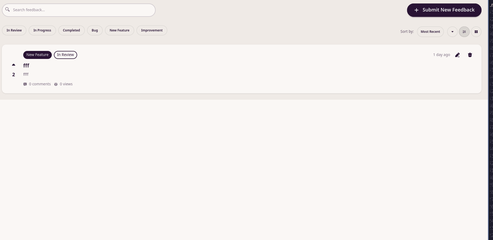
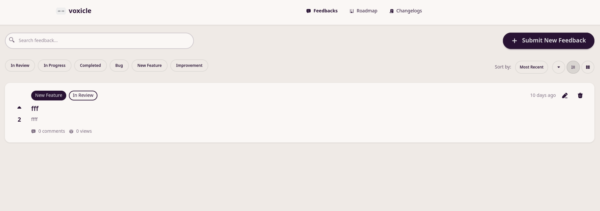
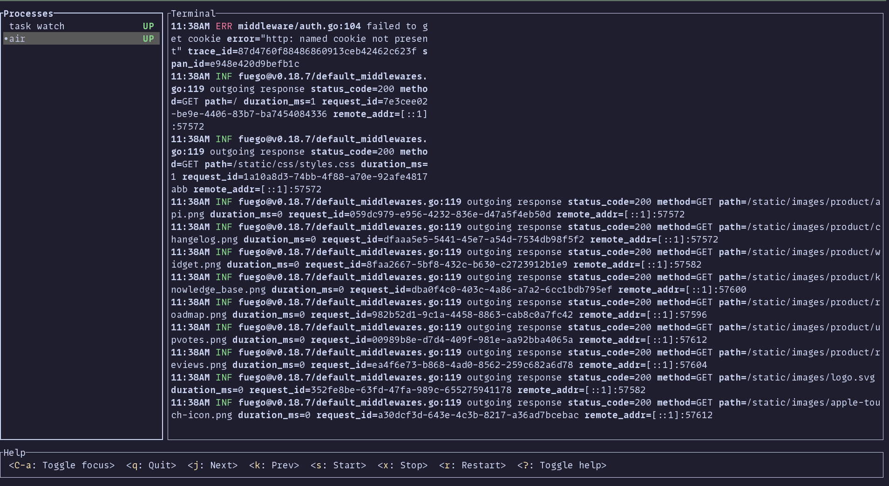
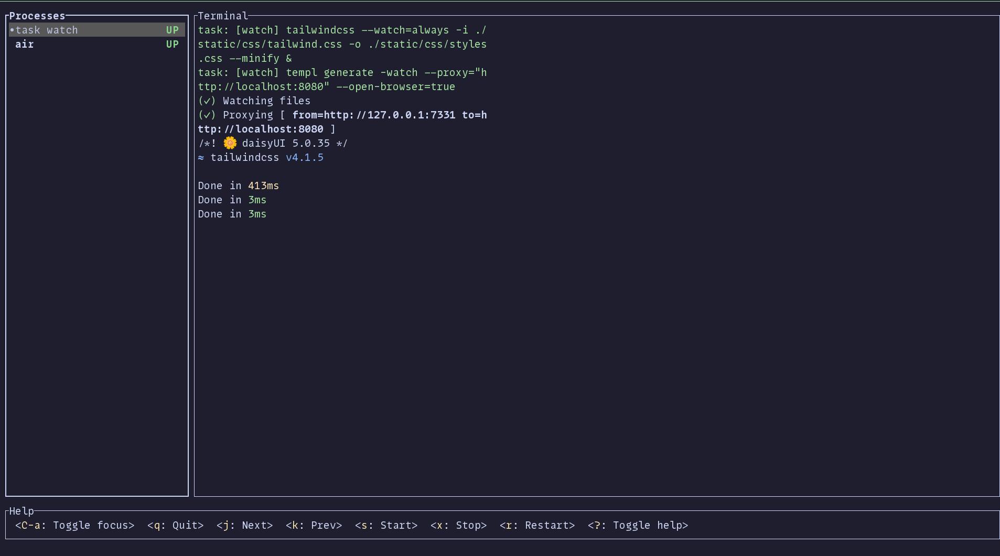
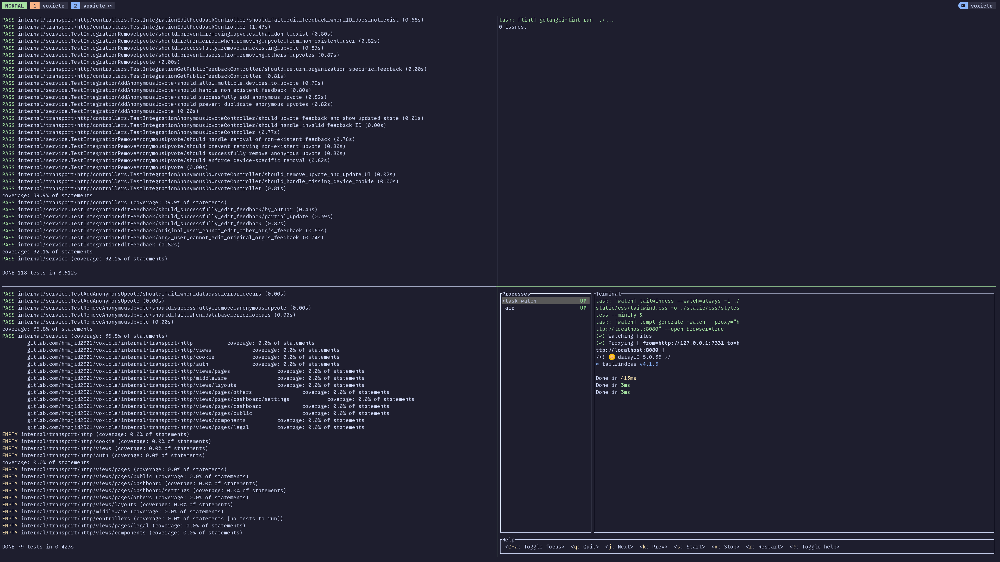

## ⏮️ Previous Build Log Objectives

- Public page for feedback
  - private and public feedbacks
  - allow anonymous voting

## 🛠️ What I Worked On

### Public Feedback Dashboard

We started of with this:

And finish with this

Users can now do the almost everything they can when logged in but when anonymous. We attach a `deviceID` cookie to them
to be able to spot if its the same user. This only works for the same device and until they clear their cookies but
should be good enough for most of the users I think for now.

### DevEx improvements

Add `mprocs` to be able to nicely manage running multiple commands in parallel and need leaving floating processes running.
Such as being ableto watch file changes with templ and tailwindcss and also start the hot reloaded web service with air.

Try to run dependencies using `docker-compose` vs services in Gitlab CI. So we don't have to make changes in multiple
places.

Also started a new tab in zellij to be able to run some common commands easily, I just need to go into the pane
and hit enter i.e. `zellij run -- task lint`.

### OpenTofu

There are lots of stuff I setup manually and I would like to move into code, declaratively using terraform/open tofu.
In this case:

- cloudflare DNS

### Observability

I have been working on my slides for my Gophercon talk about otel and observability, so I have been fixing gaps
and the broken setup in Voxicle. So now we have logs, metrics and traces viewable in a locally running instance of Grafana.
It will be easy enough to set this up in production to point to which ever tool I decide to use.

## ✅ Wins

- Subdomains take you to voxicle i.e. `orga.voxicle.app`
- Public page shows public feedbacks
- Made some DevEx improvements, taskfiles, gitlab CI
- Made my infra setup more declarative with OpenTofu

## ⚠️ Challenges

- Getting podman to work with the `dind` service in Gitlab CI
  - Going down a rabbit hole of trying to run podman vs using the Docker daemon inside

## 💡 What I Learned

- How to setup open tofu new project

## ⏭️ Next Build Log Objectives

- Mark feedback public/private
- Start on settings page

