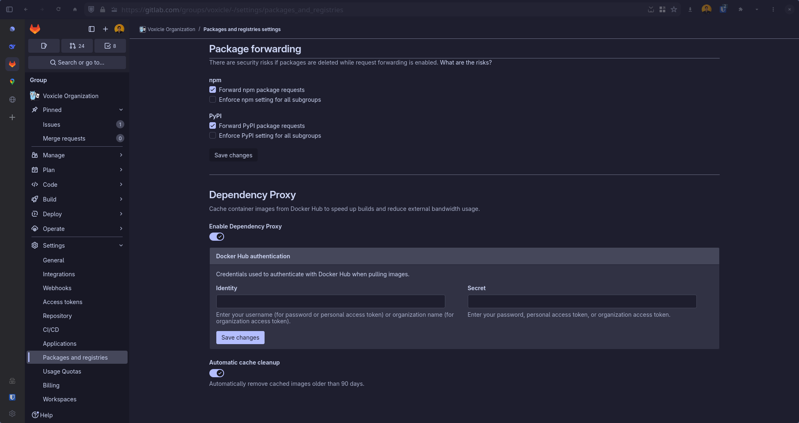


For the moment, the GitLab proxy will not work if the project is in your personal namespace
i.e. `gitlab.com/hmajid2301`. So to make it work with my project Voxicle I had to move to its own group.

GitLab Issue: https://gitlab.com/gitlab-org/gitlab/-/issues/323773


## Background

The GitLab dependency proxy, allows us to cache Docker images that we pull from Docker Hub. This allows us to
reduce bandwidth and speed up builds, i.e. quicker to pull Postgres for our tests in CI.

It can also avoid us potentially hitting rate limits with Docker Hub as well. Especially in groups that have a lot of
projects that are constantly running in CI.

## Setup

First go to your group and enable the Dependency Proxy and potentially the automatic cache clean up if you like.



Then we can now do `${CI_DEPENDENCY_PROXY_GROUP_IMAGE_PREFIX}/postgres:17.4` to pull images. You can set
that up in GitLab, CI.

In my case, some of my jobs use the `nixos/nix` so in GitLab CI I use:

```yaml
image: ${CI_DEPENDENCY_PROXY_GROUP_IMAGE_PREFIX}/nixos/nix
```

I also use docker-compose in CI:

```yaml
tests:integration:
  extends:
    - .test
  script:
    - docker compose --profile test up -d
    - task tests:integration -- ${GOTEST_EXTRA_ARGS}
```

We need to authenticate with the proxy, and you can do in CI like so:

```yaml
.test:
  services:
    - name: docker:dind
  before_script:
    - docker login -u "$CI_DEPENDENCY_PROXY_USER" -p "$CI_DEPENDENCY_PROXY_PASSWORD" "$CI_DEPENDENCY_PROXY_SERVER"
```

Then we can update our `docker-compose.yml` file like so:

```yaml
services:
  postgres:
    image: ${CI_DEPENDENCY_PROXY_GROUP_IMAGE_PREFIX:-docker.io}/postgres:17.4
    profiles:
      - test
    ports:
      - 5432:5432
    environment:
      POSTGRES_USER: postgres
      POSTGRES_PASSWORD: postgres
    volumes:
      - postgres-data:/var/lib/postgresql/data
      - ./docker/postgres-init.sql:/docker-entrypoint-initdb.d/init.sql
```


You will notice `:-docker.io` this means that if the environment variable is not set for the dependency proxy.
It defaults to `docker.io` so this docker compose file will work locally and in CI.

But for non Docker Hub images you cannot use the dependency proxy, so we leave it like so:

```yaml
  smocker:
    image: ghcr.io/smocker-dev/smocker:1.0.0
    profiles:
      - other
    ports:
      - 44300:8080
      - 44301:8081
```

That's it! You can now use the GitLab dependency proxy, which should help speed up CI a bit.

## Variables

- CI_DEPENDENCY_PROXY_GROUP_IMAGE_PREFIX pulls through the top-level group.
- CI_DEPENDENCY_PROXY_DIRECT_GROUP_IMAGE_PREFIX pulls through the subgroup, or direct group the project exists in.

## Links

- https://docs.gitlab.com/user/packages/dependency_proxy/
