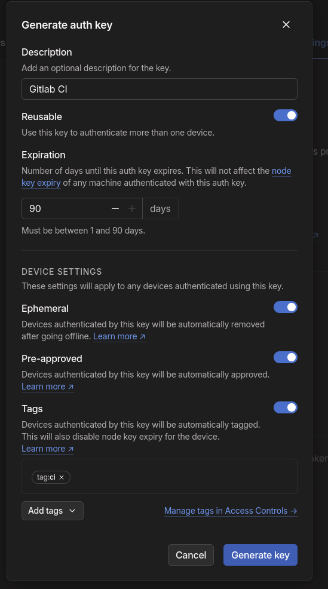
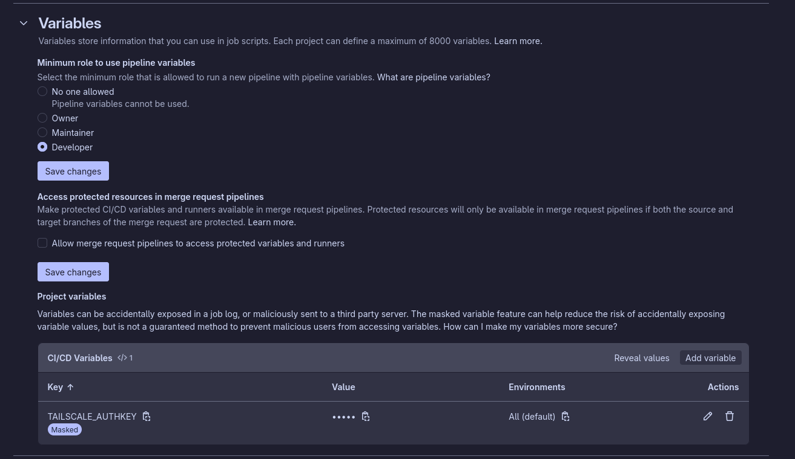
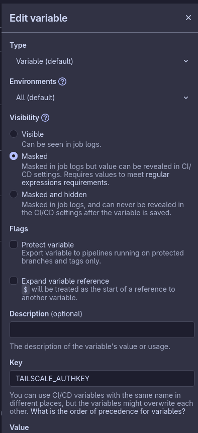
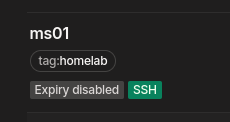

## Background

So I have a small home lab, where I have a few random things running, like a GitLab CI runner, a media server etc.
All my home lab servers (3 of them) are running NixOS and are defined within my Nix flake what services they run.

For example: https://gitlab.com/hmajid2301/nixicle/-/blob/main/systems/x86_64-linux/ms01/default.nix?ref_type=heads

They are set up using [nixos-anywhere like most of my other services](/posts/2024-05-02-part-5b-installing-our-nix-configuration-as-part-of-your-workflow). Then using deploy-rs we can ssh onto our home lab servers and deploy nix config, i.e. updating packages.

I wanted a more automated way to do, i.e. anytime nixicle repo changes, try to deploy those changes to my home lab on CI.

## Tailscale

I connect to my home lab using Tailscale a very cool tool, think like a VPN, it uses WireGuard behind the scenes.
With some extra stuff on top to provide a really nice user experience. Highly recommend if you are looking to get into homelabbing.

So first, our CI runner would need to be able to connect to Tailscale to be able to deploy our new config onto the home lab
servers.

I will assume you have already set up your Tailscale account for the next part. I may create a tutorial later on how
you can do it. Better to be honest, there is a ton of decent literature available already, including videos.

First, let's create an auth key. Go to: https://login.tailscale.com/admin/settings/keys



We want to enable Ephemeral, so the device gets removed from our list, else every time CI runs we will get a new
device in our list of machines. Then, in my case, I need to also check the pre-approve, so the admin doesn't need to
manually approve it, slightly defeating the purpose of CI.

You can also optionally create a tag for your machines using this auth key. In my case, I wanted to tag it with CI.
Which we can then use for ACL rules etc.

## Gitlab CI

After creating the key copy the value, you won't be able to see it again, so keep that in mind. Add it to your CI
variables, you can check the masked option, so the auth key isn't accidentally printed in CI.

(You can access this using the left side bar; setting > CI/CD > Variables)





Then our CI file may look something like this `.gitlab-ci.yml`

```yaml
image: nixos/nix

stages:
  - deploy

tailscale:
  stage: deploy
  rules:
    - if: $CI_PIPELINE_SOURCE == "merge_request_event"
  script:
    - mkdir -p /etc/nix/ /etc/ssh/
    - echo "experimental-features = nix-command flakes" >> /etc/nix/nix.conf
    - nix-env -iA nixpkgs.docker nixpkgs.go-task nixpkgs.flyctl nixpkgs.tailscale nixpkgs.jq
    - ssh-keygen -t ed25519 -N "" -f ~/.ssh/id_ed25519
    - ssh-keygen -t ed25519 -N "" -f /etc/ssh/ssh_host_ed25519_key
    - mkdir -p ~/.ssh
    - chmod 700 ~/.ssh
    - echo "Host *" >> ~/.ssh/config
    - echo "  StrictHostKeyChecking no" >> ~/.ssh/config
    - echo "  UserKnownHostsFile /dev/null" >> ~/.ssh/config
    - export SSH_ASKPASS_REQUIRE=never
    - eval $(ssh-agent -s)
    - ssh-add ~/.ssh/id_ed25519 2>/dev/null

    - tailscaled --state="mem:" --statedir=/var/lib/tailscale &
    - tailscale up --authkey=${TAILSCALE_AUTHKEY} --hostname="gitlab-$(cat /etc/hostname)" --accept-routes --ssh
    - nix profile install github:serokell/deploy-rs
    - deploy ".#ms01" --hostname ms01 --ssh-user nixos --skip-checks --confirm-timeout "600" --remote-build

```

Let's break this file down

First, we want to create some SSH keys so that you can SSH on the CI runner onto the home lab server.

The next part we start up the Tailscale daemon in the background, and then we authenticate with Tailscale so our
runner can now connect to our home lab servers

Then, finally, we install deploy-rs and use it to SSH to our machines and deploy to it.

## Tailscale SSH



I also had to enable Tailscale ssh on the host devices so we could SSH from the runner without needing to include
an SSH private key and adding that to the allowed SSH list on each server. Which we can do like so:

`tailscale set --ssh`

This lets Tailscale take over SSH for us, users can still SSH like normal, but you can also SSH like normal as well.
But just make sure you are aware of the security implications before you turn it on.

Then I set up on ACLs like so:


```json
	"tagOwners": {
		"tag:ci":           [],
		"tag:homelab":      [],
	},

	// Define access control lists for users, groups, autogroups, tags,
	// Tailscale IP addresses, and subnet ranges.
	"acls": [
		// Allow all connections.
		// Comment this section out if you want to define specific restrictions.
		{"action": "accept", "src": ["tag:ci"], "dst": ["tag:homelab:*"]},
		{
			"action": "accept",
			"src":    ["tag:homelab"],
			"dst":    ["tag:homelab:*"],
		},
	],

	// Define users and devices that can use Tailscale SSH.
	"ssh": [
		// Allow all users to SSH into their own devices in check mode.
		// Comment this section out if you want to define specific restrictions.
		{
			"action": "accept",
			"src":    ["autogroup:member", "tag:ci"],
			"dst":    ["tag:homelab"],
			"users":  ["autogroup:nonroot", "root"],
		},
		{
			"action": "accept",
			"src":    ["tag:ci"],
			"dst":    ["tag:homelab"],
			"users":  ["nixos", "root"],
		},
	],
```

I am no expert on ACL rules in Tailscale, but I think this allows the CI runner to SSH onto the home lab servers.
Which I, of course, have already tagged with home lab.
