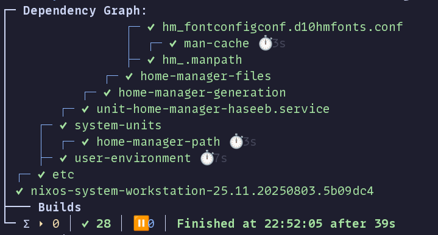
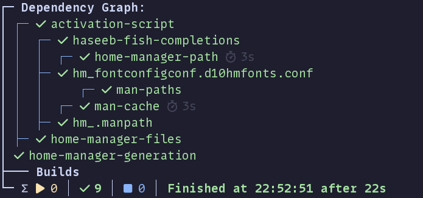

**TIL - How to Change Emojis in nh**

Recently I have been trying to update the emojis when I run [nh](https://github.com/nix-community/nh). Particularly
the nom output.

The old output was like so:




To fix this update your nh derivation like so:

```nix
environment.systemPackages = with pkgs; [
  (pkgs.nh.override {
    nix-output-monitor = pkgs.nix-output-monitor.overrideAttrs (old: {
      postPatch = old.postPatch or "" + ''
        substituteInPlace lib/NOM/Print.hs \
          --replace 'down = "↓"' 'down = "\xf072e"' \
          --replace 'up = "↑"' 'up = "\xf0737"' \
          --replace 'clock = "⏱"' 'clock = "\xf520"' \
          --replace 'running = "⏵"' 'running = "\xf04b"' \
          --replace 'done = "✔"' 'done = "\xf00c"' \
          --replace 'todo = "⏸"' 'todo = "\xf04d"' \
          --replace 'warning = "⚠"' 'warning = "\xf071"' \
          --replace 'average = "∅"' 'average = "\xf1da"' \
          --replace 'bigsum = "∑"' 'bigsum = "\xf04a0"'
      '';
    });
  })
];
```

Note you will no longer be able to use the default nix cache to build this. So everytime nh updates you will need to
manually build it.



That's it!
