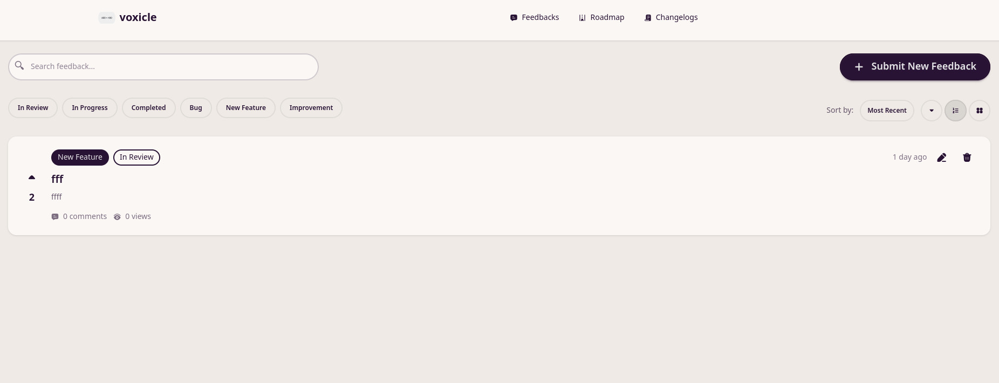

Another year has passed, and it's time to reflect on what I accomplished, what I learned, and where I'm
heading next. 2025 was a year of shipping projects, learning new technologies, and making some significant
life changes.

## Looking Back: 2025 Goals Review

My core aims were:

- Release a working version of Banter Bus by end of January
- Try to release say 20ish YouTube videos next year
- Look at making some money from my side projects

I successfully completed the first goal, though the other two took a back seat due to changing priorities.
With regards to YouTube, I didn't really find the motivation to make videos. I will likely have another
crack at it this year, aiming at creating content with simpler editing which takes less effort.

## Fun Metrics

  - 📝 **35 blog posts** published
  - 💻 **1,208 commits** across all projects
  - 📚 **7 books** read (fantasy mostly!)
  - 🎤 **2 conference talks** given

## Projects

### Banter Bus

Link: https://banterbus.games
Repo: https://gitlab.com/hmajid2301/banterbus

I did manage to release the first version of Banter Bus at the end of January. It was unfortunately in a
broken state. Multiplayer games are hard to test I found out, but it was a good learning experience
nonetheless.

I came back to it in around September/October to help clear the backlog of tasks I had. Like graceful
shutdown. Resuming games on startup and improving the UI. Whilst of course fixing game breaking bugs and a
few dodgy SQL queries. I really enjoyed building this again, with HTMX and Go. It ended up being the basis
for a conference talk I did at GoLabs later in the year as well.

It also became a nice little project to practice some terraform and kubernetes. I deployed it in my
homelab, on a k3s (k8s) cluster leveraging fluxcd for a more automated gitops approach.

### SaaS (Voxicle)

Video: https://www.youtube.com/watch?v=oM9UUdwlaWA

I tried to build a feedback collection called voxicle (micro-saas) in public, trying to give daily updates
on bluesky. But eventually I found myself losing focus and interest. So I ended up not enjoying it, I may
go back to it sometime.

The idea was to have a small business on the side to make a bit of income, using my side projects to
generate some cash. But of course it's easier said than done. However the code is all there and the skeleton
to start another SaaS is there. So if I decide to start another one or carry on this one it should be easy
enough.

### Home Lab

I carried on working on my homelab. By the end of the year I've simplified it to a NAS, running TrueNAS and
a single machine (Framework Desktop). Which acts as both my desktop and a homelab self hosting a number of
services. The most useful being, authentik for auth, jellyfin as a media server and gitlab runners for
CI/CD on GitLab.

I worked on creating a mostly declarative k3s cluster, where I could set it up with barely any manual
commands. Such as having a postgres user created for terraform, which we could then use to create databases
for services running the k3s cluster.

Overall I have a long list of services I want to look at self hosting and trying to see if I can use them vs
other offerings. Such as replacing good reads with book lore.

I also added a JetKVM, so I can control my PC remotely if I need to in an emergency. I have it set to auto
boot when it gets power. So it should always switch on in theory.

**Current Setup:**

- Framework Desktop
- TrueNAS
- Jet KVM

## Career & Professional Growth

### Career Change

I decided to change jobs after my current employer decided to do some major restructuring and decided it
wasn't really for me anymore. The time spent to get ready to interview and then interview, just seemed to
take me out of routine. This career change was one of the major life events of 2025, and ultimately impacted
my ability to focus on side projects like Voxicle.

### Conference Talks

I did two conference talks last year

#### Observability Made Painless: Go, OTel & LGTM Stack

YouTube: https://www.youtube.com/watch?v=t3Xz-IrxNwk

Learning more about o11y and OTel has proven to be useful. At my job as well I have been able to see a few
gaps and helped to improve the o11y. Especially around tracing and missing spans etc. I'm glad I researched
this topic in more detail. Even ignoring the OTel part there is a lot of useful knowledge that is very
transferable.

#### What I learnt building a web app with Go and HTMX

The video hasn't been released yet on YouTube

But this talk like my other one was basically some learnings I had when building Banter Bus with HTMX and
how others could get started building their own full stack app with HTMX and Go. Plus some other tools I
used that I really liked such as sqlc.

## Technical Exploration

### Impermanence, TPM LUKs decryption and Secure Boot

Since I didn't have any personal projects later in the year. I decided to spend my time playing around my
Nix config (because I'm that cool). On my framework desktop, I finally managed to get impermanence setup.
Such that any files I don't specify to get persisted (or folders) are wiped on reboot. Forcing me to make
more of my config declarative which can be a pain. But makes it much easier to setup a new machine.

I can do a mostly unattended install of my NixOS config, with only a few manual steps post install. Mostly
around enabling secure boot. I also decided to setup LUKs with TPM decryption, which brings its own world of
exploits, such as the PCR 15 not being checked, tricking the TPM. Or the cold boot attack. However, does
mean I don't have to type a password in twice.

### Niri

I decided to try Niri in November after seeing a random
[YouTube Video](https://www.youtube.com/watch?v=Q827qLzXGfc). I decided to try it with noctalia-shell,
which solved a bunch of my issues with running a tiling window manager and missing some of those quick access
utilities I had on gnome. But Niri seems to work pretty well on my Ubuntu 24.04 machine. So I could easily
use the same workflow at work and home.

I like the idea of being able to scroll horizontally, one random use case I started using was with Guild
Wars 2, keeping the wiki open next to it, so I could look up random info I needed quickly.

Overall I am happy moving over to Niri from Hyprland and there wasn't much of a learning curve. I just
copied most of my keybindings over.

## Personal Growth

### Reading

After being inspired by someone I worked with, who had a massive book shelf with tons of fantasy books in
their background whilst on conference calls. I decided to start reading again, when I use to commute pre
covid I got about 60 odd mins of reading in a day. But I stopped, and barely read since. So I decided to
watch a bunch of videos, get some recommendations and have created a massive backlog of mostly fantasy books
I want to read.

This started in about in November and I managed to read almost 8 by the end of the year. I don't expect to
keep this pace, my reading pace normalized to a more sustainable rate towards the end of the year. At first I
was finishing a book every 5 days or so.

## Looking Forward: 2026 Goals

- Go back to making YouTube videos
    - Recreating my workflow in NixOS
- Do one conference talk this year
- Continue expanding my homelab with new self-hosted services
- Read at least 20 books throughout the year
- Find another couple of personal projects
- Play Banter Bus with people at work
    - Having the confidence to share it, that it won't break

## Conclusion

2025 was a year of significant change and growth. While I didn't achieve all my initial goals, I shipped
Banter Bus, changed jobs, gave two conference talks, and rediscovered my love for reading. I've learned that
it's okay for priorities to shift, and that sometimes the best progress comes from adapting to new
circumstances rather than rigidly sticking to a plan. Here's to making 2026 even better!
