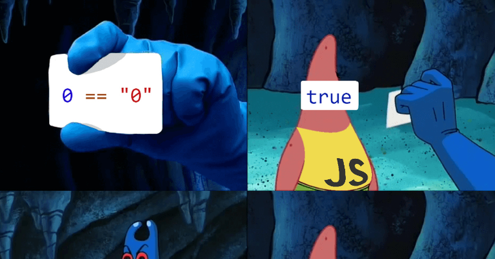
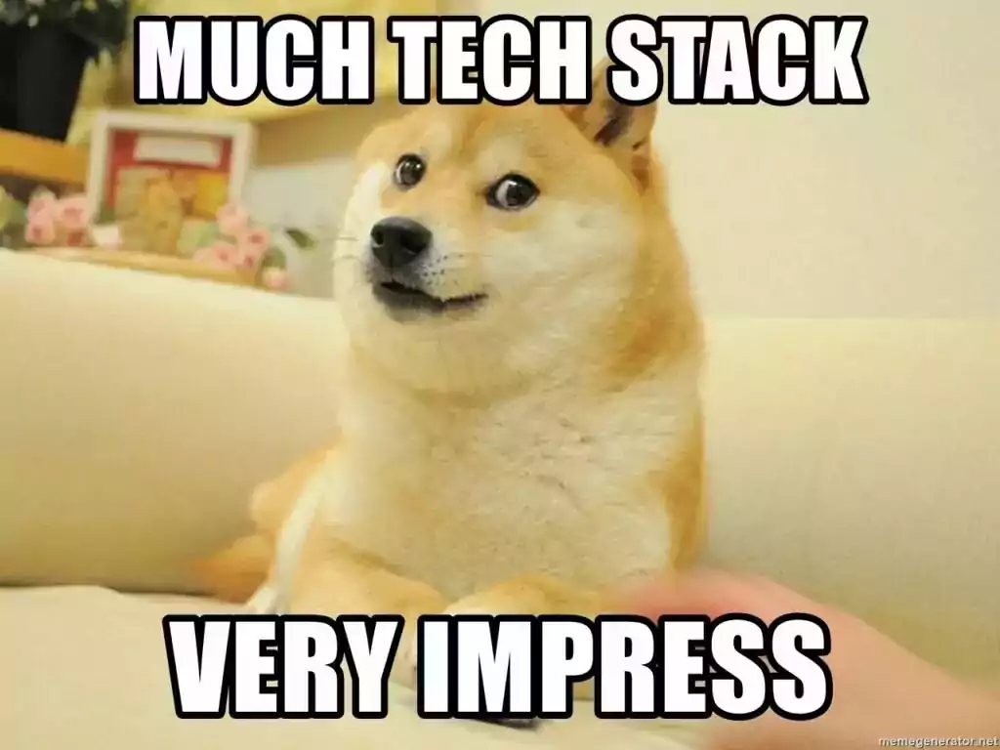

+++
title = "How I built a Web App with Go & HTMX"
outputs = ["Reveal"]
[logo]
src = "images/logo.png"
diag = "90%"
width = "5%"
[reveal_hugo]
custom_theme = "stylesheets/reveal/catppuccin.css"
slide_number = true
+++

# How I built a Web App with Go & HTMX

---

{}


## Introduction

- Haseeb Majid
  - Backend Software Engineer at [Nala](https://www.nala.com/)
  - https://haseebmajid.dev
- Loves cats 🐱
- Avid cricketer 🏏 #BazBall

---

## Who is this for?

- Backend Developers
  - No JS
- Manage state in one place

{}
- side projects struggled with frontend
  - structure
{}

---



[Credit](https://velog.io/@daeseongkim/series/JavaScript)

{}

---

{}

## Tech Stack

- Go
- Postgres
  - sqlc
- Templ

{}
{}

---

## Tech Stack

- HTMX
- TailwindCSS
- AlpineJS


{}
{}

---



[Credit](https://procoders.tech/blog/how-to-choose-best-tech-stack-for-web-development/)

{}

---

{}

## Why HTMX?

- State on backend
- Reduced complexity
- Simpler tooling

{}
- No npm
{}

---

## What about JSON?

- Separate API
- Mobile vs WebApp

{}
- A bit more boilerplate
{}

{}

---

{}

## tooling

---

## Templ

- Mostly writing HTML
- Easier to read
- Reuse

---

## TailwindCSS

- Lot of examples
- DaisyUI

{}
- Bootstrap
- Long names
{}

---

## Setup

- Go Web Server
  - Serving JSON

{}

---

{}

## HTMX

```html
<script src="https://unpkg.com/htmx.org@2.0.2" integrity="sha384-Y7hw+L/jvKeWIRRkqWYfPcvVxHzVzn5REgzbawhxAuQGwX1XWe70vji+VSeHOThJ" crossorigin="anonymous"></script>
<script src="https://unpkg.com/htmx.org/dist/ext/json-enc.js"></script>
```

---

## scripts.templ

```templ
templ Scripts(environment string) {
	<script src="https://unpkg.com/htmx.org@2.0.2" integrity="sha384-Y7hw+L/jvKeWIRRkqWYfPcvVxHzVzn5REgzbawhxAuQGwX1XWe70vji+VSeHOThJ" crossorigin="anonymous"></script>
	<script src="https://unpkg.com/htmx.org/dist/ext/json-enc.js"></script>
	<script defer src="https://cdn.jsdelivr.net/npm/alpinejs@3.14.3/dist/cdn.min.js"></script>
}
```

---

## layout.templ

```templ{|12|13}
package layouts

import "gitlab.com/hmajid2301/voxicle/internal/transport/http/views/components"

templ Base(title string, environment string) {
	<!DOCTYPE html>
	<html lang="en">
		<head>
			@components.Head(title)
		</head>
		<body class="bg-base-200 text-neutral">
			{ children... }
			@components.Scripts(environment)
		</body>
	</html>
}
```

---


```templ
script sentryLoad(environment string) {
  Sentry.onLoad(function() {
    Sentry.init({
        environment: environment,
    });
  });
}
```

---

## scripts.templ

```templ{5}
templ Scripts(environment string) {
	<script src="https://unpkg.com/htmx.org@2.0.2" integrity="sha384-Y7hw+L/jvKeWIRRkqWYfPcvVxHzVzn5REgzbawhxAuQGwX1XWe70vji+VSeHOThJ" crossorigin="anonymous"></script>
	<script src="https://unpkg.com/htmx.org/dist/ext/json-enc.js"></script>
	<script defer src="https://cdn.jsdelivr.net/npm/alpinejs@3.14.3/dist/cdn.min.js"></script>
    @sentryLoad(environment)
}
```

---

## HTMX

```html{3-6|10}
<form
    class="space-y-4"
    hx-post="/waitlist"
    hx-target="#container"
    hx-swap="innerHTML"
    hx-ext="json-enc"
>
    <label class="w-full input validator">
        <i class="h-6 hgi hgi-solid hgi-tick-02"></i>
        <input type="email" name="email" placeholder="hello@example.com" required/>
    </label>
    <div class="hidden validator-hint">Enter valid email address</div>
    <button
        type="submit"
        class="p-4 transition-colors btn btn-neutral btn-block hover:bg-secondary hover:text-neutral"
        hx-indicator=".hx-indicator"
        hx-disabled-elt="this"
    >
        <span class="htmx-show">Send Magic Link ✨</span>
        <span class="hidden justify-center items-center hx-indicator">
            <span class="loading loading-spinner"></span>
            <span class="ml-2">Sending...</span>
        </span>
    </button>
</form>

<div id="container"></div>
```

---

```html
<div hx-trigger="intersect once" />
<div hx-trigger="keyup changed delay:500ms" />
```

---

## Other tricks

Headers

- retarget
- swap-oob

---

{}

---

{}

## Go

```go{1-3}
type MagicLink struct {
	Email string `json:"email"`
}

func (h Handler) AddToWaitlist(c fuego.ContextWithBody[MagicLink]) (fuego.Templ, error) {
    // Add to waitlist
    // ...

	return components.SuccessWaitlist(email), nil
}
```

---

## Go/Templ

```templ{|14}
templ SuccessWaitlist(email string) {
	<div class="p-8 space-y-6 text-center">
		<div class="flex justify-center text-neutral">
			<i class="h-10 text-neutral hgi hgi-solid hgi-tick-02"></i>
		</div>
		<h3 class="text-2xl font-semibold">
			You're on the Waitlist 🎉
		</h3>
		<div class="space-y-6">
			<p>Thank you for your interest in our application.</p>
			<p>
				We'll notify you at
				<br/>
				<span class="font-mono text-primary">{ email }</span>
				<br/>
				when we're ready to launch.
			</p>
		</div>
	</div>
}
```

---

## HTMX

```html{|15}
<div id="container">
	<div class="p-8 space-y-6 text-center">
		<div class="flex justify-center text-neutral">
			<i class="h-10 text-neutral hgi hgi-solid hgi-tick-02"></i>
		</div>
		<h3 class="text-2xl font-semibold">
			You're on the Waitlist 🎉
		</h3>
		<div class="space-y-6">
			<p>Thank you for your interest in our application.</p>
			<p>
				We'll notify you at
				<br/>
				<span class="font-mono text-primary">hello@haseebmajid.dev</span>
				<br/>
				when we're ready to launch.
			</p>
		</div>
	</div>
</div>
```

{}

---

## Handling Errors

```go
func (h Handler) AddToWaitlist(c fuego.ContextWithBody[MagicLink]) (fuego.Templ, error) {
    // Add to waitlist
    // ...

	return nil, fmt.Errorf("Random error message. Correleation ID: 1234567")
}
```

---

## HTMX

- swap on 200 HTTP status code

---

{}

---

## Postgres

- sqlc
- generate code from SQL

---

## sqlc

```yaml
version: "2"
sql:
  - engine: "postgresql"
    queries: "internal/store/db/sqlc/query.sql"
    schema: "internal/store/db/sqlc/migrations"
    gen:
      go:
        package: "db"
        out: "internal/store/db"
        sql_package: "pgx/v5"
        emit_interface: true
```

---

## query.sql

```sql
-- name: AddUser :one
insert into users (email) values ($1) returning *;
```

---

## generated

```go
const addUser = `-- name: AddUser :one
insert into users (email) values ($1) returning id, created_at, updated_at, email
`

func (q *Queries) AddUser(ctx context.Context, email string) (User, error) {
	row := q.db.QueryRow(ctx, addUser, email)
	var i User
	err := row.Scan(
		&i.ID,
		&i.CreatedAt,
		&i.UpdatedAt,
		&i.Email,
	)
	return i, err
}
```

---

## DevEx

- docker-compose

---

```yaml{|5|11}
services:
  postgres:
    image: postgres:17.4
    ports:
      - "5432:5432"
    environment:
      POSTGRES_USER: postgres
      POSTGRES_PASSWORD: postgres
    volumes:
      - postgres-data:/var/lib/postgresql/data
      - ./docker/postgres-init.sql:/docker-entrypoint-initdb.d/init.sql
```

---

## DevEx

- Task Runners
    - Taskfiles/Makefiles/Just
- air
- watch
    - tailwind
    - templ

---

## Taskfile.yml

```yaml{|14-16|16}
version: "3"

tasks:
  build:
    desc: Build the binary in a tmp location.
    cmds:
      - go build -o ./tmp/main ./cmd/server/main.go

  dev:
    desc: Start the app in dev mode with live-reloading.
    dotenv:
      - .env.local
    cmds:
      - podman-compose up -d
      - task: watch
      - air
```

---

## Taskfile.yml

```yaml
watch:
  desc: Watch for file changes and run commands, i.e. generate templates or tailwindcss
  cmds:
    - tailwindcss --watch=always -i ./static/css/tailwind.css -o ./static/css/styles.css --minify &
    - templ generate -watch --proxy="http://localhost:8080" --open-browser=true &
```

---

## .air.toml

```toml
[build]
bin = "./tmp/main"
cmd = "task build"
exclude_dir = ["assets", "tmp", "vendor", "testdata"]
include_ext = ["go", "css", "templ"]
exclude_regex = ["_test.go"]
```

---


{}

---

{}

## DevEx

- nix dev shells
  - standalone
  - tailwind

---

## flake.nix

```nix{|15-16}
myPackages = with pkgs; [
  go_1_24

  goose
  air
  golangci-lint
  gotools
  gotestsum
  gocover-cobertura
  go-task
  go-mockery
  goreleaser

  tailwindcss-language-server
  tailwindcss_daisy.packages.${system}.default
  watchman
  templ
  sqlc

  sqlfluff
  rustywind
];
```

---

```nix{|9-12}
  inputs = {
    nixpkgs.url = "github:NixOS/nixpkgs/nixos-unstable";
    flake-utils.url = "github:numtide/flake-utils";
    pre-commit-hooks = {
      url = "github:cachix/pre-commit-hooks.nix";
      inputs.nixpkgs.follows = "nixpkgs";
    };

    tailwindcss_daisy = {
      url = "github:aabccd021/tailwindcss-daisyui-nix";
      inputs.nixpkgs.follows = "nixpkgs";
    };
  };
```

---

## DevEx

- LSP
  - DaisyUI

---

```bash
touch tailwind.config.js
```

{}
- Empty else the LSP doesn't load
{}


{}

---

## When not to use HTMX?

- Lots of frontend reactivity
- Separate frontend/backend teams
- Design System?

---

## Further

- Observability
  - Otel
- Playwright
  - Go

---


https://haseebmajid.dev/slides/go-lab-htmx-go-web-app/

---

## References & Thanks

- Example App: https://gitlab.com/hmajid2301/banterbus

