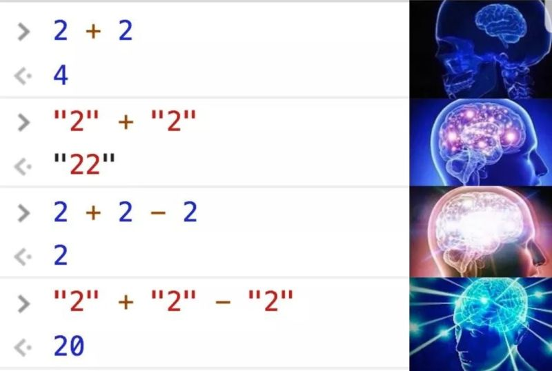

+++
title = "What I learnt building a web app with Go and HTMX"
outputs = ["Reveal"]
[logo]
src = "images/logo.png"
diag = "90%"
width = "5%"
[reveal_hugo]
custom_theme = "stylesheets/reveal/catppuccin.css"
slide_number = true
+++

# What I learnt building a web app with Go and HTMX

---

{}


## Introduction

- Haseeb Majid
  - Backend Software Engineer at [Nala](https://www.nala.com/)
  - https://haseebmajid.dev
- Loves cats 🐱
- Avid cricketer 🏏 #BazBall

---

## Who is this for?

- Backend Developers

{}
- side projects struggled with frontend
  - structure
{}

---



---

## Old

---


---

## New

---


---


---

<video data-autoplay src="images/banterbus.webm">


{}

---

{}

## Tech Stack (Backend)

- Go
- Postgres
  - sqlc
- Templ

{}
- No external framework dependencies
- Built-in routing with Go 1.22+ patterns
{}

---

## Tech Stack (Frontend)

- HTMX
- TailwindCSS
  - DaisyUI
- AlpineJS


{}
{}

---


{}

---

{}

## What is HTMX?

- A small library
- Basic interaction via HTML attributes

---

## HTMX in a Nutshell

> javascript fatigue:
longing for a hypertext
already in hand

— [htmx.org](https://htmx.org)

---

```html
<script src="https://unpkg.com/htmx.org@2.0.2"></script>
<script
   src="https://unpkg.com/htmx.org/dist/ext/json-enc.js">
</script>
```

---

## HTMX

```html{3-6|10-15}
<form
    class="space-y-4"
    hx-post="/waitlist"
    hx-target="#container"
    hx-swap="innerHTML"
    hx-ext="json-enc"
>
    <label class="w-full input validator">
        <i class="h-6 hgi hgi-solid hgi-tick-02"></i>
        <input
            type="email"
            name="email"
            placeholder="hello@example.com"
            required
        />
    </label>
    <div class="hidden validator-hint">
        Enter valid email address
    </div>
    <button
        type="submit"
        class="p-4 transition-colors btn btn-neutral btn-block hover:bg-secondary hover:text-neutral"
        hx-indicator=".hx-indicator"
        hx-disabled-elt="this"
    >
        <span class="htmx-show">Send Magic Link ✨</span>
        <span class="hidden justify-center items-center hx-indicator">
            <span class="loading loading-spinner"></span>
            <span class="ml-2">Sending...</span>
        </span>
    </button>
</form>

<div id="container"></div>
```

---

```Go
type Waitlist struct {
	Email string `json:"email"`
}
```

---

```html{6|13-15}
<div class="p-8 space-y-6 text-center">
    <div class="flex justify-center text-neutral">
        <i class="h-10 text-neutral hgi hgi-solid hgi-tick-02"></i>
    </div>
    <h3 class="text-2xl font-semibold">
        You're on the Waitlist 🎉
    </h3>
    <div class="space-y-6">
        <p>Thank you for your interest in our application.</p>
        <p>
            We'll notify you at
            <br/>
            <span class="font-mono text-primary">
                hello@haseebmajid.dev
            </span>
            <br/>
            when we're ready to launch.
        </p>
    </div>
</div>
```

---

<video data-autoplay src="images/waitlist_demo.mp4">

---

## Why HTMX?

- State on backend
- Reduced complexity
- Simpler tooling

{}
- No npm
{}

---

## What about JSON?

- Separate API
- Mobile vs WebApp

{}
- A bit more boilerplate
{}

---


---

```html
<div hx-trigger="intersect once" />
<div hx-trigger="keyup changed delay:500ms" />
```

---

```go
w.Header().Set("HX-Retarget", "#error_modal_container")
w.Header().Set("Content-Type", "text/html")
```

---

## HTMX Response Codes

- **200**: Swap content (success)
- **204**: No content to swap

---

## Interactivity

- Alpine

{}
- Stringify JS
- Hiding JS in HTML tags
- Just write JS
- Islands?
{}

---

```html
<script
src="https://cdn.jsdelivr.net/npm/alpinejs@3.14.3/dist/cdn.min.js">
</script>
```

---

```html{2-3|5|8}
<div
    x-data={ "showModal": false }
    @keydown.escape="showModal = false"
>
    <button type="button" @click="showModal = true">
        <i class="hgi-information-circle"></i>
    </button>
    <div x-show="showModal">modal</div>
</div>
```

---


<video data-autoplay src="images/modal_demo.mp4">

---

## TailwindCSS

- Lot of examples

{}
- Bootstrap
- Long names
- Can be difficult to read
{}

---

```html{1-5}
<button type="button" class="text-white bg-blue-700
    hover:bg-blue-800 focus:ring-4 focus:ring-blue-300
    font-medium rounded-lg text-sm px-5 py-2.5 me-2
    mb-2 dark:bg-blue-600 dark:hover:bg-blue-700
    focus:outline-none dark:focus:ring-blue-800"
>Default</button>
```

---


---

```css{1-2|4-5|8-13|16-18}
@import "tailwindcss";
@source "./internal/transport/http/views/**/*.templ";

@plugin "daisyui" {
  themes: cupcake --default;
}

@plugin "daisyui/theme" {
  name: "cupcake";
  default: true;
  --color-neutral: #291334;
  --size-selector: 0.3125rem;
  --size-field: 0.3125rem;
}

@utility btn-neutral {
  @apply hover:border-none transition-colors hover:bg-secondary hover:text-neutral;
}
```

---

## Alternatives

- Datastar
- Alpine AJAX

---


{}

---


{}

## Backend

- Go stdlib HTTP server

---

## Router

```go{5-11|13-21}
func main() {
    mux := http.NewServeMux()
    handler := &Handler{store: store}

    // Static files
    mux.Handle("/static/",
        http.StripPrefix("/static/",
            http.FileServer(http.Dir("./static"),
            ),
        ),
    )

    // API routes
    mux.HandleFunc(
        "POST /waitlist",
        handler.AddToWaitlist,
    )
    mux.HandleFunc(
        "GET /",
        handler.HomePage,
    )

    log.Fatal(http.ListenAndServe(":8080", mux))
}
```

---

## Groups

```go{2-3|5-8|10-21}
r := NewRouter()
// Global middleware
r.Use(recoverPanic, metrics, tracing)

r.Group(func(r *Router) {
    // Public group middleware
    r.Use(requestID, logRequest)
    r.HandleFunc("GET /", home)

    // Admin group
    r.Group(func(r *Router) {
        r.Use(authenticateUser, requireAdmin)
        r.HandleFunc(
            "GET /admin/dashboard",
            adminDashboard,
        )
        r.HandleFunc(
            "POST /admin/users",
            createUser,
        )
    })

    // API group
    r.Group(func(r *Router) {
        r.Use(corsHandler, jsonContentType)
        r.HandleFunc("POST /api/feedback", submitFeedback)
        r.HandleFunc("GET /api/health", healthCheck)
    })

    // WebSocket group
    r.Group(func(r *Router) {
        // Only authenticated users
        r.Use(auth)
        r.HandleFunc("GET /chat/room/{room_id}", handleWebSocket)
    })
})
```

---

## Handler

```go{1-3|5-8|9-22|24-25}
type Waitlist struct {
	Email string `json:"email"`
}

func (h *Handler) AddToWaitlist(
    w http.ResponseWriter,
    r *http.Request,
) {
    var req Waitlist
    json.NewDecoder(r.Body).Decode(&req)

    waitlist, err := h.store.AddToWaitlist(
        r.Context(),
        req.Email,
    )
    if err != nil {
        http.Error(w,
            err.Error(),
            http.StatusInternalServerError,
        )
        return
    }

    components.SuccessWaitlist(waitlist.Email).
        Render(r.Context(), w)
}
```

{}

---

{}

## Templ

- HTML Templates
- LSP
- Components


{}
- Components: reuse
- Downside: extra tooling, another CLI
{}

---

```go{1|3-6|8|9-12|14-15|17-20}
package sections

import (
	"gitlab.com/hmajid2301/banterbus/internal/service"
	"gitlab.com/hmajid2301/banterbus/internal/views/components"
)

templ Winner(state service.WinnerState, maxScore int) {
<div hx-swap-oob="innerHTML:#page">
    <div>
        <div class="flex">
            <div class="grid>
                <div>
                    The winner is
                    { state.Players[0].Nickname }
                </div>
                @components.Scoreboard(
                    state.Players,
                    maxScore,
                )
            </div>
        </div>
    </div>
</div>
}
```

---

## scripts.templ

```go{1|8}
templ Scripts(environment string) {
<script src="https://unpkg.com/htmx.org@2.0.2">
</script>
<script src=".../dist/ext/json-enc.js">
</script>
<script src=".../alpinejs@3.14.3/dist/cdn.min.js">
</script>
@sentryLoad(environment)
}
```

---


```js{1|2-6}
script sentryLoad(environment string) {
  Sentry.onLoad(function() {
    Sentry.init({
        environment: environment,
    });
  });
}
```


---

## layout.templ

```go{1|3|5|9|12|13}
package layouts

import "gitlab.com/hmajid2301/voxicle/internal/transport/http/views/components"

templ Base(title string, environment string) {
	<!DOCTYPE html>
	<html lang="en">
		<head>
			@components.Head(title)
		</head>
		<body class="bg-base-200 text-neutral">
			{ children... }
			@components.Scripts(environment)
		</body>
	</html>
}
```

---

```go{2-5}
templ Dashboard(title string, environment string) {
	@Base(title, environment) {
        <div class="drawer lg:drawer-open">
        </div>
    }
}
```

{}

---

{}

## i18n

```go{1|5|6-9|10}
func (m Middleware) Locale(next http.Handler)
http.Handler {
    return http.HandlerFunc(
        func(w http.ResponseWriter, r *http.Request) {
            locale := extractLocaleFromURL(r.URL.Path)
            ctx, err := ctxi18n.WithLocale(
                r.Context(),
                locale,
            )
            next.ServeHTTP(w, r.WithContext(ctx))
    })
}
```

---

```yaml
en-GB:
  common:
    ready_button: "Ready"
    roomcode_label: "Room Code"
  home:
    start_button_label: "Start Game"
```
---

```go
@components.Button() {
    { i18n.T(ctx, "common.ready_button") }
}
```

---

```html
<button class="...">
    Ready
</button>
```

{}

---

{}

## Postgres

- sqlc

---

## sqlc

```yaml{3|4-5|8-11}
version: "2"
sql:
  - engine: "postgresql"
    queries: "internal/store/db/sqlc/query.sql"
    schema: "internal/store/db/sqlc/migrations"
    gen:
      go:
        package: "db"
        out: "internal/store/db"
        sql_package: "pgx/v5"
        emit_interface: true
```

---

## query.sql

```sql
-- name: AddUser :one
insert into users (email) values ($1) returning *;
```

---

```bash
sqlc generate
```

---

## generated

```go{1-3|5-8|9-17}
const addUser = `-- name: AddUser :one
insert into users (email) values ($1) returning id, created_at, updated_at, email
`

func (q *Queries) AddUser(
    ctx context.Context,
    email string,
) (User, error) {
	row := q.db.QueryRow(ctx, addUser, email)
	var i User
	err := row.Scan(
		&i.ID,
		&i.CreatedAt,
		&i.UpdatedAt,
		&i.Email,
	)
	return i, err
}
```

---


```go
type Querier interface {
	AddFibbingItRole(ctx context.Context, arg AddFibbingItRoleParams) (FibbingItPlayerRole, error)
	AddPlayer(ctx context.Context, arg AddPlayerParams) (Player, error)
	AddQuestion(ctx context.Context, arg AddQuestionParams) (Question, error)
	AddQuestionTranslation(ctx context.Context, arg AddQuestionTranslationParams) (QuestionsI18n, error)
	AddRoom(ctx context.Context, arg AddRoomParams) (Room, error)
	GetAllPlayerByRoomCode(ctx context.Context, roomCode string) ([]GetAllPlayerByRoomCodeRow, error)
    // ...
}
```

---

## Goose

```sql{3-8|14}
-- +goose Up
-- +goose StatementBegin
CREATE TABLE IF NOT EXISTS feedback (
    id UUID PRIMARY KEY DEFAULT generate_uuidv7(),
    created_at TIMESTAMP DEFAULT current_timestamp,
    updated_at TIMESTAMP DEFAULT current_timestamp,
    title TEXT NOT NULL,
    description TEXT NOT NULL,
);
-- +goose StatementEnd

-- +goose Down
-- +goose StatementBegin
DROP TABLE IF EXISTS feedback;
-- +goose StatementEnd
```

{}
- **Type Safety**: Schema changes update Go types automatically
- **Compile-Time Errors**: Invalid queries caught during build
- When you change schema, sqlc regenerates types
- No runtime surprises with wrong column types
- Database versioning is explicit
{}

---

## Transactions

```go{2-3|4-8|13-18}
func (s *DB) StartGame(ctx context.Context, arg StartGameArgs) error {
return s.TransactionWithRetry(ctx, func(q *Queries)
error {
// Update room state
_, err := q.UpdateRoomState(ctx, UpdateParams{
    RoomState: Playing.String(),
    ID:        arg.RoomID,
})
if err != nil {
    return err
}

// Add game state
_, err = q.AddGameState(ctx, AddGameStateParams{
    ID:     arg.GameStateID,
    RoomID: arg.RoomID,
    State:  FibbingITQuestion.String(),
})
if err != nil {
    return err
}

// Assign roles to players
for i, player := range arg.Players {
    role := "normal"
    if i == arg.FibberLoc { role = "fibber" }

    _, err = q.AddFibbingItRole(ctx, AddFibbingItRoleParams{
        PlayerID: player.ID, Role: role,
    })
    if err != nil {
        return err
    }
}
return nil
})
}
```

---

```go{1|2|3}
type Storer interface {
	db.Querier
	StartGame(ctx context.Context, arg db.StartGameArgs) error
}
```

{}

---

{}

## WebSockets

```html{2-3|6-7|9-10}
<div
     hx-ext="ws"
     ws-connect="/ws">

    <form
        hx-vals='{"message_type": "submit_vote" }'
        ws-send
    >
        <input name="voted_player_nickname"
            value={ player.Nickname }/>
    </form>
</div>
```

{}

---

{}

## DevEx

---

```yaml
services:
  postgres:
    image: postgres:17.4
    ports:
      - "5432:5432"
    environment:
      POSTGRES_USER: postgres
      POSTGRES_PASSWORD: postgres
    volumes:
      - postgres-data:/var/lib/postgresql/data
      - ./docker/postgres-init.sql:/docker-entrypoint-initdb.d/init.sql
```

---

## Taskfile.yml

```yaml{|14-16|16}
version: "3"

tasks:
  build:
    desc: Build the binary in a tmp location.
    cmds:
      - go build -o ./tmp/main ./cmd/server/main.go

  dev:
    desc: Start the app in dev mode with live-reloading.
    dotenv:
      - .env.local
    cmds:
      - podman-compose up -d
      - task: watch
      - air
```

---

## .air.toml

```toml
[build]
bin = "./tmp/main"
cmd = "task build"
exclude_dir = ["assets", "tmp", "vendor", "testdata"]
include_ext = ["go", "css", "templ"]
exclude_regex = ["_test.go"]
```

---


---

```yaml
watch:
  desc: Watch for file changes
  cmds:
  - templ generate -watch --open-browser=true &
  - tailwindcss --watch=always -i \
                ./static/css/tailwind.css -o \
                ./static/css/styles.css --minify &
```

---

## Nix

```bash
example on main via 🐹 v1.22.8
❯ which golangci-lint

example on main via 🐹 v1.22.8
❯ nix develop

example on main via 🐹 v1.22.8 ❄️ impure (nix-shell-env)
❯ which golangci-lint
/nix/store/kcd...golangci-lint-1.56.2/bin/golangci-lint
```

{}

---

{}

## When not to use HTMX?

- Lots of frontend reactivity
- Separate frontend/backend teams
- Design System?

---

## Other Issues?

- Alpine: Stringified JS
- TailwindCSS: Complicated CSS
- Templ: Another tool
- SQLC: Dynamic queries

---

## Further

- Observability
  - OTel
- Playwright
  - Go
- OpenAPI Specification

{}

---


https://haseebmajid.dev/slides/go-lab-htmx-go-web-app/

---

## References & Thanks

- **alexedwards.net** - [Middleware organization patterns](https://www.alexedwards.net/blog/organize-your-go-middleware-without-dependencies)
- **Example:** Banterbus (Game): https://gitlab.com/hmajid2301/banterbus

---

- Nix Dev Shell: https://www.youtube.com/watch?v=bdGfn_ihHOk
- Playwright: https://www.youtube.com/watch?v=XdBhYt3-bbU
- OTel & Go: https://www.youtube.com/watch?v=t3Xz-IrxNwk&list=PLSCmmmcxRB6DilKhSz09JL9F4CVl7Vyd3&index=5
