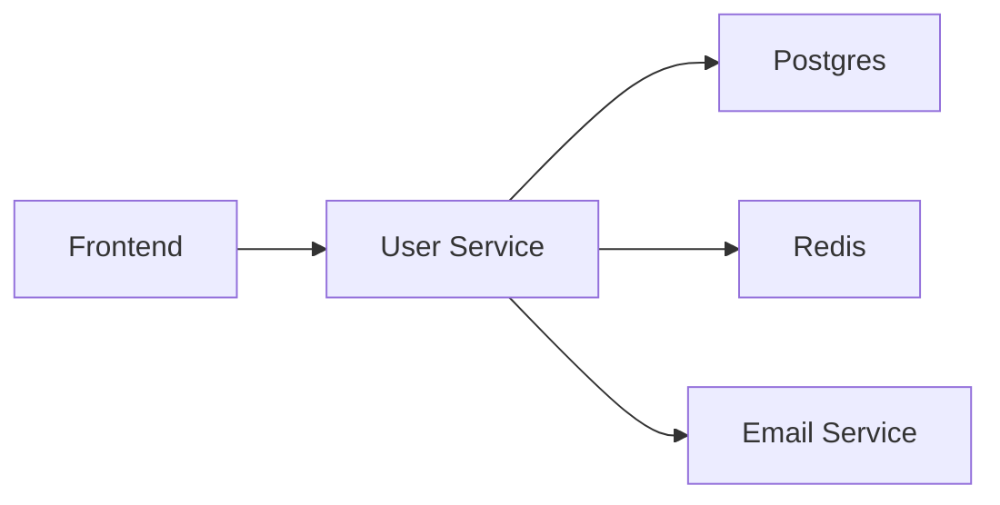

+++
title = "Log, Metrics and Tracing with Otel & Go"
outputs = ["Reveal"]
[logo]
src = "images/logo.svg"
diag = "90%"
width = "5%"
[reveal_hugo]
custom_theme = "stylesheets/reveal/catppuccin.css"
slide_number = true
+++

# Observability Made Painless: Go, Otel & LGTM Stack

"No PhD required"

---

## Introduction

- Haseeb Majid
  - Backend Software Engineer at [Nala](https://www.nala.com/)
  - https://haseebmajid.dev
- Loves cats 🐱
- Avid cricketer 🏏 #BazBall

---

## Who is this for?

- New to OpenTelemetry
- Instrument existing app

{}
- a
{}

---

## What is observability?

- What is going on with our app
- Is something wrong?

---

## What is observability?

- Logs
- Traces
- Metrics

---

## Why Observability Matters

- Provide context to issues
- Bottlenecks in the system
- 53% of users abandon after 3s delay (Google)

---

## What is otel?

- OpenTelemetry
- Open Standard
  - Solves vendor lock-in

{}
- datadog
- jaeger
{}

---

## What is otel?

- CNCF-graduated project
- Originally just for tracing

---

## Why use otel?

- Open Standard
  - Solves vendor lock-in
- Unify logs, metrics & traces

---

## What do we want?


---

## Example service

```go{17-22|25-41|11-15}
package main

import (
	"encoding/json"
	"fmt"
	"log"
	"net/http"
	"time"
)

func main() {
    handler := &Handler{
        // ...
    }

    r := mux.NewRouter()

	r.HandleFunc("/user/{id}", h.userHandler).Methods("GET")

	log.Println("Server starting on port 8080...")
	log.Fatal(http.ListenAndServe(":8080", r))
}

func (h *Handler) userHandler(w http.ResponseWriter, r *http.Request) {
    id := r.URL.Query().Get("id")
    // Validation logic ...

    // Interact with the DB.
	user := h.store.getUser(id)

	w.Header().Set("Content-Type", "application/json")
	json.NewEncoder(w).Encode(user)
}
```

---

## Definition

- Trace: Follow the flow of an application, triggered by something i.e. a user presses a button
- Span: A single component in the trace

---

## What is (a distributed) tracing?

- Caused by a single action
- Contains information acrosses different components
  - Services
  - DBs
  - Events

---

## Span

- operation name
- start and finish timestamp
- attributes (key value pairs)
- a set of events
- parent span ID
- links to other spans
- span context

---

## Span Context

```http
traceparent: 00-d4cda95b652f4a1592b449d5929fda1b-6e0c63257de34c92-01
tracestate: mycompany=true
```

---

- traceid: d4cda95b652f4a1592b449d5929fda1b
- spanid: 6e0c63257de34c92
- trace flags: 01
- trace state: mycompany=true

---

## Span Links

- Connect two spans who are related but don't have a direct parent-child relationship.
- Useful in async/event-driven systems

---

## Span

- Think of spans as a directed acylic graph (DAG) to each other



---

## Image


---

## Instrument traces

```bash
go get go.opentelemetry.io/otel \
         go.opentelemetry.io/otel/trace \
         go.opentelemetry.io/contrib/instrumentation/net/http/otelhttp \
         go.opentelemetry.io/otel/exporters/otlp/otlptrace/otlptracehttp \
         go.opentelemetry.io/otel/sdk/resource \
         go.opentelemetry.io/otel/sdk/trace \
         go.opentelemetry.io/otel/semconv/v1.26.0
```

---

```go
package main

import (
	// ... existing imports ...
    "fmt"
	"context"
	"log"
	"os"
	"time"

	"go.opentelemetry.io/otel"
	"go.opentelemetry.io/otel/attribute"
	"go.opentelemetry.io/otel/exporters/otlp/otlptrace/otlptracehttp"
	"go.opentelemetry.io/otel/sdk/resource"
	sdktrace "go.opentelemetry.io/otel/sdk/trace"
	semconv "go.opentelemetry.io/otel/semconv/v1.26.0"
)


func main() {
	// Initialize tracer
    ctx := context.Background()

	var shutdownFuncs []func(context.Context) error
	shutdown = func(ctx context.Context) error {
		var err error
		for _, fn := range shutdownFuncs {
			err = errors.Join(err, fn(ctx))
		}
		shutdownFuncs = nil
		return err
	}

	handleErr := func(inErr error) {
		err = errors.Join(inErr, shutdown(ctx))
	}

	tp, err := newTracerProvider(ctx)
	if err != nil {
		handleErr(err)
		return shutdown, err
	}

	shutdownFuncs = append(shutdownFuncs, tracerProvider.Shutdown)
	defer shutdown()
}

func newTracerProvider(ctx context.Context) (*trace.TracerProvider, error) {
	// Create OTLP exporter
	exporter, err := otlptracehttp.New(ctx)
	if err != nil {
		return nil, fmt.Errorf("failed to create exporter: %w", err)
	}

	// Create trace provider
	tp := sdktrace.NewTracerProvider(
		sdktrace.WithBatcher(exporter),
	)

	// Set global tracer provider
	otel.SetTracerProvider(tp)
    otel.SetTextMapPropagator(propagation.NewCompositeTextMapPropagator(
            propagation.TraceContext{},
            propagation.Baggage{},
    ))

	// Return shutdown function
	return tp, nil
```

---

## Trace Context

```http
traceparent: 00-d4cda95b652f4a1592b449d5929fda1b-6e0c63257de34c92-01
tracestate: mycompany=true
```

---

## Baggage

```http
baggage: userId=12345,role=admin,region=us-east
```

---

```go
func main() {
	// Initialize tracer
	shutdown := initTracer()
	defer shutdown(context.Background())

    // Previous code ...

	// Add OpenTelemetry middleware
	r.Use(otelmux.Middleware("user-service"))

	r.HandleFunc("/user/{id}", h.userHandler).Methods("GET")
    // Rest of the code ...
}
```

---


---


---

## Instrument metrics

```bash
go get go.opentelemetry.io/otel/metric \
         go.opentelemetry.io/otel/sdk/metric \
         go.opentelemetry.io/otel/exporters/otlp/otlpmetric/otlpmetrichttp
```

---

## Instrument metrics

```go
func newMeterProvider(ctx context.Context) (*sdkmetric.MeterProvider, error) {
	// Create OTLP metric exporter
	exporter, err := otlpmetrichttp.New(ctx)
	if err != nil {
		return nil, fmt.Errorf("failed to create metric exporter: %w", err)
	}

	// Create meter provider
	mp := sdkmetric.NewMeterProvider(
		sdkmetric.WithReader(sdkmetric.NewPeriodicReader(exporter)),
	)

	if err = runtimeMetrics.Start(runtimeMetrics.WithMeterProvider(mp)); err != nil {
		return nil, fmt.Errorf("failed to start runtime metrics: %w", err)
	}

	if err = hostMetrics.Start(hostMetrics.WithMeterProvider(mp)); err != nil {
		return nil, fmt.Errorf("failed to start host metrics: %w", err)
	}

	// Set global meter provider
	otel.SetMeterProvider(mp)

	return mp, nil
}
```

---

## Instrument metrics

```go
func main() {
	ctx := context.Background()

    // Previous code ...

	// Setup meter
	mp, err := newMeterProvider(ctx)
	if err != nil {
		log.Fatalf("failed to setup meter: %v", err)
	}
	shutdownFuncs = append(shutdownFuncs, mp.Shutdown)

    // Rest of the code ...

}
```

---

## Metric Types

- histogram
- counter
- guage
- summary

---

## Metric


---

## Metric


---

## Instrument logs

```go
func newLoggerProvider(ctx context.Context, logLevel minsev.Severity) (*log.LoggerProvider, error) {
	exporter, err := otlploghttp.New(ctx)
	if err != nil {
		return nil, err
	}

	p := log.NewBatchProcessor(exporter)
	processor := minsev.NewLogProcessor(p, logLevel)
	lp := log.NewLoggerProvider(
		log.WithProcessor(processor),
	)

	global.SetLoggerProvider(gp)
	return lp, nil
}
```

---

## Instrument logs


```go
func main() {
	ctx := context.Background()

    // Previous code ...

	// Setup meter
	lp, err := newLoggerProvider(ctx)
	if err != nil {
		log.Fatalf("failed to setup meter: %v", err)
	}
	shutdownFuncs = append(shutdownFuncs, mp.Shutdown)

    // Rest of the code ...

}
```

---

## Instrument logs

```go
package telemetry

import (
	"log/slog"
	"os"
	"time"

	"github.com/lmittmann/tint"
	slogotel "github.com/remychantenay/slog-otel"
	slogmulti "github.com/samber/slog-multi"
	"go.opentelemetry.io/contrib/bridges/otelslog"
)

func NewLogger() *slog.Logger {
	var handler slog.Handler
	if os.Getenv("EXAMPLE_ENVIRONMENT") == "local" {
		stdoutHandler := tint.NewHandler(os.Stdout, &tint.Options{
			AddSource:  true,
			TimeFormat: time.Kitchen,
		})
		otelHandler := otelslog.NewHandler("user-service", otelslog.WithSource(true))
		handler = slogmulti.Fanout(stdoutHandler, otelHandler)
	} else {
		handler = otelslog.NewHandler("user-service", otelslog.WithSource(true))
	}

	handler = slogotel.OtelHandler{Next: handler}
	logger := slog.New(handler)
	return logger
}
```

---


---


---

## Resources

---

## Postgres

---

## Valkey

---

## HTTP Client

---

## LGTM Stack

- Loki: logs
- Grafana: Visualisation
- Tempo: Traces
- Mimir: Metrics backend

---

## docker-compose.yml

```yaml
services:
  otel-collector:
    image: otel/opentelemetry-collector:0.123.0
    profiles:
      - monitoring
    ports:
      - 4317:4317
      - 4318:4318
      - 1888:1888
      - 8888:8888
      - 8889:8889
    volumes:
      - ./docker/otelcol.yaml:/etc/otelcol/config.yaml
    depends_on:
      - tempo

  mimir:
    image: grafana/mimir:2.11.0
    profiles:
      - monitoring
    volumes:
      - mimir-data:/data

  grafana:
    image: grafana/grafana:11.6.1
    profiles:
      - monitoring
    ports:
      - 3000:3000
    environment:
      - GF_AUTH_ANONYMOUS_ENABLED=true
      - GF_AUTH_ANONYMOUS_ORG_ROLE=Admin
    volumes:
      - grafana-data:/var/lib/grafana

  tempo:
    image: grafana/tempo:2.7.2
    profiles:
      - monitoring
    command: ["-config.file=/etc/tempo.yaml"]
    volumes:
      - ./docker/tempo.yaml:/etc/tempo.yaml

  loki:
    image: grafana/loki:3.5.0
    profiles:
      - monitoring
    command: ["-config.file=/etc/loki/loki-config.yaml"]
    volumes:
      - ./docker/loki.yaml:/etc/loki/loki-config.yaml

volumes:
  grafana-data:
  mimir-data:
```

---

## otel collector

- observability pipelines
- convert between otel and others
  - export prometheus metrics

---

## otel-collector.yaml

```yaml{4-5|11-14|15-16|26-29|31-33}
receivers:
  otlp:
    protocols:
      http:
        endpoint: 0.0.0.0:4317

processors:
  batch:

exporters:
  otlp:
    endpoint: tempo:4317
    tls:
      insecure: true
  prometheus:
    endpoint: "0.0.0.0:8889"

extensions:
  health_check:
  pprof:
    endpoint: :1888

service:
  extensions: [health_check, pprof]
  pipelines:
    traces:
      receivers: [otlp]
      processors: [batch]
      exporters: [otlp]
    metrics:
      receivers: [otlp]
      processors: [batch]
      exporters: [prometheus]
```

---

## Setup Grafana

---

## Viewing an error

---

## Correleated logs, metrics & traces

---

## Lessons learnt

- High cardinality
  - 1 unique label value = 1 new time series

---

## Lessons learnt

- Indexing
  - Over: Storage
  - Under: Slow queries

---

## Lessons learnt

- trace-first approach

---

## Metrics

- Counter resets to 0

---


https://haseebmajid.dev/slides/gophercon-otel/

---

## References & Thanks

- Example App: https://gitlab.com/hmajid2301/banterbus

