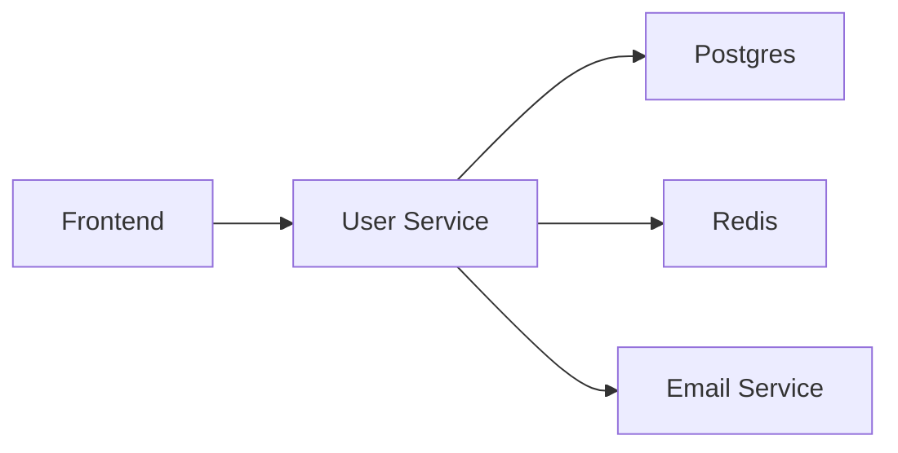

+++
title = "Log, Metrics and Tracing with Otel & Go"
outputs = ["Reveal"]
[logo]
src = "images/logo.svg"
diag = "90%"
width = "5%"
[reveal_hugo]
custom_theme = "stylesheets/reveal/catppuccin.css"
slide_number = true
+++

# Observability Made Painless: Go, Otel & LGTM Stack

"No PhD required"

---

## Introduction

- Haseeb Majid
  - Backend Software Engineer at [Nala](https://www.nala.com/)
  - https://haseebmajid.dev
- Loves cats 🐱
- Avid cricketer 🏏 #BazBall

---

## Who is this for?

- New to OpenTelemetry
- Instrument existing app

{}
- a
{}

---

## What is observability?

- What is going on with our app
- Is something wrong?

---

## What is observability?

- Logs
- Traces
- Metrics

---

## Why Observability Matters?

- Provide context to issues
- Bottlenecks in the system

{}
- 53% of users abandon after 3s delay (Google)
{}

---

## What is OTel?

- OpenTelemetry
- Open Standard
  - Solves vendor lock-in

{}
- datadog
- jaeger
{}

---

## What is OTel?

- CNCF-graduated project
- Originally just for tracing

---

## Why use OTel?

- Open Standard
  - Solves vendor lock-in
- Unify logs, metrics & traces

---

## What do we want?


---

## Example service

```go{16-18|19-20|24-31}
package main

import (
	"encoding/json"
	"fmt"
	"log"
	"net/http"
	"time"
)

func main() {
    handler := &Handler{
        // ...
    }

    r := mux.NewRouter()
    r.HandleFunc("/user/{id}", h.userHandler).Methods("GET")

    log.Println("Server starting on port 8080...")
    log.Fatal(http.ListenAndServe(":8080", r))
}

func (h *Handler) userHandler(w http.ResponseWriter, r *http.Request) {
    id := r.URL.Query().Get("id")
    // Validation logic ...

    // Interact with the DB.
    user := h.store.getUser(id)

    w.Header().Set("Content-Type", "application/json")
    json.NewEncoder(w).Encode(user)
}
```

---

## Definition

- Trace: Follow the flow of an application, triggered by something i.e. a user presses a button
- Span: A single component in the trace

---

## What is (distributed) tracing?

- Caused by a single action
- Contains information acrosses different components
  - Services
  - DBs
  - Events

---

## Span

- Operation name
- Start and finish timestamp
- Attributes
  - key-value pairs
- A set of events
- Parent span ID
- Links to other spans
- Span context

---

## Span Context

```http
traceparent: 00-d4cda95b652f4a1592b449d5929fda1b-6e0c63257de34c92-01
tracestate: mycompany=true
```

---

```http
traceparent:
00-d4cda95b652f4a1592b449d5929fda1b-6e0c63257de34c92-01
tracestate: mycompany=true
```

- trace-id: d4cda95b652f4a1592b449d5929fda1b
- span-id: 6e0c63257de34c92
- trace flags: 01
- trace state: mycompany=true

---

## Span Links

- Connect two spans who are related but don't have a direct parent-child relationship.
- Useful in async/event-driven systems

---

## Span

- Think of spans as a directed acylic graph (DAG) to each other



---

## Image


---

## Instrument traces

```bash
go get go.opentelemetry.io/otel \
         go.opentelemetry.io/otel/trace \
         go.opentelemetry.io/contrib/instrumentation/net/http/otelhttp \
         go.opentelemetry.io/otel/exporters/otlp/otlptrace/otlptracehttp \
         go.opentelemetry.io/otel/sdk/resource \
         go.opentelemetry.io/otel/sdk/trace \
         go.opentelemetry.io/otel/semconv/v1.26.0
```

---

```go{24-32|34-36|38-42|44-45|48-49|51-59|61-71}
package main

import (
	// ... existing imports ...
    "fmt"
	"context"
	"log"
	"os"
	"time"

	"go.opentelemetry.io/otel"
	"go.opentelemetry.io/otel/attribute"
	"go.opentelemetry.io/otel/exporters/otlp/otlptrace/otlptracehttp"
	"go.opentelemetry.io/otel/sdk/resource"
	sdktrace "go.opentelemetry.io/otel/sdk/trace"
	semconv "go.opentelemetry.io/otel/semconv/v1.26.0"
)


func main() {
    // Initialize tracer
    ctx := context.Background()

    var shutdownFuncs []func(context.Context) error
    shutdown = func(ctx context.Context) error {
        var err error
        for _, fn := range shutdownFuncs {
            err = errors.Join(err, fn(ctx))
        }
        shutdownFuncs = nil
        return err
    }

    handleErr := func(inErr error) {
        err = errors.Join(inErr, shutdown(ctx))
    }

    tp, err := newTracerProvider(ctx)
    if err != nil {
        handleErr(err)
        return shutdown, err
    }

    shutdownFuncs = append(shutdownFuncs, tracerProvider.Shutdown)
    return shutdownFuncs, nil
}

func newTracerProvider(ctx context.Context)
    (*trace.TracerProvider, error) {
    // Create OTLP exporter
    exporter, err := otlptracehttp.New(ctx)
    if err != nil {
        return nil, fmt.Errorf("failed to create exporter: %w", err)
    }

    // Create trace provider
    tp := sdktrace.NewTracerProvider(
        sdktrace.WithBatcher(exporter),
    )

    // Set global tracer provider
    otel.SetTracerProvider(tp)
    otel.SetTextMapPropagator(
        propagation.NewCompositeTextMapPropagator(
            propagation.TraceContext{},
            propagation.Baggage{},
        )
    )

    // Return shutdown function
    return tp, nil
}
```

---

## Trace Context

```http
traceparent: 00-d4cda95b652f4a1592b449d5929fda1b-6e0c63257de34c92-01
tracestate: mycompany=true
```

---

## Baggage

```http
baggage: userId=12345,role=admin,region=us-east
```

---

```go{3|4|9}
func main() {
	// Initialize tracer
	shutdown := initTracer()
	defer shutdown(context.Background())

    // Previous code ...

	// Add OpenTelemetry middleware
	r.Use(otelmux.Middleware("user-service"))

	r.HandleFunc("/user/{id}", h.userHandler).Methods("GET")
    // Rest of the code ...
}
```

---

## Custom Trace

---

## Postgres

```bash
go get github.com/exaring/otelpgx
```

---

```go{6}
func NewPool(ctx context.Context, uri string) (*pgxpool.Pool, error) {
	pgxConfig, err := pgxpool.ParseConfig(uri)
	if err != nil {
		return nil, fmt.Errorf("failed to parse db URI: %w", err)
	}
	pgxConfig.ConnConfig.Tracer = otelpgx.NewTracer()

	pool, err := pgxpool.NewWithConfig(ctx, pgxConfig)
	if err != nil {
		return nil, fmt.Errorf("failed to setup database: %w", err)
	}

	return pool, err
}
```

---

## Valkey

```bash
go get github.com/redis/go-redis/extra/redisotel/v9
```

---

```go{2|9}
func NewRedisClient(address string, retries int) (Client, error) {
    r := redis.NewClient(&redis.Options{
        Addr:       address,
        Password:   "",
        DB:         0,
        MaxRetries: retries,
    })

    err := redisotel.InstrumentTracing(r)
    if  err != nil {
        return Client{}, err
    }

    return Client{
        Redis:       r,
        Subscribers: map[string]*redis.PubSub{},
    }, nil
}
```

---

## HTTP Client

```bash
go get go.opentelemetry.io/contrib/instrumentation/net/http/otelhttp
```

---

```go{1-3|5-8|10-14|16-19|21-23}

func NewHTTPClient() *http.Client {
    // Wrap default transport with OTel instrumentation
    transport := otelhttp.NewTransport(
        http.DefaultTransport,
        otelhttp.WithSpanNameFormatter(func(operation string, r *http.Request) string {
            return fmt.Sprintf("%s %s", r.Method, r.URL.Path)
        }),
    )

    return &http.Client{
        Transport: transport,
        Timeout:   5 * time.Second,
    }
}

func (s *Service) callExternalAPI(ctx context.Context) {
    client := NewHTTPClient()
    req, _ := http.NewRequestWithContext(ctx, "GET", "https://api.example.com/data", nil)

    // Trace context automatically injected!
    resp, err := client.Do(req)

    // ... handle response ...
}
```

---

## Kafka

```bash
go get github.com/twmb/franz-go \
     github.com/twmb/franz-go/plugin/kotel
```

---

```go
import (
	"github.com/twmb/franz-go/pkg/kgo"
	"github.com/twmb/franz-go/plugin/kotel"
)

// Initialize instrumented Kafka client
func NewKafkaClient(brokers []string, group string) (*kgo.Client, error) {
    // Create Kotel tracer
    tracer := kotel.NewTracer(
        kotel.WithTracerProvider(otel.GetTracerProvider()),
    )

    // Configure client with instrumentation
    opts := []kgo.Opt{
        kgo.SeedBrokers(brokers...),
        kgo.ConsumerGroup(group),
        kgo.WithHooks(tracer.Hooks()),
    }

    // Add record production hook (optional)
    opts = append(opts, kgo.WithProduceBatchInterceptor(
        kotel.NewProduceBatchInterceptor(tracer),
    )

    return kgo.NewClient(opts...)
}

// Producer usage
func (s *Service) produceMessage(ctx context.Context, topic, msg string) {
    record := &kgo.Record{
        Topic: topic,
        Value: []byte(msg),
        Headers: []kgo.RecordHeader{
            // Context automatically injected via hooks!
        },
    }

    s.kafkaClient.Produce(ctx, record, func(r *kgo.Record, err error) {
        // Span automatically ends after produce callback
    })
}

// Consumer usage
func (s *Service) consumeMessages(ctx context.Context) {
    for {
        fetches := s.kafkaClient.PollFetches(ctx)
        fetches.EachRecord(func(r *kgo.Record) {
            // New span automatically created per message
            processMessage(ctx, r)
        })
    }
}
```

---


---


---

## Metrics

- Typically numerical data
 - state/behaviour
 - monitoring/alerting

---

- Time series data
 - collected over time
- Analyze trends/changes

---

- visualise using Grafana
 - query using PromQL

---

## Metric Types

- Counters: for tracking ever-increasing values, like the total number of exceptions thrown.
- Gauges: for measuring fluctuating values, such as current CPU usage.
- Histograms: for observing the distribution of values within predefined buckets.
- Summaries: for calculating quantiles (percentiles) of observed values.

---

## Metric Model

- Name: A descriptive name like http_requests_total or cpu_usage_seconds_total
- Labels: Key-value pairs that provide context and allow you to filter and aggregate data across multiple dimensions
- Timestamp: The time at which the data point was collected
- Value: The actual numerical value of the metric at that timestamp

---

## Metrics & Otel

- metrics and traces can be correlated
 - via exemplar

---

## Exemplar

Otel context to a metric event -> connect to a trace signal

---

- (optional) The trace associated with a recording (trace_id, span_id)
- The time of the observation (time_unix_nano)
- The recorded value (value)
- A set of filtered attributes (filtered_attributes)
  - additional insight into the Context

---

## Instrument metrics

```bash
go get go.opentelemetry.io/otel/metric \
         go.opentelemetry.io/otel/sdk/metric \
         go.opentelemetry.io/otel/exporters/otlp/otlpmetric/otlpmetrichttp
```

---

## Instrument metrics

```go{1-2|4-9|11-15|17-22|24-29|32-33}
func newMeterProvider(ctx context.Context)
    (*sdkmetric.MeterProvider, error) {

    // Create OTLP metric exporter
    exporter, err := otlpmetrichttp.New(ctx)
    if err != nil {
        return nil, err
    }

    // Create meter provider
    mp := sdkmetric.NewMeterProvider(
        sdkmetric.WithReader(
            sdkmetric.NewPeriodicReader(exporter)
        ),
    )

    err = runtimeMetrics.Start(
        runtimeMetrics.WithMeterProvider(mp)
    )
    if  err != nil {
        return nil, err
    }

    err = hostMetrics.Start(
        hostMetrics.WithMeterProvider(mp)
    )
    if  err != nil {
        return nil, err
    }

    // Set global meter provider
    otel.SetMeterProvider(mp)
    return mp, nil
}
```

---

## Instrument metrics

```go{6-11}
func main() {
    ctx := context.Background()

    // Previous code ...

    // Setup meter
    mp, err := newMeterProvider(ctx)
    if err != nil {
        log.Fatalf("failed to setup meter: %v", err)
    }
    shutdownFuncs = append(shutdownFuncs, mp.Shutdown)

    // Rest of the code ...
}
```

---

## Metric


---

## Metric


---

## Instrument logs

```go{1-4|5-8|10-14|16-17}
func newLoggerProvider(
    ctx context.Context,
    logLevel minsev.Severity,
) (*log.LoggerProvider, error) {
    exporter, err := otlploghttp.New(ctx)
    if err != nil {
        return nil, err
    }

    p := log.NewBatchProcessor(exporter)
    processor := minsev.NewLogProcessor(p, logLevel)
    lp := log.NewLoggerProvider(
        log.WithProcessor(processor),
    )

    global.SetLoggerProvider(gp)
    return lp, nil
}
```

---

## Instrument logs


```go{6-11}
func main() {
    ctx := context.Background()

    // Previous code ...

    // Setup logger
    lp, err := newLoggerProvider(ctx)
    if err != nil {
        log.Fatalf("failed to setup lp: %v", err)
    }
    shutdownFuncs = append(shutdownFuncs, mp.Shutdown)

    // Rest of the code ...
}
```

---

## Instrument logs

```go{8-11|16-22|23-25|27-29}
package telemetry

import (
	"log/slog"
	"os"
	"time"

	"github.com/lmittmann/tint"
	slogotel "github.com/remychantenay/slog-otel"
	slogmulti "github.com/samber/slog-multi"
	"go.opentelemetry.io/contrib/bridges/otelslog"
)

func NewLogger() *slog.Logger {
    var handler slog.Handler
    if os.Getenv("EXAMPLE_ENVIRONMENT") == "local" {
        stdoutHandler := tint.NewHandler(os.Stdout, &tint.Options{
            AddSource:  true,
            TimeFormat: time.Kitchen,
        })
        otelHandler := otelslog.NewHandler("user-service", otelslog.WithSource(true))
        handler = slogmulti.Fanout(stdoutHandler, otelHandler)
    } else {
        handler = otelslog.NewHandler("user-service", otelslog.WithSource(true))
    }

    handler = slogotel.OtelHandler{Next: handler}
    logger := slog.New(handler)
    return logger
}
```

---


---


---

## Resources

```go
res, err := resource.New(
    ctx,
    resource.WithHost(),
    resource.WithContainerID(),
    resource.WithAttributes(
        semconv.ServiceNamespaceKey.String(environment),
        semconv.ServiceNameKey.String("user-service"),
    ),
)
if err != nil {
    handleErr(err)
    return shutdown, err
}
```

---

```go
loggerProvider := log.NewLoggerProvider(
    log.WithProcessor(processor),
    log.WithResource(res),
)

meterProvider := metric.NewMeterProvider(
    metric.WithReader(reader),
    metric.WithResource(res)
)

traceProvider := trace.NewTracerProvider(
    trace.WithBatcher(traceExporter,
        trace.WithBatchTimeout(time.Second),
    ),
    trace.WithSpanProcessor(sentrySp),
    trace.WithResource(res),
)
```

---

## LGTM Stack

- Loki: logs
- Grafana: Visualisation
- Tempo: Traces
- Mimir: Metrics backend

---

## docker-compose.yml

```yaml{3-18|20-30|31-42|44-51|60-70}
services:

  otel-collector:
    image: otel/opentelemetry-collector-contrib:0.123.0
    profiles:
      - monitoring
    ports:
      - 4317:4317
      - 4318:4318
      - 1888:1888
      - 8888:8888
      - 8889:8889
    volumes:
      - ./docker/otelcol.yaml:/etc/otelcol-contrib/config.yaml
    depends_on:
      - tempo
      - loki
      - mimir

  mimir:
    image: grafana/mimir:2.11.0
    profiles:
      - monitoring
    command:
      - "-auth.multitenancy-enabled=false"
      - "-auth.no-auth-tenant=anonymous"
      - "-config.file=/etc/mimir/config.yaml"
    volumes:
      - ./docker/mimir.yaml:/etc/mimir/config.yaml
      - mimir-data:/data

  grafana:
    image: grafana/grafana:11.6.1
    profiles:
      - monitoring
    ports:
      - 3000:3000
    environment:
      - GF_AUTH_ANONYMOUS_ENABLED=true
      - GF_AUTH_ANONYMOUS_ORG_ROLE=Admin
    volumes:
     - ./docker/grafana/datasources.yaml:/etc/grafana/provisioning/datasources/datasources.yml:ro
     - grafana-data:/var/lib/grafana

  tempo:
    image: grafana/tempo:2.7.2
    profiles:
      - monitoring
    command: ["-config.file=/etc/tempo.yaml"]
    volumes:
      - ./docker/tempo.yaml:/etc/tempo.yaml
      - tempo-data:/var/tempo

  loki:
    image: grafana/loki:3.5.0
    profiles:
      - monitoring
    command: ["-config.file=/etc/loki/loki-config.yaml"]
    volumes:
      - ./docker/loki.yaml:/etc/loki/loki-config.yaml
      - loki-data:/loki

volumes:
  grafana-data:
  mimir-data:
  tempo-data:
  loki-data:
```

---

## Tempo Config

```yaml{2-3|10}
server:
  http_listen_port: 3200
  grpc_listen_port: 9096

distributor:
  receivers:
    otlp:
      protocols:
        http:
          endpoint: "0.0.0.0:4418"

ingester:
  trace_idle_period: 1s
  max_block_duration: 1s
  flush_check_period: 1s
  lifecycler:
    address: 127.0.0.1
    ring:
      kvstore:
        store: inmemory
      replication_factor: 1
    min_ready_duration: 1s

storage:
  trace:
    backend: local
    wal:
      path: /var/tempo/wal
    local:
      path: /var/tempo/blocks
```

---

## Mimir Config

```yaml{42}
# Single-binary Mimir config
target: all
multitenancy_enabled: false

common:
  storage:
    backend: filesystem
    filesystem:
      dir: /data

blocks_storage:
  storage_prefix: blocks
  bucket_store:
    sync_dir: /data/tsdb-sync
  tsdb:
    dir: /data/tsdb

compactor:
  data_dir: /data/compactor
  sharding_ring:
    kvstore:
      store: inmemory

distributor:
  ring:
    instance_addr: 127.0.0.1
    kvstore:
      store: inmemory

ingester:
  ring:
    instance_addr: 127.0.0.1
    kvstore:
      store: inmemory
    replication_factor: 1

ruler_storage:
  backend: filesystem
  filesystem:
    dir: /data/rules

server:
  http_listen_port: 9009
  log_level: info

store_gateway:
  sharding_ring:
    replication_factor: 1

usage_stats:
  enabled: false
```

---

## Loki Config

```yaml{4-5}
auth_enabled: false

server:
  http_listen_port: 3100
  grpc_listen_port: 9096

common:
  instance_addr: 127.0.0.1
  path_prefix: /tmp/loki
  storage:
    filesystem:
      chunks_directory: /tmp/loki/chunks
      rules_directory: /tmp/loki/rules
  replication_factor: 1
  ring:
    kvstore:
      store: inmemory

query_range:
  results_cache:
    cache:
      embedded_cache:
        enabled: true
        max_size_mb: 100

schema_config:
  configs:
    - from: 2020-10-24
      store: tsdb
      object_store: filesystem
      schema: v13
      index:
        prefix: index_
        period: 24h

ruler:
  alertmanager_url: http://localhost:9093
```

---

## OTel collector

- observability pipelines
- convert between otel and others
  - export prometheus metrics

---

## otel-collector.yaml

```yaml{4-5|11-14|15-16|26-29|31-33}
receivers:
  otlp:
    protocols:
      grpc:
        endpoint: 0.0.0.0:4317
      http:
        endpoint: 0.0.0.0:4318

exporters:
  otlphttp:
    endpoint: http://tempo:4418
    tls:
      insecure: true

  prometheusremotewrite:
    endpoint: http://mimir:9009/api/v1/push

  loki:
    endpoint: http://loki:3100/loki/api/v1/push

service:
  pipelines:
    traces:
      receivers: [otlp]
      exporters: [otlphttp]
    metrics:
      receivers: [otlp]
      exporters: [prometheusremotewrite]
    logs:
      receivers: [otlp]
      exporters: [loki]
```

---

## Setup Grafana

```yaml{3-7|9-13|15-19}
apiVersion: 1
datasources:
  - name: Prometheus
    type: prometheus
    access: proxy
    url: http://mimir:9009/prometheus
    isDefault: true

  - name: Loki
    type: loki
    access: proxy
    url: http://loki:3100
    isDefault: false

  - name: Tempo
    type: tempo
    access: proxy
    url: http://tempo:3200
    isDefault: false
```

---

## Viewing an error

---

## Correleated logs, metrics & traces

---

## Lessons learnt

- High cardinality
  - 1 unique label value = 1 new time series

---

## Lessons learnt

- Indexing
  - Over: Storage
  - Under: Slow queries

---

## Lessons learnt

- trace-first approach

---

## Metrics

- Counter resets to 0

---


https://haseebmajid.dev/slides/gophercon-otel/

---

## References & Thanks

- Example App: https://gitlab.com/hmajid2301/banterbus
