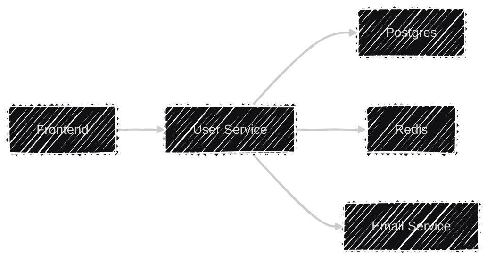

+++
title = "Log, Metrics and Tracing with Otel & Go"
outputs = ["Reveal"]
[logo]
src = "images/logo.svg"
diag = "90%"
width = "5%"
[reveal_hugo]
custom_theme = "stylesheets/reveal/catppuccin.css"
slide_number = true
auto_play_media = true
+++

# Observability Made Painless: Go, Otel & LGTM Stack

{}
- LGTM: Loki, Grafana, Tempo, Mimir
{}

---

## Introduction

- Haseeb Majid
  - Backend Software Engineer at [Nala](https://www.nala.com/)
  - https://haseebmajid.dev
- Loves cats 🐱
- Avid cricketer 🏏 #BazBall

---

## Who is this for?

- New to OpenTelemetry
- Instrument existing app

{}
{}

---

## What is Observability?

- What is going on with our app
- Is something wrong?

---

## What is Observability?

- Logs
- Traces
- Metrics

---

## Why Observability Matters?

- Provide context to issues
- Bottlenecks in the system

{}
- 53% of users abandon after 3s delay (Google)
{}

---

## What is OTel?

- OpenTelemetry
- Open Standard
  - Solves vendor lock-in

{}
- datadog
- jaeger
{}

---

## Why use OTel?

- Open Standard
  - Solves vendor lock-in
- Unify logs, metrics & traces

---



---

## Example service

```go{16-18|20-21|28-35}
package main

import (
	"encoding/json"
	"fmt"
	"log"
	"net/http"
	"time"
)

func main() {
    handler := &Handler{
        // ...
    }

    r := mux.NewRouter()
    r.HandleFunc("/user/{id}", h.userHandler)
    .Methods("GET")

    log.Println("Server starting on port 8080...")
    log.Fatal(http.ListenAndServe(":8080", r))
}

func (h *Handler) userHandler(
    w http.ResponseWriter,
    r *http.Request,
) {
    id := r.PathValue("id")
    // Validation logic ...

    // Interact with the DB.
    user := h.store.getUser(id)

    w.Header().Set("Content-Type", "application/json")
    json.NewEncoder(w).Encode(user)
}
```

---


---


---

## What is Tracing?

- Caused by a single action
- Components:
  - Services
  - DBs
  - Events

---

## Span

- Operation name
- Start and finish timestamp
- Attributes
  - key-value pairs

---

## Span (Cont..)

- A set of events
- Parent span ID
- Links to other spans
- Span context

---

## Span Context

```http
traceparent: 00-d4cda95b652f4a1592b449d5929fda1b-6e0c63257de34c92-01
tracestate: mycompany=true
```

---

```http
traceparent:
00-d4cda95b652f4a1592b449d5929fda1b-6e0c63257de34c92-01
tracestate: mycompany=true
```

```
trace-id: d4cda95b652f4a1592b449d5929fda1b
span-id: 6e0c63257de34c92
trace flags: 01
trace state: mycompany=true
```

---

## Span Links

- Connect two spans who are related but don't have a direct parent-child relationship.
- Useful in async/event-driven systems

---

## Span(s)

- Think of spans as a directed acylic graph (DAG) to each other

---


{}

{}

---

## Instrument traces

```bash
go get go.opentelemetry.io/otel \
go.opentelemetry.io/otel/trace \
go.opentelemetry.io/contrib/instrumentation/net/http/\
otelhttp \
go.opentelemetry.io/otel/exporters/otlp/otlptrace/\
otlptracehttp \
go.opentelemetry.io/otel/sdk/resource \
go.opentelemetry.io/otel/sdk/trace \
go.opentelemetry.io/otel/semconv/v1.26.0
```

---

```go{20-21|23-26|29-31|34-40|43}
package main

import (
	// ... existing imports ...
    "fmt"
	"context"
	"log"
	"os"
	"time"

	"go.opentelemetry.io/otel"
	"go.opentelemetry.io/otel/attribute"
	"go.opentelemetry.io/otel/exporters/otlp/otlptrace/otlptracehttp"
	"go.opentelemetry.io/otel/sdk/resource"
	sdktrace "go.opentelemetry.io/otel/sdk/trace"
	semconv "go.opentelemetry.io/otel/semconv/v1.26.0"
)


func newTracerProvider(ctx context.Context)
    (*trace.TracerProvider, error) {
    // Create OTLP exporter
    exporter, err := otlptracehttp.New(ctx)
    if err != nil {
        return nil, err
    }

    // Create trace provider
    tp := sdktrace.NewTracerProvider(
        sdktrace.WithBatcher(exporter),
    )

    // Set global tracer provider
    otel.SetTracerProvider(tp)
    otel.SetTextMapPropagator(
        propagation.NewCompositeTextMapPropagator(
            propagation.TraceContext{},
            propagation.Baggage{},
        )
    )

    // Return shutdown function
    return tp, nil
}
```

---

## Trace Context

```http
traceparent: 00-d4cda95b652f4a1592b449d5929fda1b-6e0c63257de34c92-01
tracestate: mycompany=true
```

---

## Baggage

```http
baggage: userId=12345,role=admin,region=us-east
```

---

```go{3|4|9-13}
func main() {
    ctx := context.Background()
    tp, err := newTracerProvider(ctx)
    defer tp.Shutdown(ctx)

    // Previous code ...

    // Add OpenTelemetry middleware
    r.Use(otelmux.Middleware("user-service"))

    r.HandleFunc("/user/{id}", h.userHandler)
     .Methods("GET")
    // Rest of the code ...
}
```

---

## ctx

```go
span := trace.SpanFromContext(ctx)
baggage := baggage.FromContext(ctx)
```

---

## Custom Trace

```go{3-4|7-9|12|14|16|18|22-26}
func getUser(ctx context.Context, userID string)
(*User, error) {
	ctx, span := otel.Tracer("user-service")
                     .Start(ctx, "getUser")
	defer span.End()

	span.SetAttributes(
        attribute.String("user.id", userID)
    )

	user, err := dbFetch(ctx, userID)
	if err != nil {
		if errors.Is(err, ErrNotFound) {
			span.SetStatus(codes.Error, "user not found")
		} else {
			span.SetStatus(codes.Error, "database error")
		}
		span.RecordError(err)
		return nil, err
	}

	if user.Premium {
		span.SetAttributes(
            attribute.Bool("user.premium", true)
        )
	}

	return user, nil
}
```

---

## Postgres

```bash
go get github.com/exaring/otelpgx
```

---

```go{6}
func NewPool(ctx context.Context, uri string) (*pgxpool.Pool, error) {
	pgxConfig, err := pgxpool.ParseConfig(uri)
	if err != nil {
		return nil, fmt.Errorf("failed to parse db URI: %w", err)
	}
	pgxConfig.ConnConfig.Tracer = otelpgx.NewTracer()

	pool, err := pgxpool.NewWithConfig(ctx, pgxConfig)
	if err != nil {
		return nil, fmt.Errorf("failed to setup database: %w", err)
	}

	return pool, err
}
```

---

## Redis

```bash
go get github.com/redis/go-redis/extra/redisotel/v9
```

---

```go{2|9}
func NewRedisClient(address string, retries int) (Client, error) {
    r := redis.NewClient(&redis.Options{
        Addr:       address,
        Password:   "",
        DB:         0,
        MaxRetries: retries,
    })

    err := redisotel.InstrumentTracing(r)
    if  err != nil {
        return Client{}, err
    }

    return Client{
        Redis:       r,
        Subscribers: map[string]*redis.PubSub{},
    }, nil
}
```

---

## HTTP Client

```bash
go get \
go.opentelemetry.io/contrib/instrumentation/net/http/\
otelhttp
```

---

```go{2|4|5-6|7-9|21-27|30}
func NewHTTPClient() *http.Client {
    transport := otelhttp.NewTransport(
        http.DefaultTransport,
        otelhttp.WithSpanNameFormatter(
        func(operation string, r *http.Request)
        string {
            return fmt.Sprintf("%s %s",
                        r.Method,
                        r.URL.Path,
            )
        }),
    )

    return &http.Client{
        Transport: transport,
        Timeout:   5 * time.Second,
    }
}

func (s *Service) callExternalAPI(ctx context.Context) {
    client := NewHTTPClient()
    req, _ := http.NewRequestWithContext(
        ctx,
        "GET",
        "https://api.example.com/data",
        nil,
    )

    // Trace context automatically injected!
    resp, err := client.Do(req)

    // ... handle response ...
}
```

---

## Kafka

```bash
go get github.com/twmb/franz-go \
     github.com/twmb/franz-go/plugin/kotel
```

---

```go{7-11|16|30|33-37|43-45}
import (
	"github.com/twmb/franz-go/pkg/kgo"
	"github.com/twmb/franz-go/plugin/kotel"
)

func NewKafkaClient(brokers []string, group string) (*kgo.Client, error) {
    tracer := kotel.NewTracer(
        kotel.WithTracerProvider(
            otel.GetTracerProvider(),
        ),
    )

    opts := []kgo.Opt{
        kgo.SeedBrokers(brokers...),
        kgo.ConsumerGroup(group),
        kgo.WithHooks(tracer.Hooks()),
    }

    opts = append(opts, kgo.WithProduceBatchInterceptor(
        kotel.NewProduceBatchInterceptor(tracer),
    )

    return kgo.NewClient(opts...)
}

func (s *Service) produceMessage(ctx context.Context, topic, msg string) {
    record := &kgo.Record{
        Topic: topic,
        Value: []byte(msg),
        Headers: []kgo.RecordHeader{},
    }

    s.kafkaClient.Produce(ctx, record,
        func(r *kgo.Record, err error) {
            // Do stuff ...
        }
    )
}

func (s *Service) consumeMessages(ctx context.Context) {
    for {
        fetches := s.kafkaClient.PollFetches(ctx)
        fetches.EachRecord(func(r *kgo.Record) {
            processMessage(ctx, r)
        })
    }
}
```


---

## Metrics

- Typically numerical data
 - state/behaviour
 - monitoring/alerting

---

## Metrics (Cont...)

- Time series data
 - collected over time
- Analyze trends/changes


{}
- visualise using Grafana
 - query using PromQL
{}

---


---


---

## Metric Types

- Counters: for tracking ever-increasing values
- Gauges: for measuring fluctuating values


{}
counter: total number of requests

guages: cpu usauge
{}

---

## Metric Types (Cont...)

- Histograms: for observing the distribution of values within predefined buckets.
- Summaries: for calculating quantiles (percentiles) of observed values.

{}
counter: total number of requests

guages: cpu usauge
{}

---

## Metric Model

- Name: A descriptive name like http_requests_total

- Labels: Key-value pairs that provide context

---

## Metric Model (Cont...)

- Timestamp: The time at which the data point was collected

- Value: The actual numerical value of the metric at that timestamp

---

## Install metrics

```bash
go get go.opentelemetry.io/otel/metric \
 go.opentelemetry.io/otel/sdk/metric \
 go.opentelemetry.io/otel/exporters/otlp/otlpmetric/\
 otlpmetrichttp
```

---

## Instrument metrics

```go{1-2|4-7|9-13|15-19|22-27|30-31}
func newMeterProvider(ctx context.Context)
    (*sdkmetric.MeterProvider, error) {

    exporter, err := otlpmetrichttp.New(ctx)
    if err != nil {
        return nil, err
    }

    mp := sdkmetric.NewMeterProvider(
        sdkmetric.WithReader(
            sdkmetric.NewPeriodicReader(exporter)
        ),
    )

    err = runtimeMetrics.Start(
        runtimeMetrics.WithMeterProvider(mp)
    )
    if  err != nil {
        return nil, err
    }

    err = hostMetrics.Start(
        hostMetrics.WithMeterProvider(mp)
    )
    if  err != nil {
        return nil, err
    }

    // Set global meter provider
    otel.SetMeterProvider(mp)
    return mp, nil
}
```

---

## Instrument metrics

```go{6-11}
func main() {
    ctx := context.Background()

    // Previous code ...

    // Setup meter
    mp, err := newMeterProvider(ctx)
    if err != nil {
        log.Fatalf("failed to setup meter: %v", err)
    }
    defer mp.Shutdown(ctx)

    // Rest of the code ...
}
```

---

## Middleware

```go{28-32|89-93}
package middleware

import (
	"net/http"
	"strings"
	"sync"
	"time"

	"go.opentelemetry.io/otel"
	"go.opentelemetry.io/otel/attribute"
	"go.opentelemetry.io/otel/metric"
	semconv "go.opentelemetry.io/otel/semconv/v1.26.0"
)

var (
	metricsOnce  sync.Once
	requestCount metric.Int64Counter
	latencyHist  metric.Float64Histogram
	requestSize  metric.Int64Histogram
	responseSize metric.Int64Histogram
)

func (m Middleware) Metrics(next http.Handler) http.Handler {
    metricsOnce.Do(func() {
        meter := otel.GetMeterProvider().Meter("http.metrics")

        var err error
        requestCount, err = meter.Int64Counter(
        "http.server.request_count",
        metric.WithUnit("1"),
        metric.WithDescription("Number of requests"),
        )
        if err != nil {
            otel.Handle(err)
        }

        latencyHist, err = meter.Float64Histogram(
            "http.server.duration",
            metric.WithUnit("ms"),
            metric.WithDescription("HTTP request duration"),
        )
        if err != nil {
            otel.Handle(err)
        }

        requestSize, err = meter.Int64Histogram(
            "http.server.request.size",
            metric.WithUnit("By"),
            metric.WithDescription("Request body size"),
        )
        if err != nil {
            otel.Handle(err)
        }

        responseSize, err = meter.Int64Histogram(
            "http.server.response.size",
            metric.WithUnit("By"),
            metric.WithDescription("Response body size"),
        )
        if err != nil {
            otel.Handle(err)
        }
    })

	return http.HandlerFunc(func(w http.ResponseWriter, r *http.Request) {
		path := r.URL.Path
		if strings.HasPrefix(path, "/static") || path == "/readiness" || path == "/health" {
			next.ServeHTTP(w, r)
			return
		}

		start := time.Now()
		ww := wrapResponseWriter(w)
		next.ServeHTTP(ww, r)

		duration := time.Since(start).Milliseconds()
		statusCode := ww.Status()
		if statusCode == 0 {
			statusCode = http.StatusOK
		}

		attrs := []attribute.KeyValue{
			semconv.HTTPRequestMethodKey.String(r.Method),
			semconv.HTTPResponseStatusCode(statusCode),
			semconv.HTTPRoute(r.URL.EscapedPath()),
		}

		ctx := r.Context()
		if requestCount != nil {
            requestCount.Add(ctx, 1,
                metric.WithAttributes(attrs...)
            )
		}
		if latencyHist != nil {
			latencyHist.Record(ctx, float64(duration), metric.WithAttributes(attrs...))
		}
		if requestSize != nil && r.ContentLength >= 0 {
			requestSize.Record(ctx, r.ContentLength, metric.WithAttributes(attrs...))
		}
		if responseSize != nil {
			responseSize.Record(ctx, int64(ww.size), metric.WithAttributes(attrs...))
		}
	})
}
```

---

## Logs


{}
- Debugging
- What happened
{}

---

> "If you didn't log it, it didn't happen"

---

## Why OTel & Logging?

- Context Propagation: Attach trace context to logs
- Correlation: Link logs directly to traces

---

## Why OTel & Logging (Cont...)?

- Unified Schema: Consistent attributes across signals
- Reduced Overhead: Single instrumentation pipeline

---

## Example Log

```json{5-6}
{
  "time": "2023-10-05T12:34:56Z",
  "level": "ERROR",
  "msg": "Failed to get user",
  "trace_id": "d4cda95b652f4a1592b449d5929fda1b",
  "span_id": "6e0c63257de34c92",
  "user_id": "12345",
  "service.name": "user-service",
  "error": "record not found"
}
```

---

## Instrument logs

```go{1-4|5-8|10-14|16-17}
func newLoggerProvider(
    ctx context.Context,
    logLevel minsev.Severity,
) (*log.LoggerProvider, error) {
    exporter, err := otlploghttp.New(ctx)
    if err != nil {
        return nil, err
    }

    p := log.NewBatchProcessor(exporter)
    processor := minsev.NewLogProcessor(p, logLevel)
    lp := log.NewLoggerProvider(
        log.WithProcessor(processor),
    )

    global.SetLoggerProvider(lp)
    return lp, nil
}
```

---

## Instrument logs


```go{6-11}
func main() {
    ctx := context.Background()

    // Previous code ...

    // Setup logger
    lp, err := newLoggerProvider(ctx)
    if err != nil {
        log.Fatalf("failed to setup lp: %v", err)
    }
    defer lp.Shutdown(ctx)

    // Rest of the code ...
}
```

---

## Instrument logs

```go{8-10|15-21|23|26-27}
package telemetry

import (
	"log/slog"
	"os"
	"time"

	"github.com/lmittmann/tint"
	slogmulti "github.com/samber/slog-multi"
	"go.opentelemetry.io/contrib/bridges/otelslog"
)

func NewLogger() *slog.Logger {
    var handler slog.Handler
    if os.Getenv("ENVIRONMENT") == "local" {
        stdoutHandler := tint.NewHandler(os.Stdout, &tint.Options{
            AddSource:  true,
            TimeFormat: time.Kitchen,
        })
        otelHandler := otelslog.NewHandler("user-service", otelslog.WithSource(true))
        handler = slogmulti.Fanout(stdoutHandler, otelHandler)
    } else {
        handler = otelslog.NewHandler("user-service", otelslog.WithSource(true))
    }

    logger := slog.New(handler)
    return logger
}
```

---


---


---

## Resources

- Attributes to include in all OTel data

---

## Resources

- Example: Container in k8s
  - process name
  - namespace
  - deployment name

---

```bash
OTEL_RESOURCE_ATTRIBUTES="service.namespace=
              tutorial,service.version=1.0"
```

---

## Resources

```go{|5-8}
res, err := resource.New(
    ctx,
    resource.WithHost(),
    resource.WithContainerID(),
    resource.WithAttributes(
        semconv.DeploymentEnvironmentKey.String(
            environment
        ),
        semconv.ServiceNameKey.String("user-service"),
    ),
)
```

---

```go
loggerProvider := log.NewLoggerProvider(
    log.WithProcessor(processor),
    log.WithResource(res),
)

meterProvider := metric.NewMeterProvider(
    metric.WithReader(reader),
    metric.WithResource(res)
)

traceProvider := trace.NewTracerProvider(
    trace.WithBatcher(traceExporter,
        trace.WithBatchTimeout(time.Second),
    ),
    trace.WithResource(res),
)
```

---

## semcov

- Semantic Convention
  - common attributes
  - collecting, producing and consuming

---

## semcov

```bash
http.user_agent
http.request_content_length
http.response_content_length
```

---

## LGTM Stack

- Loki: Logs
- Grafana: Visualisation
- Tempo: Traces
- Mimir: Metrics backend

---

## docker-compose.yml

```yaml{2-12||24-31|36-44|49-56|58-65|67-71}
services:
  alloy:
    image: grafana/alloy:v1.9.1
    profiles:
      - monitoring
    command:
      [
        "run",
        "--server.http.listen-addr=0.0.0.0:12345",
        "--storage.path=/var/lib/alloy/data",
        "/etc/alloy/config.alloy",
      ]
    ports:
      - 4317:4317
      - 4318:4318
      - 12345:12345
    volumes:
      - ./docker/config.alloy:/etc/alloy/config.alloy
    depends_on:
      - tempo
      - loki
      - mimir

  mimir:
    image: grafana/mimir:2.11.0
    profiles:
      - monitoring
    command:
      - "-auth.multitenancy-enabled=false"
      - "-auth.no-auth-tenant=anonymous"
      - "-config.file=/etc/mimir/config.yaml"
    volumes:
      - ./docker/mimir.yaml:/etc/mimir/config.yaml
      - mimir-data:/data

  grafana:
    image: grafana/grafana:11.6.1
    profiles:
      - monitoring
    ports:
      - 3000:3000
    environment:
      - GF_AUTH_ANONYMOUS_ENABLED=true
      - GF_AUTH_ANONYMOUS_ORG_ROLE=Admin
    volumes:
     - ./docker/grafana/datasources.yaml:/etc/grafana/provisioning/datasources/datasources.yml:ro
     - grafana-data:/var/lib/grafana

  tempo:
    image: grafana/tempo:2.7.2
    profiles:
      - monitoring
    command: ["-config.file=/etc/tempo.yaml"]
    volumes:
      - ./docker/tempo.yaml:/etc/tempo.yaml
      - tempo-data:/var/tempo

  loki:
    image: grafana/loki:3.5.0
    profiles:
      - monitoring
    command: ["-config.file=/etc/loki/loki-config.yaml"]
    volumes:
      - ./docker/loki.yaml:/etc/loki/loki-config.yaml
      - loki-data:/loki

volumes:
  grafana-data:
  mimir-data:
  tempo-data:
  loki-data:
```

---

## Tempo Config

```yaml{2-3|10}
server:
  http_listen_port: 3200
  grpc_listen_port: 9096

distributor:
  receivers:
    otlp:
      protocols:
        http:
          endpoint: "0.0.0.0:4318"

ingester:
  trace_idle_period: 1s
  max_block_duration: 1s
  flush_check_period: 1s
  lifecycler:
    address: 127.0.0.1
    ring:
      kvstore:
        store: inmemory
      replication_factor: 1
    min_ready_duration: 1s

storage:
  trace:
    backend: local
    wal:
      path: /var/tempo/wal
    local:
      path: /var/tempo/blocks
```

---

## Mimir Config

```yaml{43}
# Single-binary Mimir config
target: all
multitenancy_enabled: false

common:
  storage:
    backend: filesystem
    filesystem:
      dir: /data

blocks_storage:
  storage_prefix: blocks
  bucket_store:
    sync_dir: /data/tsdb-sync
  tsdb:
    dir: /data/tsdb

compactor:
  data_dir: /data/compactor
  sharding_ring:
    kvstore:
      store: inmemory

distributor:
  ring:
    instance_addr: 127.0.0.1
    kvstore:
      store: inmemory

ingester:
  ring:
    instance_addr: 127.0.0.1
    kvstore:
      store: inmemory
    replication_factor: 1

ruler_storage:
  backend: filesystem
  filesystem:
    dir: /data/rules

server:
  http_listen_port: 9009
  log_level: info

store_gateway:
  sharding_ring:
    replication_factor: 1

usage_stats:
  enabled: false
```

---

## Loki Config

```yaml{4-5}
auth_enabled: false

server:
  http_listen_port: 3100
  grpc_listen_port: 9096

common:
  instance_addr: 127.0.0.1
  path_prefix: /tmp/loki
  storage:
    filesystem:
      chunks_directory: /tmp/loki/chunks
      rules_directory: /tmp/loki/rules
  replication_factor: 1
  ring:
    kvstore:
      store: inmemory

query_range:
  results_cache:
    cache:
      embedded_cache:
        enabled: true
        max_size_mb: 100

schema_config:
  configs:
    - from: 2020-10-24
      store: tsdb
      object_store: filesystem
      schema: v13
      index:
        prefix: index_
        period: 24h

ruler:
  alertmanager_url: http://localhost:9093
```

---

## OTel collector

- observability pipelines
- convert between formats
  - export prometheus metrics

---

## Alloy

- UI
- Grafana stack

---


---

## config.alloy

```json{1-8|10-14|18-22|25-27|29-33|35-37|39-43|45-51}
otelcol.receiver.otlp "default" {
  grpc {
    endpoint = "0.0.0.0:4317"
  }

  http {
    endpoint = "0.0.0.0:4318"
  }

  output {
    metrics = [otelcol.processor.batch.default.input]
    logs    = [otelcol.processor.batch.default.input]
    traces  = [otelcol.processor.batch.default.input]
  }
}

otelcol.processor.batch "default" {
  output {
    metrics = [otelcol.exporter.prometheus.default.input]
    logs    = [otelcol.exporter.loki.default.input]
    traces  = [otelcol.exporter.otlp.default.input]
  }
}

otelcol.exporter.prometheus "default" {
  forward_to = [prometheus.remote_write.default.receiver]
}

prometheus.remote_write "default" {
  endpoint {
    url = "http://mimir:8080/api/v1/push"
  }
}

otelcol.exporter.loki "default" {
  forward_to = [loki.write.default.receiver]
}

loki.write "default" {
  endpoint {
    url = "http://loki:3100/loki/api/v1/push"
  }
}

otelcol.exporter.otlp "default" {
  client {
    endpoint = "tempo:4317"
    tls {
      insecure = true
    }
  }
}
```

---

## Setup Grafana

```yaml{3-7|9-14|16-21|22-28|30-36|37-45}
apiVersion: 1
datasources:
  - name: Prometheus
    uid: "prometheus"
    type: prometheus
    access: proxy
    url: http://mimir:9009/prometheus
    isDefault: true
    jsonData:
      httpMethod: POST
      exemplarTraceIdDestinations:
        - name: trace_id
          datasourceUid: "tempo"
          url: '${__value.raw}'

  - name: Loki
    uid: "loki"
    type: loki
    access: proxy
    url: http://loki:3100
    isDefault: false
    jsonData:
      derivedFields:
        - name: "🔍 View Trace"
          matcherRegex: '"traceid":\s*"([0-9a-f]{32})"'
          url: '$${__value.raw}'
          datasourceUid: "tempo"
          matcherType: regex

  - name: Tempo
    uid: "tempo"
    type: tempo
    access: proxy
    url: http://tempo:3200
    isDefault: false
    jsonData:
      nodeGraph:
        enabled: true
      tracesToLogs:
        datasourceUid: "loki"
        spanStartTimeShift: '-5m'
        spanEndTimeShift: '5m'
        filterByTraceID: true
      tracesToMetrics:
        datasourceUid: "prometheus"
```

---

## Viewing an error


---

## Viewing an error


---


---

## Logs -> Traces

- Derived Values
- Link: http://localhost:3000/connections/datasources/edit/loki

---

## Logs -> Traces


---

## Metrics -> Traces

- Exemplar
- Link: http://localhost:3000/connections/datasources/edit/prometheus

---


---

## Exemplars

Otel context to a metric event -> connect to a trace signal

---

## Exemplar Modal

- (optional) The trace associated with a recording (trace_id, span_id)

- The time of the observation (time_unix_nano)

---

## Exemplar Modal (Cont...)

- The recorded value (value)
- A set of filtered attributes (filtered_attributes)
  - additional insight into the Context

---

## OTLP Export

```json
metrics {
  name: "http_request_duration_seconds"
  histogram {
    data_points {
      buckets {
        count: 12
        exemplars {
          value: 0.382
          time_unix_nano: 1678901234000000000
          // Base64-encoded span ID
          span_id: "APBnoLoJArc="
          // Base64-encoded trace ID
          trace_id: "S/kyNXezTaajzpKdDg5HNg=="
        }
      }
      explicit_bounds: [0.5, 1, 2]
    }
  }
}
```

---

## Traces -> Logs

- trace to logs
- trace to metrics
- Link: http://localhost:3000/connections/datasources/edit/tempo

---

## Traces -> Logs


---

## Logging

- over logging
- logging PII
  - PII: Personally Identifiable Information
- log levels
  - print
  - error

---

## Lessons learnt

- Indexing
  - Over: Storage
  - Under: Slow queries

---

## Tracing

- avoid PII
- Sampling
    - cost
      - $0.50 per GB

---

## Lessons learnt

- trace-first approach

---

## Metrics

- High cardinality
  - 1 unique label value = 1 new time series
- Counter resets to 0

---


https://haseebmajid.dev/slides/gophercon-otel/
