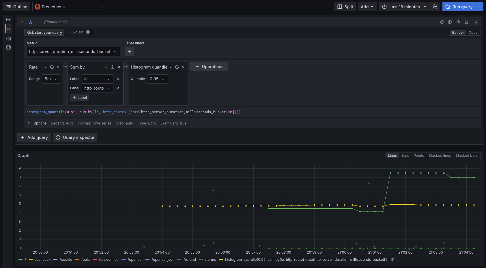

+++
title = "Log, Metrics and Tracing with OTel & Go"
outputs = ["Reveal"]
[logo]
src = "images/logo.svg"
diag = "90%"
width = "5%"
[reveal_hugo]
custom_theme = "stylesheets/reveal/catppuccin.css"
slide_number = true
auto_play_media = true
+++

# Observability Made Painless: Go, OTel & LGTM Stack

{}
- LGTM: Loki, Grafana, Tempo, Mimir
{}

---

{}

## Introduction

- Haseeb Majid
  - Backend Software Engineer at [Nala](https://www.nala.com/)
  - https://haseebmajid.dev
- Loves cats 🐱
- Avid cricketer 🏏 #BazBall

---

## Who is this for?

- New to OpenTelemetry
- Instrument an existing app

{}
- Add observability signals
- Not covering PromQL
{}

{}

---

{}

## What is Observability?

- What is going on with our app
- Is something wrong?

---

## What is Observability?

- Logs
- Traces
- Metrics


{}
Logs:
 - Lots of context when something goes wrong
 - Append only, detailed

Metrics:
 - aggregating numerical data
 - omitting detailed context

Traces:
 - See every element of an event
 - Holistic view of the system
 - Sample
{}


---


---

## Pizza Shop

{}Logs: "Order #123: Large veggie pizza burned at 8:05 PM due to oven failure."{}
{}Traces: "Order #123 took 30 mins: 5 mins prep → 20 mins cooking (delay) → 5 mins delivery."{}
{}Metrics: "We sold 50 pizzas/hour (avg cook time: 8 mins)."{}

----


---

## Why Observability Matters?

- Provide context to issues
- Bottlenecks in the system

{}
- How many have dealt with 3AM production issues with no visibility?
- 53% of users abandon after 3s delay (Google)
{}

---


---

## What is OTel?

- OpenTelemetry
- Open Standard
  - Solves vendor lock-in

{}
- datadog
- jaeger
- raise your hand if you say otel or ohhtel?

{}

---

## Why use OTel?

- Open Standard
- Unify logs, metrics & traces

---

> "Only half of programming is coding. The other 90% is debugging" - Anonymous

---



{}

---

{}

## What is Tracing?

- Caused by a single action
- Components:
  - Services
  - DBs
  - Events

---

## Span

- Operation name
- Start and finish timestamp
- Span context
- Attributes

{}
- Unit of work
- building blocks of traces
- never creating a trace
- linking spans with a trace id
{}

---

## Span (Cont...)

- A set of events
- Parent span ID
- Links to other spans
- Span Status

---

## Span Context

```http
traceparent: 00-d4cda95b652f4a1592b449d5929fda1b-6e0c63257de34c92-01
tracestate: mycompany=true
```

{}
a list of key-value pairs that can carry vendor-specific trace information
{}


---

```http
traceparent:
00-d4cda95b652f4a1592b449d5929fda1b-6e0c63257de34c92-01
```

```http
trace-id: d4cda95b652f4a1592b449d5929fda1b
span-id: 6e0c63257de34c92
trace flags: 01
```

---

## Span Links

- Connect two spans
    - event-driven systems


{}
- who are related but don't have a direct parent-child relationship.
- Cannot predict when subsequent operation will start
{}

---

## Span Events

- Denote point in time
- Page becomes interactive


{}
- Attribute vs Event (Timestamp)
{}

---

## Span Kind

- One of:
  - Client, Server, Internal, Producer, or Consumer
- Default is internal
- Producer -> Consumer
- Client -> Server

---


---


---


---

## Example service

```go{16-17|19-20|27-34}
package main

import (
	"encoding/json"
	"fmt"
	"log"
	"net/http"
	"time"
)

func main() {
    h := &Handler{
        // ...
    }

    mux := http.NewServeMux()
    mux.HandleFunc("GET /user/{id}", h.userHandler)

    log.Println("Server starting on port 8080...")
    log.Fatal(http.ListenAndServe(":8080", mux))
}

func (h *Handler) userHandler(
    w http.ResponseWriter,
    r *http.Request,
) {
    id := r.PathValue("id")
    // Validation logic ...

    // Interact with the DB.
    user := h.store.getUser(id)

    w.Header().Set("Content-Type", "application/json")
    json.NewEncoder(w).Encode(user)
}
```

---

## Install traces

```bash
go get go.opentelemetry.io/otel \
go.opentelemetry.io/otel/trace \
go.opentelemetry.io/contrib/instrumentation/net/http/\
otelhttp \
go.opentelemetry.io/otel/exporters/otlp/otlptrace/\
otlptracehttp \
go.opentelemetry.io/otel/sdk/resource \
go.opentelemetry.io/otel/sdk/trace \
go.opentelemetry.io/otel/semconv/v1.26.0
```

{}
- Download go modules
{}

---

```bash
OTEL_EXPORTER_OTLP_ENDPOINT="http://localhost:4318"
```

---

```go{21-22|24-27|30-32|35|36-41|43}
package main

import (
	// ... existing imports ...
    "fmt"
	"context"
	"log"
	"os"
	"time"

	"go.opentelemetry.io/otel"
	"go.opentelemetry.io/otel/attribute"
	"go.opentelemetry.io/otel/exporters/otlp/otlptrace/otlptracehttp"
	"go.opentelemetry.io/otel/propagation"
	"go.opentelemetry.io/otel/sdk/resource"
	sdktrace "go.opentelemetry.io/otel/sdk/trace"
	semconv "go.opentelemetry.io/otel/semconv/v1.26.0"
)


func newTracerProvider(ctx context.Context)
    (*sdktrace.TracerProvider, error) {
    // Create OTLP exporter
    exporter, err := otlptracehttp.New(ctx)
    if err != nil {
        return nil, err
    }

    // Create trace provider
    tp := sdktrace.NewTracerProvider(
        sdktrace.WithBatcher(exporter),
    )

    // Set global tracer provider
    otel.SetTracerProvider(tp)
    otel.SetTextMapPropagator(
        propagation.NewCompositeTextMapPropagator(
            propagation.TraceContext{},
        )
    )

    // Return shutdown function
    return tp, nil
}
```


{}
- Propagation is the mechanism that moves context between services and processes.
- W3C Trace Context
- Baggage
{}


---

## Trace Context

```http
traceparent: 00-d4cda95b652f4a1592b449d5929fda1b-6e0c63257de34c92-01
tracestate: mycompany=true
```


{}
- Third party HTTP APIs
{}


---

```go{3|4-7|12-20|22}
func main() {
    ctx := context.Background()
    tp, err := newTracerProvider(ctx)
    if err != nil {
        log.Fatalf("failed to setup tracer: %v", err)
    }
    defer tp.Shutdown(ctx)

    // Previous code ...

    // Add OpenTelemetry middleware
	m := otelhttp.NewMiddleware("user-service",
        otelhttp.WithSpanNameFormatter(
        func(operation string, r *http.Request) string {
            return fmt.Sprintf("%s %s",
                    r.Method,
                    r.URL.Path,
            )
        }),
    ),

    log.Fatal(http.ListenAndServe(":8080", m(mux)))

}
```

---

## ctx

```go{1|6|7-8}
func (h *Handler) userHandler(
    w http.ResponseWriter,
    r *http.Request,
) {

    ctx := r.Context()
    span := trace.SpanFromContext(ctx)
    baggage := baggage.FromContext(ctx)
}
```

---

## Custom Trace

```go{2-3|5|8|9-11|14-16}
func getUser(ctx context.Context, userID string) (*User, error) {
	ctx, span := otel.Tracer("user-service")
                     .Start(ctx, "getUser")
	defer span.End()
	span.SetAttributes(attribute.String("user.id", userID))

	user, err := dbFetch(ctx, userID)
	if err != nil {
		span.SetStatus(codes.Error, "database error")
		span.RecordError(err)
		return nil, err
	}

	if user.Premium {
		span.SetAttributes(attribute.Bool("user.premium", true))
	}
	return user, nil
}
```

---

## Trace JSON

```json{|3-6|7|10-12|13-21}
{
  "name": "hello",
  "context": {
    "trace_id": "5b8aa5a2d2c872e8321cf37308d69df2",
    "span_id": "051581bf3cb55c13"
  },
  "parent_id": null,
  "start_time": "2022-04-29T18:52:58.114201Z",
  "end_time": "2022-04-29T18:52:58.114687Z",
  "attributes": {
    "http.route": "some_route1"
  },
  "events": [
    {
      "name": "Guten Tag!",
      "timestamp": "2022-04-29T18:52:58.114561Z",
      "attributes": {
        "event_attributes": 1
      }
    }
  ]
}
```

---

## Postgres

```bash
go get github.com/exaring/otelpgx
```

---

```go{6}
func NewPool(ctx context.Context, uri string) (*pgxpool.Pool, error) {
	pgxConfig, err := pgxpool.ParseConfig(uri)
	if err != nil {
		return nil, fmt.Errorf("failed to parse db URI: %w", err)
	}
	pgxConfig.ConnConfig.Tracer = otelpgx.NewTracer()

	pool, err := pgxpool.NewWithConfig(ctx, pgxConfig)
	if err != nil {
		return nil, fmt.Errorf("failed to setup database: %w", err)
	}

	return pool, err
}
```

---


---

## Redis

```bash
go get github.com/redis/go-redis/extra/redisotel/v9
```

---

```go{2|9}
func NewRedisClient(address string, retries int) (Client, error) {
    r := redis.NewClient(&redis.Options{
        Addr:       address,
        Password:   "",
        DB:         0,
        MaxRetries: retries,
    })

    err := redisotel.InstrumentTracing(r)
    if  err != nil {
        return Client{}, err
    }

    return Client{
        Redis:       r,
        Subscribers: map[string]*redis.PubSub{},
    }, nil
}
```

---


---

## HTTP Client

```bash
go get \
go.opentelemetry.io/contrib/instrumentation/net/http/\
otelhttp
```

---

```go{2|4|5-6|7-12|10-11|22|23-29|31}
func NewHTTPClient() *http.Client {
    transport := otelhttp.NewTransport(
        http.DefaultTransport,
        otelhttp.WithSpanNameFormatter(
        func(operation string, r *http.Request)
        string {
            return fmt.Sprintf("%s %s",
                r.Method,
                // INFO: From /user/123 -> /user/id
                sanitizePath(r.URL.Path),
            )
        }),
    )

    return &http.Client{
        Transport: transport,
        Timeout:   5 * time.Second,
    }
}

func (s *Service) callExternalAPI(ctx context.Context) {
    client := NewHTTPClient()
    req, _ := http.NewRequestWithContext(
        ctx,
        "GET",
        "https://api.example.com/data",
        nil,
    )

    // Trace context automatically injected!
    resp, err := client.Do(req)

    // ... handle response ...
}
```

---

## Kafka

```bash
go get github.com/twmb/franz-go \
     github.com/twmb/franz-go/plugin/kotel
```

---

```go{7-11|16|30|33-37|43-45}
import (
	"github.com/twmb/franz-go/pkg/kgo"
	"github.com/twmb/franz-go/plugin/kotel"
)

func NewKafkaClient(brokers []string, group string) (*kgo.Client, error) {
    tracer := kotel.NewTracer(
        kotel.WithTracerProvider(
            otel.GetTracerProvider(),
        ),
    )

    opts := []kgo.Opt{
        kgo.SeedBrokers(brokers...),
        kgo.ConsumerGroup(group),
        kgo.WithHooks(tracer.Hooks()),
    }

    opts = append(opts, kgo.WithProduceBatchInterceptor(
        kotel.NewProduceBatchInterceptor(tracer),
    ))

    return kgo.NewClient(opts...)
}

func (s *Service) produceMessage(ctx context.Context, topic, msg string) {
    record := &kgo.Record{
        Topic: topic,
        Value: []byte(msg),
        Headers: []kgo.RecordHeader{},
    }

    s.kafkaClient.Produce(ctx, record,
        func(r *kgo.Record, err error) {
            // Do stuff ...
        }
    )
}

func (s *Service) consumeMessages(ctx context.Context) {
    for {
        fetches := s.kafkaClient.PollFetches(ctx)
        fetches.EachRecord(func(r *kgo.Record) {
            processMessage(ctx, r)
        })
    }
}
```

---


---


---

## Sampling

- Head vs Tail

{}
- Consider if most requests are successful, healthy with little variation
- Tail sampling implementation
  - must be stateful keep in memory
{}


{}

---

{}

## Metrics

- Numerical Data
  - Low Context
  - Fast to query
- Time series data

{}
- visualise using Grafana
 - query using PromQL
{}

---

## Metric Types

- Counter: for tracking ever-increasing values
- Gauge: for measuring fluctuating values


{}
counter: total number of requests, will never decrease 1000 -> 999

gauges: cpu usauge
{}

---

## Metric Types (Cont...)

- Histogram: for observing the distribution of values within predefined buckets.
- UpDownCounter: for values that go up and down

{}
histogram: distribution of values

up down counter: like queue size (how much did it change)

async versions of these:
  - connection pools
  - periodic sampling
  - expensive to compute
{}

---

## Metric Model

- Name: A descriptive name like http.server.request_count
- Attributes: Key-value pairs that provide context

---

## Metric Model (Cont...)

- Timestamp: The time at which the data point was collected
- Value: The actual numerical value of the metric at that timestamp

---

## Install metrics

```bash
go get go.opentelemetry.io/otel/metric \
go.opentelemetry.io/otel/sdk/metric \
go.opentelemetry.io/otel/exporters/otlp/ \
otlpmetric/otlpmetrichttp \
go.opentelemetry.io/contrib/instrumentation/runtime \
go.opentelemetry.io/contrib/instrumentation/host
```

---

## Instrument metrics

```go{1-2|4-7|9-13|15-19|22-27|30-31}
func newMeterProvider(ctx context.Context)
    (*sdkmetric.MeterProvider, error) {

    exporter, err := otlpmetrichttp.New(ctx)
    if err != nil {
        return nil, err
    }

    mp := sdkmetric.NewMeterProvider(
        sdkmetric.WithReader(
            sdkmetric.NewPeriodicReader(exporter)
        ),
    )

    err = runtimeMetrics.Start(
        runtimeMetrics.WithMeterProvider(mp)
    )
    if  err != nil {
        return nil, err
    }

    err = hostMetrics.Start(
        hostMetrics.WithMeterProvider(mp)
    )
    if  err != nil {
        return nil, err
    }

    // Set global meter provider
    otel.SetMeterProvider(mp)
    return mp, nil
}
```


---

## Instrument metrics


```go{6-11}
func main() {
    ctx := context.Background()

    // Previous code ...

    // Setup meter
    mp, err := newMeterProvider(ctx)
    if err != nil {
        log.Fatalf("failed to setup meter: %v", err)
    }
    defer mp.Shutdown(ctx)

    // Rest of the code ...
}
```


---

## Middleware

```go{28-32|82-86|89-93}
package middleware

import (
	"net/http"
	"strings"
	"sync"
	"time"

	"go.opentelemetry.io/otel"
	"go.opentelemetry.io/otel/attribute"
	"go.opentelemetry.io/otel/metric"
	semconv "go.opentelemetry.io/otel/semconv/v1.26.0"
)

var (
	metricsOnce  sync.Once
	requestCount metric.Int64Counter
	latencyHist  metric.Float64Histogram
	requestSize  metric.Int64Histogram
	responseSize metric.Int64Histogram
)

func Metrics(next http.Handler) http.Handler {
    metricsOnce.Do(func() {
        meter := otel.GetMeterProvider().Meter("http.metrics")

        var err error
        requestCount, err = meter.Int64Counter(
        "http.server.request_count",
        metric.WithUnit("1"),
        metric.WithDescription("Number of requests"),
        )
        if err != nil {
            otel.Handle(err)
        }

        latencyHist, err = meter.Float64Histogram(
            "http.server.duration",
            metric.WithUnit("ms"),
            metric.WithDescription("HTTP request duration"),
        )
        if err != nil {
            otel.Handle(err)
        }

        requestSize, err = meter.Int64Histogram(
            "http.server.request.size",
            metric.WithUnit("By"),
            metric.WithDescription("Request body size"),
        )
        if err != nil {
            otel.Handle(err)
        }

        responseSize, err = meter.Int64Histogram(
            "http.server.response.size",
            metric.WithUnit("By"),
            metric.WithDescription("Response body size"),
        )
        if err != nil {
            otel.Handle(err)
        }
    })

	return http.HandlerFunc(func(w http.ResponseWriter, r *http.Request) {
		path := r.URL.Path
		if strings.HasPrefix(path, "/static") || path == "/readiness" || path == "/health" {
			next.ServeHTTP(w, r)
			return
		}

		start := time.Now()
		ww := wrapResponseWriter(w)
		next.ServeHTTP(ww, r)

		duration := time.Since(start).Milliseconds()
		statusCode := ww.Status()
		if statusCode == 0 {
			statusCode = http.StatusOK
		}

		attrs := []attribute.KeyValue{
			semconv.HTTPRequestMethodKey.String(r.Method),
			semconv.HTTPResponseStatusCode(statusCode),
			semconv.HTTPRoute(r.URL.EscapedPath()),
		}

		ctx := r.Context()
		if requestCount != nil {
            requestCount.Add(ctx, 1,
                metric.WithAttributes(attrs...)
            )
		}
		if latencyHist != nil {
			latencyHist.Record(ctx, float64(duration), metric.WithAttributes(attrs...))
		}
		if requestSize != nil && r.ContentLength >= 0 {
			requestSize.Record(ctx, r.ContentLength, metric.WithAttributes(attrs...))
		}
		if responseSize != nil {
			responseSize.Record(ctx, int64(ww.size), metric.WithAttributes(attrs...))
		}
	})
}
```

---

## High Cardinality

```go{1-10|12-13}
requestCounter.Add(ctx, 1, metric.WithAttributes(
    // 1M possible values
    attribute.String("user_id", "user_12345"),
    // 100 endpoints
    attribute.String("endpoint", "/api/users"),
    // 5 methods
    attribute.String("method", "GET"),
    // 20 status codes
    attribute.String("status", "200"),
))

// Total time series = 1M × 100 × 5 × 20
// = 10 BILLION time series! 💥
```

{}
Each time series stores:

• Metadata: Label names and values
• Data points: Timestamp + value pairs over time
• Indexes: For fast querying

1 time series ≈ 1-2KB metadata + data points over time
10 billion time series ≈ 10-20TB just for metadata
Plus historical data points = 100TB+ easily
{}

---



{}
100 requests sorted by response time:
[10ms, 15ms, 20ms, ..., 180ms, 200ms, 250ms, 300ms, 500ms]
                                    ↑
                                  P95 ≈ 250ms

• 95% of requests were faster than this value
• 5% of requests were slower than this value
{}

---


{}
150 ms average is great:
- 90% under 100ms
- 5% over 500ms

Visualise to see it
{}

---


---


{}

---

{}


---

## Logs

{}
- Debugging
- What happened
{}


---

## Why OTel & Logging?

- Context Propagation: Attach trace context to logs
- Correlation: Link logs directly to traces

---

## Why OTel & Logging (Cont...)?

- Unified Schema: Consistent attributes across signals
- Reduced Overhead: Single instrumentation pipeline

---

## Example Log

```json{5-6}
{
  "time": "2023-10-05T12:34:56Z",
  "level": "ERROR",
  "msg": "Failed to get user",
  "trace_id": "d4cda95b652f4a1592b449d5929fda1b",
  "span_id": "6e0c63257de34c92",
  "user_id": "12345",
  "service.name": "user-service",
  "error": "record not found"
}
```

---

## Install logs

```bash
go get go.opentelemetry.io/otel/log \
 go.opentelemetry.io/otel/log/global \
 go.opentelemetry.io/otel/sdk/log \
 go.opentelemetry.io/otel/exporters/otlp/ \
 otlplog/otlploghttp \
 go.opentelemetry.io/contrib/bridges/otelslog \
 github.com/lmittmann/tint \
 github.com/samber/slog-multi
```

---


## Instrument logs

```go{1-4|5-8|10-14|16-17}
func newLoggerProvider(
    ctx context.Context,
    logLevel minsev.Severity,
) (*log.LoggerProvider, error) {
    exporter, err := otlploghttp.New(ctx)
    if err != nil {
        return nil, err
    }

    p := log.NewBatchProcessor(exporter)
    processor := minsev.NewLogProcessor(p, logLevel)
    lp := log.NewLoggerProvider(
        log.WithProcessor(processor),
    )

    global.SetLoggerProvider(lp)
    return lp, nil
}
```

{}
- global is part of the otel library
{}

---

## Instrument logs

```go{6-11}
func main() {
    ctx := context.Background()

    // Previous code ...

    // Setup logger
    lp, err := newLoggerProvider(ctx)
    if err != nil {
        log.Fatalf("failed to setup lp: %v", err)
    }
    defer lp.Shutdown(ctx)

    // Rest of the code ...
}
```

---

## Instrument logs

```go{15|16-21|22-25|26-29|31-34|37-38}
package telemetry

import (
	"log/slog"
	"os"
	"time"

	"github.com/lmittmann/tint"
	slogmulti "github.com/samber/slog-multi"
	"go.opentelemetry.io/contrib/bridges/otelslog"
)

func NewLogger() *slog.Logger {
    var handler slog.Handler
    if os.Getenv("ENVIRONMENT") == "local" {
        stdoutHandler := tint.NewHandler(os.Stdout,
            &tint.Options{
                AddSource:  true,
                TimeFormat: time.Kitchen,
            }
        )
        otelHandler := otelslog.NewHandler(
            "user-service",
            otelslog.WithSource(true),
        )
        handler = slogmulti.Fanout(
            stdoutHandler,
            otelHandler,
        )
    } else {
        handler = otelslog.NewHandler(
            "user-service",
            otelslog.WithSource(true),
        )
    }

    logger := slog.New(handler)
    return logger
}
```

---

```go
logger.InfoContext(
    ctx,
    "starting server",
    slog.String("host", conf.Server.Host),
    slog.Int("port", conf.Server.Port)
)
```

---

```json
{
  "time": "2023-10-05T12:34:56Z",
  "level": "INFO",
  "msg": "starting server",
  "trace_id": "d4cda95b652f4a1592b449d5929fda1b",
  "span_id": "6e0c63257de34c92",
  "host": "localhost",
  "port": 8080
}
```

---


---


{}

---

{}

|                                        |          |                                                                      |
|----------------------------------------|----------|----------------------------------------------------------------------|
| **How many errors occurred?**          | Metrics  | Aggregate counts needed for alerting                                 |
| **Why did request ID:123 fail?**       | Logs     | Requires detailed error context (stack trace, inputs)                |
| **Is latency increasing system-wide?** | Metrics  | Track percentiles (P95/P99) across all requests                      |

---

|                                        |          |                                                                      |
|----------------------------------------|----------|----------------------------------------------------------------------|
| **Where is the bottleneck?**           | Traces   | Breakdown of time spent across services                              |
| **Why did payment TX-456 timeout?**    | Traces   | Follow call path: Gateway → Auth → Payment → DB                      |
| **Why did login for user@x fail?**     | Logs     | Authentication details (wrong password? locked account?)             |

---

## Resources

- Attributes to include in all OTel data
- Describe the "source" of the telemetry data
  - service name
  - instance id

---

## Resources

- Example: Container in k8s
  - process name
  - namespace
  - deployment name

---

```bash
OTEL_RESOURCE_ATTRIBUTES="service.namespace=
              tutorial,service.version=1.0"
```

---

## Resources

```go{|5-10}
res, err := resource.New(
    ctx,
    resource.WithHost(),
    resource.WithContainerID(),
    resource.WithAttributes(
        semconv.DeploymentEnvironmentKey.String(
            environment
        ),
        semconv.ServiceNameKey.String("user-service"),
    ),
)
```

---

```go{3|8|15}
loggerProvider := log.NewLoggerProvider(
    log.WithProcessor(processor),
    log.WithResource(res),
)

meterProvider := metric.NewMeterProvider(
    metric.WithReader(reader),
    metric.WithResource(res)
)

traceProvider := trace.NewTracerProvider(
    trace.WithBatcher(traceExporter,
        trace.WithBatchTimeout(time.Second),
    ),
    trace.WithResource(res),
)
```

---

## semconv

- Semantic Convention
- Common attributes
  - Across languages and tools

---

```go
attrs := []attribute.KeyValue{
    semconv.HTTPRequestMethodKey.String(r.Method),
    semconv.HTTPResponseStatusCode(statusCode),
    semconv.HTTPRoute(r.URL.EscapedPath()),
}
```

---

```go
http.request.method
http.response.status_code
http.route
```

---

## Anti-Patterns

- Emitting a log for every HTTP request (use metrics instead).
- Trying to capture a user ID in a metric (use logs/traces).
- Logs without TraceId (use OTel context propagation).

{}

---

{}

## LGTM Stack

- Loki: Logs
- Grafana: Visualisation
- Tempo: Traces
- Mimir: Metrics

---


---

## docker-compose.yml

```yaml{2-12|13-23|24-34|36-47|49-56|58-65|67-71}
services:
  alloy:
    image: grafana/alloy:v1.9.1
    profiles:
      - monitoring
    command:
      [
        "run",
        "--server.http.listen-addr=0.0.0.0:12345",
        "--storage.path=/var/lib/alloy/data",
        "/etc/alloy/config.alloy",
      ]
    ports:
      - 4317:4317
      - 4318:4318
      - 12345:12345
    volumes:
      - ./docker/config.alloy:/etc/alloy/config.alloy
    depends_on:
      - tempo
      - loki
      - mimir

  mimir:
    image: grafana/mimir:2.11.0
    profiles:
      - monitoring
    command:
      - "-auth.multitenancy-enabled=false"
      - "-auth.no-auth-tenant=anonymous"
      - "-config.file=/etc/mimir/config.yaml"
    volumes:
      - ./docker/mimir.yaml:/etc/mimir/config.yaml
      - mimir-data:/data

  grafana:
    image: grafana/grafana:11.6.1
    profiles:
      - monitoring
    ports:
      - 3000:3000
    environment:
      - GF_AUTH_ANONYMOUS_ENABLED=true
      - GF_AUTH_ANONYMOUS_ORG_ROLE=Admin
    volumes:
     - ./docker/grafana/datasources.yaml:/etc/grafana/provisioning/datasources/datasources.yml:ro
     - grafana-data:/var/lib/grafana

  tempo:
    image: grafana/tempo:2.7.2
    profiles:
      - monitoring
    command: ["-config.file=/etc/tempo.yaml"]
    volumes:
      - ./docker/tempo.yaml:/etc/tempo.yaml
      - tempo-data:/var/tempo

  loki:
    image: grafana/loki:3.5.0
    profiles:
      - monitoring
    command: ["-config.file=/etc/loki/loki-config.yaml"]
    volumes:
      - ./docker/loki.yaml:/etc/loki/loki-config.yaml
      - loki-data:/loki

volumes:
  grafana-data:
  mimir-data:
  tempo-data:
  loki-data:
```

---


---

## Alloy


{}
- Easier to integrate with kubernetes (no controllers)
-
{}

---

## Setup Grafana

```yaml{3-7|9-14|16-21|22-28|30-36|37-45}
apiVersion: 1
datasources:
  - name: Prometheus
    uid: "prometheus"
    type: prometheus
    access: proxy
    url: http://mimir:9009/prometheus
    isDefault: true
    jsonData:
      httpMethod: POST
      exemplarTraceIdDestinations:
        - name: trace_id
          datasourceUid: "tempo"
          url: '${__value.raw}'

  - name: Loki
    uid: "loki"
    type: loki
    access: proxy
    url: http://loki:3100
    isDefault: false
    jsonData:
      derivedFields:
        - name: "🔍 View Trace"
          matcherRegex: '"traceid":\s*"([0-9a-f]{32})"'
          url: '$${__value.raw}'
          datasourceUid: "tempo"
          matcherType: regex

  - name: Tempo
    uid: "tempo"
    type: tempo
    access: proxy
    url: http://tempo:3200
    isDefault: false
    jsonData:
      nodeGraph:
        enabled: true
      tracesToLogs:
        datasourceUid: "loki"
        spanStartTimeShift: '-5m'
        spanEndTimeShift: '5m'
        filterByTraceID: true
      tracesToMetrics:
        datasourceUid: "prometheus"
```

{}

---

{}

## Logs


---

## Metrics


---

## Exemplars

- OTel context to a metric
  - Connect to a trace

---

## Exemplar Modal

- The trace context
- The time of the observation

---

## Exemplar Modal (Cont...)

- The recorded value
- A set of filtered attributes
  - additional insight into the Context

---

## OTLP Export

```json{4-13|10-13|16}
metrics {
  name: "http_request_duration_seconds"
  histogram {
    data_points {
      buckets {
        count: 12
        exemplars {
          value: 0.382
          time_unix_nano: 1678901234000000000
          // Base64-encoded span ID
          span_id: "APBnoLoJArc="
          // Base64-encoded trace ID
          trace_id: "S/kyNXezTaajzpKdDg5HNg=="
        }
      }
      explicit_bounds: [0.5, 1, 2]
    }
  }
}
```

---

## Traces


---

## Viewing an error


---


---


---


---


---


Slides: https://haseebmajid.dev/slides/gophercon-otel/

Example Service: https://gitlab.com/hmajid2301/banterbus

---

## Useful Links

- Observability vs Monitoring: https://www.youtube.com/watch?v=ytx6jr2TyxI
- OpenTelemetry Collector - Explanation & Setup: https://www.youtube.com/watch?v=4ACQhkJBKyA
- Sick of Digging Through Logs? Find Errors FAST with OpenTelemetry and Go!: https://www.youtube.com/watch?v=gOag7kWHJ5c

---

- OTel Metrics Spec: https://opentelemetry.io/docs/specs/otel/metrics/
- Traces vs Spans: https://www.youtube.com/watch?v=A-nbuPugjxo

{}
