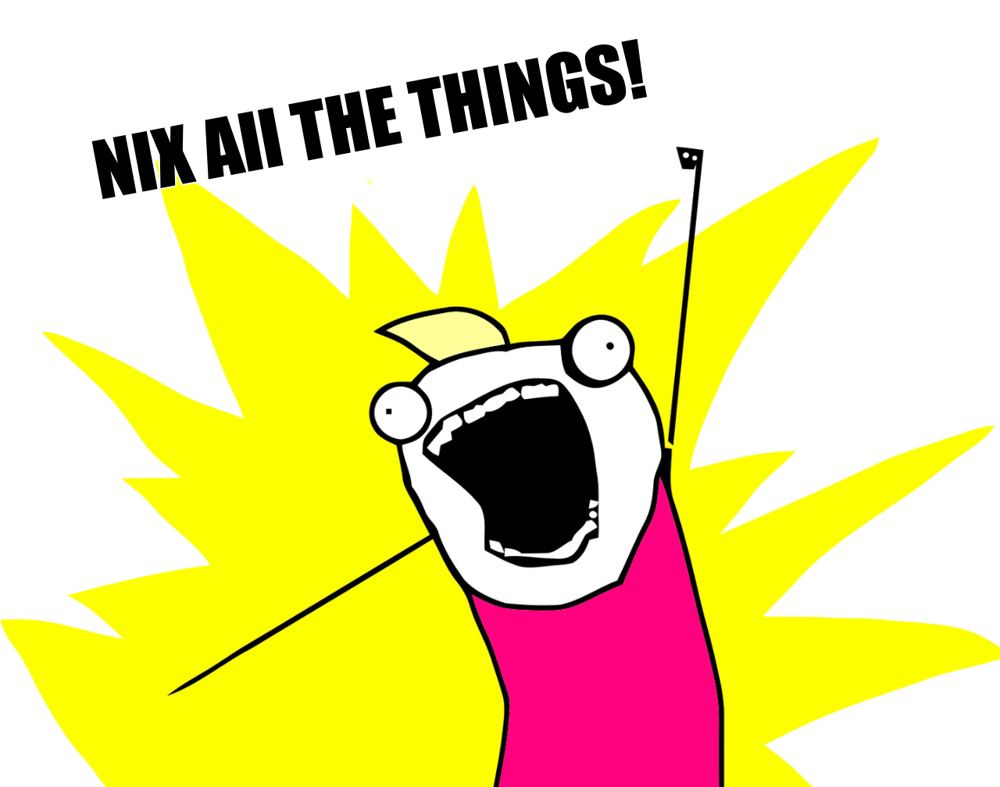

+++
title = "Using Nix to create reproducible Go development environments"
outputs = ["Reveal"]
[logo]
src = "images/logo.png"
diag = "85%"
width = "8%"
[reveal_hugo]
custom_theme = "stylesheets/reveal/catppuccin.css"
slide_number = true
+++

# Using Nix to Create Reproducible Go Development Environments

---

{}


## Introduction

- Haseeb Majid
  - Backend Software Engineer at [Curve](https://www.curve.com/en-gb/)
  - https://haseebmajid.dev
- Loves cats 🐱
- Avid cricketer 🏏 #BazBall

---

## Who is this for?

- Interested in Nix
- Consistent development environments
  - Old project; still works
  - New developers
  - "It works on my machine"

{}
- Explain reproducible
- Explain ephemeral short-lived
- Looking to improve the developer experience
- Scared to re-run
- Fails on CI
{}

---


[Credit](https://elbruno.com/2015/12/20/humor-it-works-on-my-machine/)

{}

---

{}

## What is Nix?

- Nix is a declarative package manager
- Nixlang the programming language that powers Nix
- Nixpkgs is the largest repository of Nix packages

{}
- Put your hand up if you've heard of Nix
- limited lanuage
- Pure functional: no side effects, same inputs same outputs
- Lazy: only evaluates what is needed for that nix file
- nixos is not nix
    - NixOS: A Linux distribution that can be configured using Nixlang
- nixpkgs
    - maintained by community and NixOS foundation
{}

---

## Declarative


```nix
{
  wayland.windowManager.sway.enable = true;
  xsession.windowManager.i3.enable = false;
}
```

{}
- imperative: instructions

- Declarative is what to do not how to do it
The main advantage of declarative package managers is that they are more predictable and reproducible. Since you're describing what you want rather than how to get it, you can be sure that you'll get the same result every time
{}

---


[Credit](https://devrant.com/rants/1590154/everytime-i-see-a-topic-about-linux)

---

## Summary

- We want reproducible and ephemeral environments
- Nix is an ecosystem of tools

{}
- Nix is an ecosystem of tools
  - Not just a package manager
- Our current packaging system all have various different flaws
  - Nix can be very complicated
  - Allows us to maintain multiple versions of the same tool
{}

{}

---

{}


---

## Golang

- Tools to aid development
  - lint
  - testing
  - docker

---

## tools.go


```go{1-3|6-7}
// +build tools

package main

import (
_ "github.com/golangci/golangci-lint/cmd/golangci-lint"
_ "github.com/goreleaser/goreleaser"
)
```

{}
  - manage deps with go.mod
  - `tools.go`
    - Only works with go dependencies
{}


---

```vim
go run github.com/...../cmd/golangci-lint
```

---


```vim{3-6|9}
example on  main via 🐹 v1.22.8
❯ ls -al
.rw-r--r-- 101 haseebmajid 28 Mar 15:36 go.mod
.rw-r--r-- 191 haseebmajid 28 Mar 15:37 go.sum
.rw-r--r-- 313 haseebmajid 28 Mar 15:33 main.go
.rw-r--r--   0 haseebmajid 28 Mar 14:55 main_test.go

example on  main via 🐹 v1.22.8
❯ nvim flake.nix
```

---


```nix{4-7|9-14|15|18|20|21|22-29}
{
  description = "I use Nix btw!";

  inputs = {
    nixpkgs.url = "github:NixOS/nixpkgs";
    flake-utils.url = "github:numtide/flake-utils";
  };

  outputs = {
    self,
    nixpkgs,
    flake-utils,
    ...
  }: (
    flake-utils.lib.eachDefaultSystem
    (system: let
      # system is like "x86_64-linux" or "aarch64-linux"
      pkgs = nixpkgs.legacyPackages.${system};
    in {
      devShells.default = pkgs.mkShell {
        packages = with pkgs; [
          go_1_22
          golangci-lint
          gotools
          go-junit-report
          gocover-cobertura
          go-task
          goreleaser
          sqlc
        ];
      };
    })
  );
}
```

---

```vim{2|5|8-9}
example on  main via 🐹 v1.22.8
❯ which golangci-lint

example on  main via 🐹 v1.22.8
❯ nix develop

example on  main via 🐹 v1.22.8 ❄️ impure (nix-shell-env)
❯ which golangci-lint
/nix/store/kcd...golangci-lint-1.56.2/bin/golangci-lint
```


{}
- Run `nix develop`
  - Will also create the `flake.lock` file if it does not exist
{}

---

```vim{1|3-11}
nix run 'gitlab:hmajid2301/optinix' get --no-tui

# Output

Option: 0
Name: services.prometheus.scrapeConfigs.*.docker_sd_configs.*.refresh_interval
Type: null or string
Default: null
Example:
From: NixOS
Sources: [/nix/store/xr9wjzx0cdnwkmhzz74h8lphgn5jmyv3-source/nixos/modules/services/monitoring/prometheus/default.nix]

```

---

## Summary

- Leverage dev shells for installing packages
  - `nix develop`
- Make sure each dev gets the same package
  - `nix flake update`

{}

---

{}


## direnv


```
# .envrc

use flake
```

[Direnv Code "use flake"](https://github.com/nix-community/nix-direnv/blob/57f831e2e43c6d8a6b11511e40e18eb59ca1f471/direnvrc#L244)

{}
- Allows us to automatically activate the devshell when we go to a folder
- a helper function from direnv
{}

---

## Usage


```vim{1|3|4-7|9|10-13|16-17|20-21|23}
❯ which golangci-lint

❯ cd banterbus
direnv: error /home/haseeb/banterbus/.envrc
is blocked. Run `direnv allow` to approve
its content

banterbus on  main via 🐹 v1.22.7
❯ direnv allow
direnv: loading ~/banterbus/.envrc
direnv: using flake
direnv: nix-direnv: Renewed cache
...

banterbus on  main via 🐹 v1.22.8 via ❄️  impure (nix-shell-env)
❯ which golangci-lint
/nix/store/kcd...golangci-lint-1.56.2/bin/golangci-lint

banterbus on  main via 🐹 v1.22.8 via ❄️  impure (nix-shell-env)
❯ cd ..
direnv: unloading

❯ which golangci-lint
```

{}
no need for nix develop
{}

---

## Remote Environments

```
# .envrc

use flake "github:the-nix-way/dev-templates?dir=go"
```

---

## pre-commit

```nix{7|20-25|29}
{
description = "Development environment for example project";

inputs = {
nixpkgs.url = "github:NixOS/nixpkgs";
flake-utils.url = "github:numtide/flake-utils";
pre-commit.url = "github:cachix/pre-commit-hooks.nix";
};

outputs = {
self,
nixpkgs,
flake-utils,
pre-commit,
...
}: (
flake-utils.lib.eachDefaultSystem
(system: let
  pkgs = nixpkgs.legacyPackages.${system};
  pre-commit-check = pre-commit.lib.${system}.run {
    src = ./.;
    hooks = {
      golangci-lint.enable = true;
      gotest.enable = true;
    };
  };
in {
  devShells.default = pkgs.mkShell {
    shellHook = pre-commit-check.shellHook;
    packages = with pkgs; [
      go_1_22
      golangci-lint
      gotools
      go-junit-report
      gocover-cobertura
      go-task
      goreleaser
      sqlc
      docker-compose
    ];
  };
})
);
}
```

---


## Summary

- We can use `direnv` to reduce cognitive load
- Use dev shell from remote git repository
- We can manage pre-commit in Nix as well

{}

{}
  - Share between multiple projects
  - However using an abstraction
{}

---

{}

## How does Nix work?

---

```nix{48|49-55}
{ lib
, stdenv
, fetchurl
, tzdata
, substituteAll
, iana-etc
, Security
, Foundation
, xcbuild
, mailcap
, buildPackages
, pkgsBuildTarget
, threadsCross
, testers
, skopeo
, buildGo122Module
}:

let
  goBootstrap = buildPackages.callPackage ./bootstrap121.nix { };

  skopeoTest = skopeo.override { buildGoModule = buildGo122Module; };

  goarch = platform: {
    "aarch64" = "arm64";
    "arm" = "arm";
    "armv5tel" = "arm";
    "armv6l" = "arm";
    "armv7l" = "arm";
    "i686" = "386";
    "mips" = "mips";
    "mips64el" = "mips64le";
    "mipsel" = "mipsle";
    "powerpc64" = "ppc64";
    "powerpc64le" = "ppc64le";
    "riscv64" = "riscv64";
    "s390x" = "s390x";
    "x86_64" = "amd64";
    "wasm32" = "wasm";
  }.${platform.parsed.cpu.name} or (throw "Unsupported system: ${platform.parsed.cpu.name}");

  # We need a target compiler which is still runnable at build time,
  # to handle the cross-building case where build != host == target
  targetCC = pkgsBuildTarget.targetPackages.stdenv.cc;

  isCross = stdenv.buildPlatform != stdenv.targetPlatform;
in
stdenv.mkDerivation (finalAttrs: {
    pname = "go";
    version = "1.22.7";

    src = fetchurl {
        url = "https://go.dev/dl/go....";
        hash = "sha256-ZkMth9h...";
    };

  strictDeps = true;
  buildInputs = [ ]
    ++ lib.optionals stdenv.hostPlatform.isLinux [ stdenv.cc.libc.out ]
    ++ lib.optionals (stdenv.hostPlatform.libc == "glibc") [ stdenv.cc.libc.static ];

  depsTargetTargetPropagated = lib.optionals stdenv.targetPlatform.isDarwin [ Foundation Security xcbuild ];

  depsBuildTarget = lib.optional isCross targetCC;

  depsTargetTarget = lib.optional stdenv.targetPlatform.isWindows threadsCross.package;

  postPatch = ''
    patchShebangs .
  '';

  patches = [
    (substituteAll {
      src = ./iana-etc-1.17.patch;
      iana = iana-etc;
    })
    # Patch the mimetype database location which is missing on NixOS.
    # but also allow static binaries built with NixOS to run outside nix
    (substituteAll {
      src = ./mailcap-1.17.patch;
      inherit mailcap;
    })
    # prepend the nix path to the zoneinfo files but also leave the original value for static binaries
    # that run outside a nix server
    (substituteAll {
      src = ./tzdata-1.19.patch;
      inherit tzdata;
    })
    ./remove-tools-1.11.patch
    ./go_no_vendor_checks-1.22.patch
  ];

  GOOS = if stdenv.targetPlatform.isWasi then "wasip1" else stdenv.targetPlatform.parsed.kernel.name;
  GOARCH = goarch stdenv.targetPlatform;
  # GOHOSTOS/GOHOSTARCH must match the building system, not the host system.
  # Go will nevertheless build a for host system that we will copy over in
  # the install phase.
  GOHOSTOS = stdenv.buildPlatform.parsed.kernel.name;
  GOHOSTARCH = goarch stdenv.buildPlatform;

  # {CC,CXX}_FOR_TARGET must be only set for cross compilation case as go expect those
  # to be different from CC/CXX
  CC_FOR_TARGET =
    if isCross then
      "${targetCC}/bin/${targetCC.targetPrefix}cc"
    else
      null;
  CXX_FOR_TARGET =
    if isCross then
      "${targetCC}/bin/${targetCC.targetPrefix}c++"
    else
      null;

  GOARM = toString (lib.intersectLists [ (stdenv.hostPlatform.parsed.cpu.version or "") ] [ "5" "6" "7" ]);
  GO386 = "softfloat"; # from Arch: don't assume sse2 on i686
  # Wasi does not support CGO
  CGO_ENABLED = if stdenv.targetPlatform.isWasi then 0 else 1;

  GOROOT_BOOTSTRAP = "${goBootstrap}/share/go";

  buildPhase = ''
    runHook preBuild
    export GOCACHE=$TMPDIR/go-cache
    # this is compiled into the binary
    export GOROOT_FINAL=$out/share/go

    export PATH=$(pwd)/bin:$PATH

    ${lib.optionalString isCross ''
    # Independent from host/target, CC should produce code for the building system.
    # We only set it when cross-compiling.
    export CC=${buildPackages.stdenv.cc}/bin/cc
    ''}
    ulimit -a

    pushd src
    ./make.bash
    popd
    runHook postBuild
  '';

  preInstall = ''
    # Contains the wrong perl shebang when cross compiling,
    # since it is not used for anything we can deleted as well.
    rm src/regexp/syntax/make_perl_groups.pl
  '' + (if (stdenv.buildPlatform.system != stdenv.hostPlatform.system) then ''
    mv bin/*_*/* bin
    rmdir bin/*_*
    ${lib.optionalString (!(finalAttrs.GOHOSTARCH == finalAttrs.GOARCH && finalAttrs.GOOS == finalAttrs.GOHOSTOS)) ''
      rm -rf pkg/${finalAttrs.GOHOSTOS}_${finalAttrs.GOHOSTARCH} pkg/tool/${finalAttrs.GOHOSTOS}_${finalAttrs.GOHOSTARCH}
    ''}
  '' else lib.optionalString (stdenv.hostPlatform.system != stdenv.targetPlatform.system) ''
    rm -rf bin/*_*
    ${lib.optionalString (!(finalAttrs.GOHOSTARCH == finalAttrs.GOARCH && finalAttrs.GOOS == finalAttrs.GOHOSTOS)) ''
      rm -rf pkg/${finalAttrs.GOOS}_${finalAttrs.GOARCH} pkg/tool/${finalAttrs.GOOS}_${finalAttrs.GOARCH}
    ''}
  '');

  installPhase = ''
    runHook preInstall
    mkdir -p $GOROOT_FINAL
    cp -a bin pkg src lib misc api doc go.env $GOROOT_FINAL
    mkdir -p $out/bin
    ln -s $GOROOT_FINAL/bin/* $out/bin
    runHook postInstall
  '';

  disallowedReferences = [ goBootstrap ];

  passthru = {
    inherit goBootstrap skopeoTest;
    tests = {
      skopeo = testers.testVersion { package = skopeoTest; };
      version = testers.testVersion {
        package = finalAttrs.finalPackage;
        command = "go version";
        version = "go${finalAttrs.version}";
      };
    };
  };

  meta = with lib; {
    changelog = "https://go.dev/doc/devel/release#go${lib.versions.majorMinor finalAttrs.version}";
    description = "Go Programming language";
    homepage = "https://go.dev/";
    license = licenses.bsd3;
    maintainers = teams.golang.members;
    platforms = platforms.darwin ++ platforms.linux ++ platforms.wasi ++ platforms.freebsd;
    mainProgram = "go";
  };
})
```

[Go Nix Expression](https://github.com/NixOS/nixpkgs/blob/nixos-unstable/pkgs/development/compilers/go/1.22.nix)

---

## Evaluation

- Evaluation Time: Nix Expression (`.nix`) is parsed and returns a derivation set `.drv`

- Build Time: The derivation is built into a package

{}
nix-build does two jobs:

    nix-instantiate : parse and evaluate simple.nix and return the .drv file corresponding to the parsed derivation set

    nix-store -r : realise the .drv file, which actually builds it.
{}

---
## Derivations


```vim{1|2}
/nix/store/<hash>-<name>-<version>.drv
/nix/store/zg65r8ys8y5865lcwmmybrq5g...-go-1.21.8.drv
/nix/store/z45pk6pw3h4yx0cpi51fc5nwm...-go-1.22.1.drv
```

{}
- Multiple versions of go, nix can add them to our path as and when
{}

---

```json{3|8|9|53|54-64|109-115}
nix derivation show nixpkgs#go_1_21
{
"/nix/store/gccilxhvxkbhm79....-go-1.21.8.drv": {
"args": [
  "-e",
  "/nix/store/v6x3cs394jgqfbi0a42pam708flxaphh-default-builder.sh"
],
"builder": "/nix/store/5lr5n...-bash-5.2p26/bin/bash",
"env": {
  "CGO_ENABLED": "1",
  "GO386": "softfloat",
  "GOARCH": "amd64",
  "GOARM": "",
  "GOHOSTARCH": "amd64",
  "GOHOSTOS": "linux",
  "GOOS": "linux",
  "GOROOT_BOOTSTRAP": "/nix/store/zx73644vwvd8h3vx1x84pwy9gqb9x58c-go-1.21.0-linux-amd64-bootstrap/share/go",
  "__structuredAttrs": "",
  "buildInputs": "/nix/store/1rm6sr6ixxzipv5358x0cmaw8rs84g2j-glibc-2.38-44 /nix/store/gnamly9z9ni53d0c2fllvkm510h3v0y0-glibc-2.38-44-static",
  "buildPhase": "runHook preBuild\nexport GOCACHE=$TMPDIR/go-cache\n# this is compiled into the binary\nexport GOROOT_FINAL=$out/share/go\n\nexport PATH=$(pwd)/bin:$PATH\n\n\nulimit -a\n\npushd src\n./make.bash\npopd\nrunHook postBuild\n",
  "builder": "/nix/store/5lr5n3qa4day8l1ivbwlcby2nknczqkq-bash-5.2p26/bin/bash",
  "cmakeFlags": "",
  "configureFlags": "",
  "depsBuildBuild": "",
  "depsBuildBuildPropagated": "",
  "depsBuildTarget": "",
  "depsBuildTargetPropagated": "",
  "depsHostHost": "",
  "depsHostHostPropagated": "",
  "depsTargetTarget": "",
  "depsTargetTargetPropagated": "",
  "disallowedReferences": "/nix/store/zx73644vwvd8h3vx1x84pwy9gqb9x58c-go-1.21.0-linux-amd64-bootstrap",
  "doCheck": "",
  "doInstallCheck": "",
  "installPhase": "runHook preInstall\nmkdir -p $GOROOT_FINAL\ncp -a bin pkg src lib misc api doc go.env $GOROOT_FINAL\nmkdir -p $out/bin\nln -s $GOROOT_FINAL/bin/* $out/bin\nrunHook postInstall\n",
  "mesonFlags": "",
  "name": "go-1.21.8",
  "nativeBuildInputs": "",
  "out": "/nix/store/afv3zwqxyw062vg2j220658jq0g1yadv-go-1.21.8",
  "outputs": "out",
  "patches": "/nix/store/6h8v8058468bgvnc8yi9z6gq99aw2vk3-iana-etc-1.17.patch /nix/store/za75y1m01nql7xv3hvw1g9m5dsrza56y-mailcap-1.17.patch /nix/store/94vcyjc4hjf0172lnddnfscrbp1kxzx6-tzdata-1.19.patch /nix/store/x48d0s4gns4jrck6qkwrpqn7nh9ygpx6-remove-tools-1.11.patch /nix/store/m88mg4d43hwkkbip6dha7p858c0vm5c1-go_no_vendor_checks-1.21.patch",
  "pname": "go",
  "postPatch": "patchShebangs .\n",
  "preInstall": "# Contains the wrong perl shebang when cross compiling,\n# since it is not used for anything we can deleted as well.\nrm src/regexp/syntax/make_perl_groups.pl\n",
  "propagatedBuildInputs": "",
  "propagatedNativeBuildInputs": "",
  "src": "/nix/store/p81s0316n7snx40fwkhda4p5jczf2pff-go1.21.8.src.tar.gz",
  "stdenv": "/nix/store/c8dj731bkcdzhgrpawhc8qvdgls4xfjv-stdenv-linux",
  "strictDeps": "1",
  "system": "x86_64-linux",
  "version": "1.21.8"
},
"inputDrvs": {
  "/nix/store/17gdfyx....-stdenv-linux.drv": {
    "dynamicOutputs": {},
    "outputs": [
      "out"
    ]
  },
  "/nix/store/9j2pqjj8...-mailcap-1.17.patch.drv": {
    "dynamicOutputs": {},
    "outputs": [
      "out"
    ]
  },
  "/nix/store/g5k51ksq5z01wshg1s3aw4q4iqkcvhrh-tzdata-1.19.patch.drv": {
    "dynamicOutputs": {},
    "outputs": [
      "out"
    ]
  },
  "/nix/store/jdz6mf99da6hs2afsnjmkcbrffamdyw0-glibc-2.38-44.drv": {
    "dynamicOutputs": {},
    "outputs": [
      "out",
      "static"
    ]
  },
  "/nix/store/mp2cripvy09y12ym8ph30wx6r9n193mz-iana-etc-1.17.patch.drv": {
    "dynamicOutputs": {},
    "outputs": [
      "out"
    ]
  },
  "/nix/store/vkz515grgl3dakz3n8qc7zz2ww3yaljk-bash-5.2p26.drv": {
    "dynamicOutputs": {},
    "outputs": [
      "out"
    ]
  },
  "/nix/store/xb2mgwjdfy92q985imns28hpaqff0218-go1.21.8.src.tar.gz.drv": {
    "dynamicOutputs": {},
    "outputs": [
      "out"
    ]
  },
  "/nix/store/zl2wlcnqi9sg6b7i3ghgr6zxq0890s1h-go-1.21.0-linux-amd64-bootstrap.drv": {
    "dynamicOutputs": {},
    "outputs": [
      "out"
    ]
  }
},
"inputSrcs": [
  "/nix/store/m88mg4d43hwkkbip6dha7p858c0vm5c1-go_no_vendor_checks-1.21.patch",
  "/nix/store/v6x3cs394jgqfbi0a42pam708flxaphh-default-builder.sh",
  "/nix/store/x48d0s4gns4jrck6qkwrpqn7nh9ygpx6-remove-tools-1.11.patch"
],
"name": "go-1.21.8",
"outputs": {
  "out": {
    "path": "/nix/store/afv3zwqxyw062...-go-1.21.8"
  }
},
"system": "x86_64-linux"
}
}
```

{}
- Only inputs are made available to the package
- Compute address without building
{}

---

## Advantages

- A derivation is immutable

```vim
/nix/store/afv3zwqxyw062vg2j220658jq0g1yadv-go-1.21.8
├── bin
│  ├── go -> ../share/go/bin/go
│  └── gofmt -> ../share/go/bin/gofmt
└── share
   └── go
      ├── api
      ├── bin
      ├── doc
      ├── go.env
      ├── lib
      ├── misc
      ├── pkg
      └── src
```

---

## Advantages

- Binary cache

```vim{4,5|6-7}
> nix-shell -p go_1_21

this path will be fetched
(39.16 MiB download, 204.47 MiB unpacked):
  /nix/store/k7chjapvryi....-go-1.21.8
copying path '/nix/store/k7chjapvryi....-go-1.21.8'
from 'https://cache.nixos.org'..
```
{}
- prebuilt
- Compute address without building
{}

---

## Advantages

- Atomic updates

```vim
> ls -al ~/.nix-profile/bin

lrwxrwxrwx - root  1 Jan  1970 , -> /nix/store/09irdfc2nqr6plb0gcf684k7h3fsk4mr-home-manager-path/bin/,
lrwxrwxrwx - root  1 Jan  1970 accessdb -> /nix/store/09irdfc2nqr6plb0gcf684k7h3fsk4mr-home-manager-path/bin/accessdb
lrwxrwxrwx - root  1 Jan  1970 addgnupghome -> /nix/store/09irdfc2nqr6plb0gcf684k7h3fsk4mr-home-manager-path/bin/addgnupghome
lrwxrwxrwx - root  1 Jan  1970 ag -> /nix/store/09irdfc2nqr6plb0gcf684k7h3fsk4mr-home-manager-path/bin/ag
lrwxrwxrwx - root  1 Jan  1970 animate -> /nix/store/09irdfc2nqr6plb0gcf684k7h3fsk4mr-home-manager-path/bin/animate
lrwxrwxrwx - root  1 Jan  1970 applygnupgdefaults -> /nix/store/09irdfc2nqr6plb0gcf684k7h3fsk4mr-home-manager-path/bin/applygnupgdefaults
lrwxrwxrwx - root  1 Jan  1970 apropos -> /nix/store/09irdfc2nqr6plb0gcf684k7h3fsk4mr-home-manager-path/bin/apropos
lrwxrwxrwx - root  1 Jan  1970 atuin -> /nix/store/09irdfc2nqr6plb0gcf684k7h3fsk4mr-home-manager-path/bin/atuin
```

{}
After the build, Nix sets the last-modified timestamp on all files in the build result to 1 (00:00:01 1/1/1970 UTC),

Removes case of non-determinism

In some cases, the build process of a package might embed the timestamp of the files into the resulting binary.
{}

---


[Credit](https://old.reddit.com/r/linuxmemes/comments/15yi79m/explaining_linux_with_cats/)

---

## Summary

- Derivations are a key building block of Nix

- Nix derivations -> immutable packages

{}

---

{}

##  Nix Flakes

- Per project dependencies
    - `flake.lock`
- Improves reproducibility


{}
- Use other git repo as inputs
- Define some structure
{}

---

## flake.nix

```nix
{
  inputs = {
    # Aliased to "nixpkgs";
    nixpkgs.url = "github:NixOS/nixpkgs";
  };
  outputs = {};
}
```

---

## flake.lock

```json{3-17|7|13}
{
  "nodes": {
    "nixpkgs": {
      "locked": {
        "lastModified": 1668703332,
        // A SHA of the contents of the flake
        "narHash": "sha256-PW3vz3ODXaInogvp2I...=",
        // The GitHub org
        "owner": "NixOS",
        // The GitHub repo
        "repo": "nixpkgs",
        // The specific revision
        "rev": "de60d387a0e5737375ee61848872b1...",
        // The type of input
        "type": "github"
      }
    },
    // Other inputs
  }
}
```

{}
  - update using github action/ci
  - The hash of the NAR serialisation (in SRI format) of the contents of the flake. This is useful for flake types such as tarballs that lack a unique content identifier such as a Git commit hash.
{}

---
## Summary

- Nix Flakes improve reproducibility
    - Lock dependencies

- Provide a more standard way to configure Nix

- Are an EXPERIMENTAL feature still

{}

---

{}

## CI

- Use same versions as local
- Leverage Nix "cachability"

---

## ci.nix

```nix{6|13-21|21}
{
  pkgs,
  devPackages,
  ...
}:
pkgs.dockerTools.buildImage {
  name = "banterbus-dev";
  tag = "latest";
  copyToRoot = pkgs.buildEnv {
    name = "banterbus-dev";
    pathsToLink = ["/bin"];
    paths = with pkgs;
      [
        coreutils
        gnugrep
        bash
        cacert.out
        curl
        git
      ]
      ++ devPackages;
  };
  config = {
    Env = [
      "NIX_PAGER=cat"
      # A user is required by nix
      # https://github.com/NixOS/nix/blob/9348f9291e5d9e4ba3c4347ea1b235640f54fd79/src/libutil/util.cc#L478
      "USER=nobody"
      "SSL_CERT_FILE=${pkgs.cacert}/etc/ssl/certs/ca-bundle.crt"
      "SSL_CERT_DIR=${pkgs.cacert}/etc/ssl/certs/"
    ];
  };
}
```

---

## flake.nix

```nix{23-32|34-37|38-40}
# flake.nix
{
  description = "Development environment for BanterBus";

  inputs = {
    nixpkgs.url = "github:NixOS/nixpkgs/nixos-unstable";
    flake-utils.url = "github:numtide/flake-utils";
    pre-commit-hooks.url = "github:cachix/pre-commit-hooks.nix";
  };

  outputs = {
    self,
    nixpkgs,
    flake-utils,
    gomod2nix,
    pre-commit-hooks,
    ...
  }: (
    flake-utils.lib.eachDefaultSystem
    (system: let
      pkgs = nixpkgs.legacyPackages.${system};

      devPackages = with pkgs; [
        go_1_22
        golangci-lint
        gotools
        go-junit-report
        gocover-cobertura
        go-task
        goreleaser
        sqlc
      ];
    in {
      packages.ci = pkgs.callPackage ./ci.nix {
        inherit pkgs;
        inherit devPackages;
      };
      devShells.default = pkgs.mkShell {
        packages = devPackages;
      };
    })
  );
}
```

---

## .gitlab-ci.yml

```bash{17-18|19-24}
publish:docker:ci:
  stage: pre
  variables:
    DOCKER_HOST: tcp://docker:2375
    DOCKER_DRIVER: overlay2
    DOCKER_TLS_CERTDIR: ""
    IMAGE: $CI_REGISTRY_IMAGE/ci
  rules:
    - if: $CI_PIPELINE_SOURCE == "merge_request_event"
      changes:
        - "containers/ci.nix"
  services:
    - docker:25-dind
  script:
    - echo "experimental-features = nix-command flakes" > /etc/nix/nix.conf
    - nix-env -iA nixpkgs.docker
    - nix build .#ci
    - docker load < ./result
    - docker login -u $CI_REGISTRY_USER -p $CI_REGISTRY_PASSWORD $CI_REGISTRY
    - docker image tag banterbus-dev:latest $IMAGE:latest
    - docker push $CI_REGISTRY_IMAGE/ci:latest

```

---

```yml{6-16|8|9-14|18-22}

stages:
  - deps
  - test

.task:
  stage: test
  image: $CI_REGISTRY_IMAGE/ci:latest
  variables:
    GOPATH: $CI_PROJECT_DIR/.go
  cache:
    paths:
      - ${GOPATH}/pkg/mod
    policy: pull
  rules:
    - if: $CI_PIPELINE_SOURCE == "merge_request_event"

tests:unit:
  extends:
    - .task
  script:
    - go test -skip '^TestIntegration' ./internal/...
```

---


[Credit](https://mstdn.social/@godmaire/111544747165375207)

{}

---

{}

## Why not Docker?

- Docker is imperative
  - Repeatable but not reproducible
- Hard to personalise
  - bash vs fish vs zsh

{}
- specifically about dockerfile to image

- Docker is great for services

- For example, two people using the same docker image will always get the same results, but two people building the
same Dockerfile can (and often do) end up with two different images.
{}

{}

---

{}

## Try Nix!

- Install Nix
   - https://determinate.systems/posts/determinate-nix-installer/
- Use dev template
   - https://flakehub.com/f/the-nix-way/dev-templates
- Install direnv-nix
   - https://github.com/nix-community/nix-direnv

{}
- flake.nix with all packages you want
- Most value
{}

---

```vim
curl --proto '=https' --tlsv1.2 -sSf -L \
 https://install.determinate.systems/nix | sh -s -- install

nix flake init --template \
  "https://flakehub.com/f/the-nix-way/dev-templates/*#go"

nix profile install nixpkgs#nix-direnv
```


{}

---

{}

## Further

- gomod2nix: https://www.tweag.io/blog/2021-03-04-gomod2nix/
- Build Docker image: https://jameswillia.ms/posts/go-nix-containers.html
- Arion: Manage docker-compose with nix
- devenv: https://devenv.sh/

---




---

## My Links

- [My Dotfiles Configured Using Nix](https://gitlab.com/hmajid2301/nixicle)
- [How I setup dev shell for a Go project](https://www.youtube.com/watch?v=ffpMe7RH8lU&t=738s)
  - [Project using dev shell](https://gitlab.com/hmajid2301/banterbus)

---

## Appendix

- Useful Articles:
  - https://blog.ysndr.de/posts/guides/2021-12-01-nix-shells/
  - https://serokell.io/blog/what-is-nix
  - https://shopify.engineering/what-is-nix
  - nix-shell vs nix shell vs nix develop: https://blog.ysndr.de/posts/guides/2021-12-01-nix-shells/

---

## Useful Tools


---

- Get started with Nix

  - https://zero-to-nix.com/
  - https://nixos.org/guides/nix-pills/why-you-should-give-it-a-try
  - https://nixos-and-flakes.thiscute.world/introduction/

---

More about flakes:

- https://nixos.wiki/wiki/Flakes
- https://zero-to-nix.com/concepts/flakes

---

- Useful Channels/Videos

  - https://www.youtube.com/@vimjoyer
  - Docker and Nix (Dockercon 2023): https://www.youtube.com/watch?v=l17oRkhgqHE
  - How to build a new package in Nix: https://www.youtube.com/watch?v=3hMIqxbQBRM
  - https://www.youtube.com/watch?app=desktop&v=TsZte_9GfPE&si=osBujLY3pyBI_Ymi

---


https://haseebmajid.dev/slides/london-gophers-reproducible-envs-with-nix/

---

## References & Thanks

- GIFs made with [vhs](https://github.com/charmbracelet/vhs)
- Photos editted with [pixlr](https://pixlr.com/)
- All my friends who took time to give me feedback on this talk
- Some memes from https://github.com/gytis-ivaskevicius/high-quality-nix-content

{}
Don't forget to thank the audience.
{}

{}
