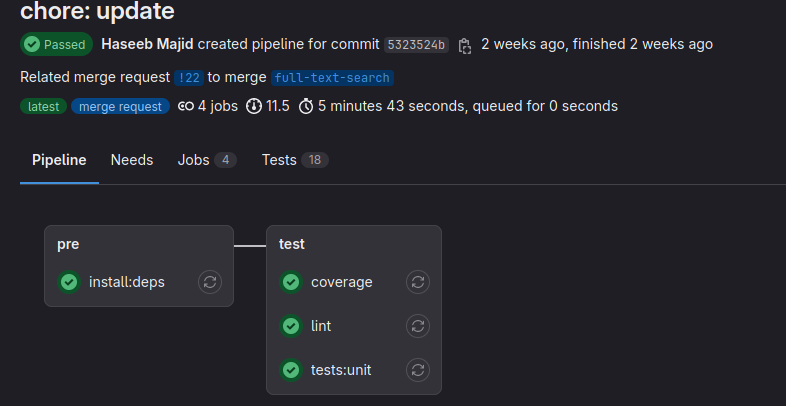
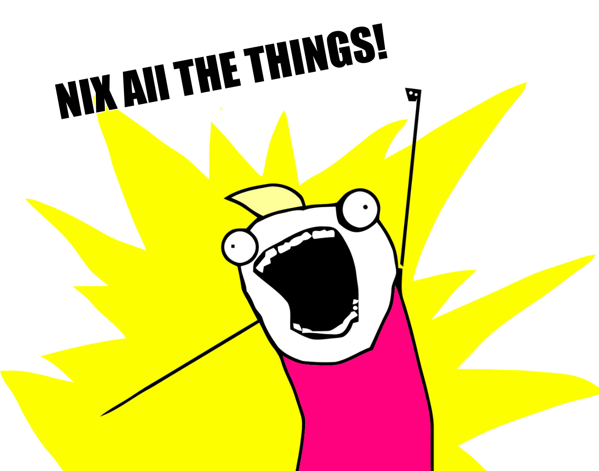

+++
title = "Reproducible & Ephemeral Development Environments with Nix"
outputs = ["Reveal"]
[logo]
src = "images/logo.png"
diag = "90%"
width = "3%"
[reveal_hugo]
custom_theme = "stylesheets/reveal/catppuccin.css"
slide_number = true
+++

# Reproducible & Ephemeral Development Environments with Nix

---

{}

## Introduction

- Haseeb Majid
  - Backend Software Engineer at [Curve](https://www.curve.com/en-gb/)
  - https://haseebmajid.dev
- Loves cats 🐱
- Avid cricketer 🏏 #BazBall

---

## Who is this for?

- Interested in Nix
- Consistent development environments
  - Old project; still works
  - New developers
  - "It works on my machine"

{}
- Explain reproducible
- Explain ephemeral short-lived
- Looking to improve the developer experience
- Scared to re-run
- Fails on CI
{}

---


[Credit](https://elbruno.com/2015/12/20/humor-it-works-on-my-machine/)

{}

---

{}
## What is Nix?

- Nix is a declarative package manager
- Nixlang the programming language that powers Nix
- NixOS: A Linux distribution that can be configured using Nixlang

{}
- limited lanuage
- Pure functional: no side effects, same inputs same outputs
- Lazy: only evaluates what is needed for that nix file
- nixos is not nix
{}

---

## Declarative


```nix
{
  wayland.windowManager.sway.enable = true;
  xsession.windowManager.i3.enable = false;
}
```

{}
- imperative: instructions

- Declarative is what to do not how to do it
The main advantage of declarative package managers is that they are more predictable and reproducible. Since you're describing what you want rather than how to get it, you can be sure that you'll get the same result every time
{}

---


[Credit](https://devrant.com/rants/1590154/everytime-i-see-a-topic-about-linux)

{}

---

{}


## What is the problem?

- `/usr/local/bin/golangci-lint`
    - Dependencies
    - Configuration flags & Env Vars
    - Two versions of this package

---

There are various other packaging solutions that try to fix these issues:

- Snap/Flatpak
- asdf
- virtualenv

---

## Summary
- We want reproducible and ephemeral environments
- Nix is an ecosystem of tools
- Our current packaging system all have various different flaws

{}
- Nix is an ecosystem of tools
  - Not just a package manager
- Our current packaging system all have various different flaws
  - Nix can be very complicated
  - Allows us to maintain multiple versions of the same tool
{}

{}

---

{}


---

## Golang

- Tooling to aid development
- Use the same tool
- Same versions running on CI

---

## tools.go


```go
// +build tools

package main

import (
    _ "github.com/golangci/golangci-lint/cmd/golangci-lint"
    _ "github.com/goreleaser/goreleaser"
    _ "github.com/spf13/cobra/cobra"
)
```

{}
  - manage deps with go.mod
  - `tools.go`
    - Only works with go dependencies
{}


---

```bash
cat tools.go | grep _ | awk -F'"' '{print $2}' \
| xargs -tI % go install %
```

---

## Creating our first dev environment


```bash
> ls -al
.rw-r--r-- 101 haseebmajid 28 Mar 15:36 go.mod
.rw-r--r-- 191 haseebmajid 28 Mar 15:37 go.sum
.rw-r--r-- 313 haseebmajid 28 Mar 15:33 main.go
.rw-r--r--   0 haseebmajid 28 Mar 14:55 main_test.go
```

---


# flake.nix

```nix{4-6|9-14|15|18|20|21|22-30}
{
  description = "Development environment for example project";

  inputs = {
    nixpkgs.url = "github:NixOS/nixpkgs/nixos-unstable";
    flake-utils.url = "github:numtide/flake-utils";
  };

  outputs = {
    self,
    nixpkgs,
    flake-utils,
    ...
  }: (
    flake-utils.lib.eachDefaultSystem
    (system: let
      # system is like "x86_64-linux" or "aarch64-linux"
      pkgs = nixpkgs.legacyPackages.${system};
    in {
      devShells.default = pkgs.mkShell {
        packages = with pkgs; [
          go_1_22
          golangci-lint
          gotools
          go-junit-report
          gocover-cobertura
          go-task
          goreleaser
          sqlc
          docker-compose
        ];
      };
    })
  );
}
```

---

```bash
> which golangci-lint

> nix develop

> which golangci-lint
/nix/store/kc58bqdmjdc6mfilih5pywprs7r7lxrw-golangci-lint-1.56.2/bin/golangci-lint
```


{}
- Run `nix develop`
  - Will also create the `flake.lock` file if it does not exist
{}


---

## Summary
- Leverage Flakes devshells for installing packages
  - Load into shell: `nix develop`
- Make sure each dev gets the same package
  - Update lock file: `nix flake update`

{}

---

{}


## direnv


```
# .envrc

use flake
```

[Direnv Code "use flake"](https://github.com/nix-community/nix-direnv/blob/57f831e2e43c6d8a6b11511e40e18eb59ca1f471/direnvrc#L244)

{}
- Allows us to automatically activate the devshell when we go to a folder
- a helper function from direnv
{}

---

## Usage


```bash{1-2|4-8|10-12|13-16}
> cd example
> which golangci-lint

> direnv allow
direnv: loading ~/projects/example/.envrc
direnv: using flake
direnv: nix-direnv: using cached dev shell
direnv: export +AR +AS +CC +CONFIG_SHELL +CXX +GOTOOLDIR +HOST_PATH +IN_NIX_SHELL +LD +NIX_BINTOOLS +NIX_BINTOOLS_WRAPPER_TARGET_HOST_x86_64_unknown_linux_gnu +NIX_BUILD_CORES +NIX_CC +NIX_CC_WRAPPER_TARGET_HOST_x86_64_unknown_linux_gnu +NIX_CFLAGS_COMPILE +NIX_ENFORCE_NO_NATIVE +NIX_HARDENING_ENABLE +NIX_LDFLAGS +NIX_STORE +NM +OBJCOPY +OBJDUMP +RANLIB +READELF +SIZE +SOURCE_DATE_EPOCH +STRINGS +STRIP +__structuredAttrs +buildInputs +buildPhase +builder +cmakeFlags +configureFlags +depsBuildBuild +depsBuildBuildPropagated +depsBuildTarget +depsBuildTargetPropagated +depsHostHost +depsHostHostPropagated +depsTargetTarget +depsTargetTargetPropagated +doCheck +doInstallCheck +dontAddDisableDepTrack +hardeningDisable +mesonFlags +name +nativeBuildInputs +out +outputs +patches +phases +preferLocalBuild +propagatedBuildInputs +propagatedNativeBuildInputs +shell +shellHook +stdenv +strictDeps +system ~PATH ~XDG_DATA_DIRS

> example on  main via ❄ impure (nix-shell-env) took 5s
> which golangci-lint
/nix/store/kc58bqdmjdc6mfilih5pywprs7r7lxrw-golangci-lint-1.56.2/bin/golangci-lint

> cd ..
direnv: unloading
> which golangci-lint
```

{}
no need for nix develop
{}

---

## Remote Environments

```
# .envrc

use flake "github:the-nix-way/dev-templates?dir=go"
```

---

## pre-commit

```nix{7|20-25|29}
{
  description = "Development environment for example project";

  inputs = {
    nixpkgs.url = "github:NixOS/nixpkgs/nixos-unstable";
    flake-utils.url = "github:numtide/flake-utils";
    pre-commit-hooks.url = "github:cachix/pre-commit-hooks.nix";
  };

  outputs = {
    self,
    nixpkgs,
    flake-utils,
    pre-commit-hooks,
    ...
  }: (
    flake-utils.lib.eachDefaultSystem
    (system: let
      pkgs = nixpkgs.legacyPackages.${system};
      pre-commit-check = pre-commit-hooks.lib.${system}.run {
        src = ./.;
        hooks = {
          golangci-lint.enable = true;
          gotest.enable = true;
        };
      };
    in {
      devShells.default = pkgs.mkShell {
        shellHook = pre-commit-check.shellHook;
        packages = with pkgs; [
          go_1_22
          golangci-lint
          gotools
          go-junit-report
          gocover-cobertura
          go-task
          goreleaser
          sqlc
          docker-compose
        ];
      };
    })
  );
}
```

---


## Summary
- We can use `direnv` to further reduce cognitive load
- Can even use flakes from remote git repository
  - Share between multiple projects
- We can manage pre-commit in Nix as well
  - However using an abstraction

{}

---

{}

## How does Nix work?


```nix{1|2|3-6}
{pkgs, ...}:
pkgs.mkShell {
  packages = with pkgs; [
    go_1_22
    golangci-lint
  ];
}
```

[mk.shell docs](https://nixos.org/manual/nixpkgs/stable/#sec-pkgs-mkShell)

{}
- pkgs.mkShell is a helper function
- nix expression
- function with args package
- attribute set
{}

---

```nix{3}
{ buildGoModule, fetchFromGitHub, lib, installShellFiles }:

buildGoModule rec {
  pname = "golangci-lint";
  version = "1.57.2";

  src = fetchFromGitHub {
    owner = "golangci";
    repo = "golangci-lint";
    rev = "v${version}";
    hash = "sha256-d3U56fRIyntj/uKTOHuKFvOZqh+6VtzYrbKDjcKzhbI=";
  };

  vendorHash = "sha256-3gS/F1jcjegtkLfmPcBzYqDA4KmwABkKpPAhTxqguYw=";

  subPackages = [ "cmd/golangci-lint" ];

  nativeBuildInputs = [ installShellFiles ];

  ldflags = [
    "-s"
    "-w"
    "-X main.version=${version}"
    "-X main.commit=v${version}"
    "-X main.date=19700101-00:00:00"
  ];

  postInstall = ''
    for shell in bash zsh fish; do
      HOME=$TMPDIR $out/bin/golangci-lint completion $shell > golangci-lint.$shell
      installShellCompletion golangci-lint.$shell
    done
  '';

  meta = with lib; {
    description = "Fast linters Runner for Go";
    homepage = "https://golangci-lint.run/";
    changelog = "https://github.com/golangci/golangci-lint/blob/v${version}/CHANGELOG.md";
    mainProgram = "golangci-lint";
    license = licenses.gpl3Plus;
    maintainers = with maintainers; [ anpryl manveru mic92 ];
  };
}
```

[golangci-lint Nix expression](https://github.com/NixOS/nixpkgs/blob/nixos-unstable/pkgs/development/tools/golangci-lint/default.nix)

---

```nix
stdenv.mkDerivation
```

[buildGoModule function](https://github.com/NixOS/nixpkgs/blob/fdf020573d6298cb0dbe7a8df8ac4930b76afba6/pkgs/build-support/go/module.nix)

---

## Evaluation

- Evaluation Time: Nix Expression (`.nix`) is parsed and returns a derivation set `.drv`
- Build Time: The derivation is built into a package

{}
nix-build does two jobs:

    nix-instantiate : parse and evaluate simple.nix and return the .drv file corresponding to the parsed derivation set

    nix-store -r : realise the .drv file, which actually builds it.
{}

---
## Derivations


```bash
/nix/store/<hash>-<name>-<version>.drv
/nix/store/zg65r8ys8y5865lcwmmybrq5gn30n1az-go-1.21.8.drv
```

{}
- Multiple versions of go, nix can add them to our path as and when
{}

---

```json{3|8|9|53|109-115}
nix derivation show nixpkgs#go_1_21
{
"/nix/store/gccilxhvxkbhm79hkmcczn0vxbb7dl20-go-1.21.8.drv": {
"args": [
  "-e",
  "/nix/store/v6x3cs394jgqfbi0a42pam708flxaphh-default-builder.sh"
],
"builder": "/nix/store/5lr5n3qa4day8l1ivbwlcby2nknczqkq-bash-5.2p26/bin/bash",
"env": {
  "CGO_ENABLED": "1",
  "GO386": "softfloat",
  "GOARCH": "amd64",
  "GOARM": "",
  "GOHOSTARCH": "amd64",
  "GOHOSTOS": "linux",
  "GOOS": "linux",
  "GOROOT_BOOTSTRAP": "/nix/store/zx73644vwvd8h3vx1x84pwy9gqb9x58c-go-1.21.0-linux-amd64-bootstrap/share/go",
  "__structuredAttrs": "",
  "buildInputs": "/nix/store/1rm6sr6ixxzipv5358x0cmaw8rs84g2j-glibc-2.38-44 /nix/store/gnamly9z9ni53d0c2fllvkm510h3v0y0-glibc-2.38-44-static",
  "buildPhase": "runHook preBuild\nexport GOCACHE=$TMPDIR/go-cache\n# this is compiled into the binary\nexport GOROOT_FINAL=$out/share/go\n\nexport PATH=$(pwd)/bin:$PATH\n\n\nulimit -a\n\npushd src\n./make.bash\npopd\nrunHook postBuild\n",
  "builder": "/nix/store/5lr5n3qa4day8l1ivbwlcby2nknczqkq-bash-5.2p26/bin/bash",
  "cmakeFlags": "",
  "configureFlags": "",
  "depsBuildBuild": "",
  "depsBuildBuildPropagated": "",
  "depsBuildTarget": "",
  "depsBuildTargetPropagated": "",
  "depsHostHost": "",
  "depsHostHostPropagated": "",
  "depsTargetTarget": "",
  "depsTargetTargetPropagated": "",
  "disallowedReferences": "/nix/store/zx73644vwvd8h3vx1x84pwy9gqb9x58c-go-1.21.0-linux-amd64-bootstrap",
  "doCheck": "",
  "doInstallCheck": "",
  "installPhase": "runHook preInstall\nmkdir -p $GOROOT_FINAL\ncp -a bin pkg src lib misc api doc go.env $GOROOT_FINAL\nmkdir -p $out/bin\nln -s $GOROOT_FINAL/bin/* $out/bin\nrunHook postInstall\n",
  "mesonFlags": "",
  "name": "go-1.21.8",
  "nativeBuildInputs": "",
  "out": "/nix/store/afv3zwqxyw062vg2j220658jq0g1yadv-go-1.21.8",
  "outputs": "out",
  "patches": "/nix/store/6h8v8058468bgvnc8yi9z6gq99aw2vk3-iana-etc-1.17.patch /nix/store/za75y1m01nql7xv3hvw1g9m5dsrza56y-mailcap-1.17.patch /nix/store/94vcyjc4hjf0172lnddnfscrbp1kxzx6-tzdata-1.19.patch /nix/store/x48d0s4gns4jrck6qkwrpqn7nh9ygpx6-remove-tools-1.11.patch /nix/store/m88mg4d43hwkkbip6dha7p858c0vm5c1-go_no_vendor_checks-1.21.patch",
  "pname": "go",
  "postPatch": "patchShebangs .\n",
  "preInstall": "# Contains the wrong perl shebang when cross compiling,\n# since it is not used for anything we can deleted as well.\nrm src/regexp/syntax/make_perl_groups.pl\n",
  "propagatedBuildInputs": "",
  "propagatedNativeBuildInputs": "",
  "src": "/nix/store/p81s0316n7snx40fwkhda4p5jczf2pff-go1.21.8.src.tar.gz",
  "stdenv": "/nix/store/c8dj731bkcdzhgrpawhc8qvdgls4xfjv-stdenv-linux",
  "strictDeps": "1",
  "system": "x86_64-linux",
  "version": "1.21.8"
},
"inputDrvs": {
  "/nix/store/17gdfyx2nzzcbhh8c2fm6zm8973nnrsd-stdenv-linux.drv": {
    "dynamicOutputs": {},
    "outputs": [
      "out"
    ]
  },
  "/nix/store/9j2pqjj8j88az2qysmsvljx8xksvljyd-mailcap-1.17.patch.drv": {
    "dynamicOutputs": {},
    "outputs": [
      "out"
    ]
  },
  "/nix/store/g5k51ksq5z01wshg1s3aw4q4iqkcvhrh-tzdata-1.19.patch.drv": {
    "dynamicOutputs": {},
    "outputs": [
      "out"
    ]
  },
  "/nix/store/jdz6mf99da6hs2afsnjmkcbrffamdyw0-glibc-2.38-44.drv": {
    "dynamicOutputs": {},
    "outputs": [
      "out",
      "static"
    ]
  },
  "/nix/store/mp2cripvy09y12ym8ph30wx6r9n193mz-iana-etc-1.17.patch.drv": {
    "dynamicOutputs": {},
    "outputs": [
      "out"
    ]
  },
  "/nix/store/vkz515grgl3dakz3n8qc7zz2ww3yaljk-bash-5.2p26.drv": {
    "dynamicOutputs": {},
    "outputs": [
      "out"
    ]
  },
  "/nix/store/xb2mgwjdfy92q985imns28hpaqff0218-go1.21.8.src.tar.gz.drv": {
    "dynamicOutputs": {},
    "outputs": [
      "out"
    ]
  },
  "/nix/store/zl2wlcnqi9sg6b7i3ghgr6zxq0890s1h-go-1.21.0-linux-amd64-bootstrap.drv": {
    "dynamicOutputs": {},
    "outputs": [
      "out"
    ]
  }
},
"inputSrcs": [
  "/nix/store/m88mg4d43hwkkbip6dha7p858c0vm5c1-go_no_vendor_checks-1.21.patch",
  "/nix/store/v6x3cs394jgqfbi0a42pam708flxaphh-default-builder.sh",
  "/nix/store/x48d0s4gns4jrck6qkwrpqn7nh9ygpx6-remove-tools-1.11.patch"
],
"name": "go-1.21.8",
"outputs": {
  "out": {
    "path": "/nix/store/afv3zwqxyw062vg2j220658jq0g1yadv-go-1.21.8"
  }
},
"system": "x86_64-linux"
}
}
```

{}
- Only inputs are made available to the package
- Compute address without building
{}

---

## Advantages

- A derivation is immutable

```bash
/nix/store/afv3zwqxyw062vg2j220658jq0g1yadv-go-1.21.8
├── bin
│  ├── go -> ../share/go/bin/go
│  └── gofmt -> ../share/go/bin/gofmt
└── share
   └── go
      ├── api
      ├── bin
      ├── doc
      ├── go.env
      ├── lib
      ├── misc
      ├── pkg
      └── src
```

---

## Advantages
- Binary cache

```bash{4,5|6}
> nix-shell -p go_1_21

this path will be fetched (39.16 MiB download, 204.47 MiB unpacked):
  /nix/store/k7chjapvryivjixp01iil9z0z7yzg7z4-go-1.21.8
copying path '/nix/store/k7chjapvryivjixp01iil9z0z7yzg7z4-go-1.21.8' from '
https://cache.nixos.org'..
```
{}
- prebuilt
- Compute address without building
{}

---
## Advantages

- Forces us to make our dependency tree explicit

```bash
> nix-store -q --tree /nix/store/k7chjapvryivjixp01iil9z0z7yzg7z4-go-1.21.8

/nix/store/k7chjapvryivjixp01iil9z0z7yzg7z4-go-1.21.8
├───/nix/store/7vvggrs9367d3g9fl23vjfyvsv10gb0r-mailcap-2.1.53
├───/nix/store/a1s263pmsci9zykm5xcdf7x9rv26w6d5-bash-5.2p26
│   ├───/nix/store/ddwyrxif62r8n6xclvskjyy6szdhvj60-glibc-2.39-5
│   │   ├───/nix/store/rxganm4ibf31qngal3j3psp20mak37yy-xgcc-13.2.0-libgcc
│   │   ├───/nix/store/s32cldbh9pfzd9z82izi12mdlrw0yf8q-libidn2-2.3.7
│   │   │   ├───/nix/store/7n0mbqydcipkpbxm24fab066lxk68aqk-libunistring-1>
│   │   │   │   └───/nix/store/7n0mbqydcipkpbxm24fab066lxk68aqk-libunistri>
│   │   │   └───/nix/store/s32cldbh9pfzd9z82izi12mdlrw0yf8q-libidn2-2.3.7 >
│   │   └───/nix/store/ddwyrxif62r8n6xclvskjyy6szdhvj60-glibc-2.39-5 [...]
│   └───/nix/store/a1s263pmsci9zykm5xcdf7x9rv26w6d5-bash-5.2p26 [...]
├───/nix/store/lscnjrqblizizhfbwbha05cyff7d7606-iana-etc-20231227
│   └───/nix/store/lscnjrqblizizhfbwbha05cyff7d7606-iana-etc-20231227 [...]
└───/nix/store/s1wmpnb0pyxh1idkmxc3n9hnbfgj67c0-tzdata-2024a
```

---

## Advantages

- Symlink
- Atomic updates

```bash
> ls ~/.nix-profile/bin

lrwxrwxrwx - root  1 Jan  1970 , -> /nix/store/09irdfc2nqr6plb0gcf684k7h3fsk4mr-home-manager-path/bin/,
lrwxrwxrwx - root  1 Jan  1970 accessdb -> /nix/store/09irdfc2nqr6plb0gcf684k7h3fsk4mr-home-manager-path/bin/accessdb
lrwxrwxrwx - root  1 Jan  1970 addgnupghome -> /nix/store/09irdfc2nqr6plb0gcf684k7h3fsk4mr-home-manager-path/bin/addgnupghome
lrwxrwxrwx - root  1 Jan  1970 ag -> /nix/store/09irdfc2nqr6plb0gcf684k7h3fsk4mr-home-manager-path/bin/ag
lrwxrwxrwx - root  1 Jan  1970 animate -> /nix/store/09irdfc2nqr6plb0gcf684k7h3fsk4mr-home-manager-path/bin/animate
lrwxrwxrwx - root  1 Jan  1970 applygnupgdefaults -> /nix/store/09irdfc2nqr6plb0gcf684k7h3fsk4mr-home-manager-path/bin/applygnupgdefaults
lrwxrwxrwx - root  1 Jan  1970 apropos -> /nix/store/09irdfc2nqr6plb0gcf684k7h3fsk4mr-home-manager-path/bin/apropos
lrwxrwxrwx - root  1 Jan  1970 atuin -> /nix/store/09irdfc2nqr6plb0gcf684k7h3fsk4mr-home-manager-path/bin/atuin
```

{}
After the build, Nix sets the last-modified timestamp on all files in the build result to 1 (00:00:01 1/1/1970 UTC),

Removes case of non-determinism

In some cases, the build process of a package might embed the timestamp of the files into the resulting binary.
{}

---


[Credit](https://old.reddit.com/r/linuxmemes/comments/15yi79m/explaining_linux_with_cats/)

---

## Summary

- Nix derivations allow us to have immutable packages
  - Require us to make dependencies explicit
- What if package is not in nixpkgs

{}

---

{}

##  Nix Flakes

- Generates a lock file
- Improve reproducibility
- Use other git repo as inputs
- Define some structure

---

## flake.nix

```nix
{
  inputs = {
    # Aliased to "nixpkgs";
    nixpkgs.url = "github:NixOS/nixpkgs";
  };
  outputs = {};
}
```

---

## flake.lock

```json{7|13}
{
  "nodes": {
    "nixpkgs": {
      "locked": {
        "lastModified": 1668703332,
        // A SHA of the contents of the flake
        "narHash": "sha256-PW3vz3ODXaInogvp2IQyDG9lnwmGlf07A6OEeA1Q7sM=",
        // The GitHub org
        "owner": "NixOS",
        // The GitHub repo
        "repo": "nixpkgs",
        // The specific revision
        "rev": "de60d387a0e5737375ee61848872b1c8353f945e",
        // The type of input
        "type": "github"
      }
    },
    // Other inputs
  }
}
```

{}
  - update using github action/ci
  - The hash of the NAR serialisation (in SRI format) of the contents of the flake. This is useful for flake types such as tarballs that lack a unique content identifier such as a Git commit hash.
{}

---
## Summary

- Nix Flakes improve reproducibility across systems
  - Lock dependencies
- Provide a more standard way to configure system
- Are an EXPERIMENTAL feature still

{}

---

{}

## CI

- Use same versions as local
- Leverage Nix "cachability"
  - Packages share dependencies

---

## Gitlab CI

```yml{5-8|9-12}
.nix:
  image: registry.gitlab.com/cynerd/gitlab-ci-nix
  tags:
    - docker
  cache:
    key: "nix"
    paths:
      - ".nix-cache"
  before_script:
    - gitlab-ci-nix-cache-before
  after_script:
    - gitlab-ci-nix-cache-after
```

- Taken from https://gitlab.com/Cynerd/gitlab-ci-nix

---

```yml{1-2|9-15|17-23}
include:
  - 'https://gitlab.com/Cynerd/gitlab-ci-nix/-/raw/master/template.yml'

stages:
  - pre
  - test
  - release

install:deps:
  stage: pre
  extends: .nix
  only:
    - merge_request
  script:
    - nix develop

lint:
  stage: test
  extends: .nix
  only:
    - merge_request
  script:
    - nix develop -c golangci-lint run

tests:
  stage: test
  extends: .nix
  only:
    - merge_request
  script:
    - nix develop -c go test -run ./...
```
---



---

# CI Logs

```bash{1,2}
copying path '/nix/store/97j7mjdvbxb59jnkr97qmhlkk97mnly8-source'
from 'file:///builds/hmajid2301/optinix/.nix-cache'...
copying path '/nix/store/yj1wxm9hh8610iyzqnz75kvs6xl8j3my-source' from 'file:///builds/hmajid2301/optinix/.nix-cache'...
copying path '/nix/store/gig8j85kj7ybjy3ksn6k3aich8j2k59y-source' from 'file:///builds/hmajid2301/optinix/.nix-cache'...
copying path '/nix/store/lrq619bzwr9z810hac96cg7r5ga6fkq4-source' from 'file:///builds/hmajid2301/optinix/.nix-cache'...
copying path '/nix/store/3phl7qxbxvxdg5b053q81mgqwf95gsiv-source' from 'file:///builds/hmajid2301/optinix/.nix-cache'...
copying path '/nix/store/pgid9c9xfcrbqx2giry0an0bi0df7s5c-source' from 'file:///builds/hmajid2301/optinix/.nix-cache'...
copying path '/nix/store/g16z4fs1mrbkxc4x6wm8xbrh13nc7aw4-source' from 'file:///builds/hmajid2301/optinix/.nix-cache'...
```

---


[Credit](https://mstdn.social/@godmaire/111544747165375207)

{}

---

{}

## Why not Docker?

- Docker is imperative
  - Repeatable but not reproducible
- Hard to personalise
  - bash vs fish vs zsh

{}
- specifically about dockerfile to image

- Docker is great for services

- For example, two people using the same docker image will always get the same results, but two people building the
same Dockerfile can (and often do) end up with two different images.
{}

{}

---

{}

## Further

- gomod2nix: https://www.tweag.io/blog/2021-03-04-gomod2nix/
- Build Docker image: https://jameswillia.ms/posts/go-nix-containers.html
- Arion: Manage docker-compose with nix
- devenv: https://devenv.sh/

---



---

## Slides

- Slides: https://haseebmajid.dev/slides/reproducible-envs-with-nix/

---

## My Links

- [My Dotfiles Configured Using Nix](https://gitlab.com/hmajid2301/dotfiles)
- [Project using Nix Development Env](https://gitlab.com/hmajid2301/optinix)
- [Raspberry PI Cluster Deployed using Nix](https://gitlab.com/hmajid2301/rpi-lab-k3s-config)

---

## Appendix

- Useful Articles:

  - https://blog.ysndr.de/posts/guides/2021-12-01-nix-shells/
  - https://serokell.io/blog/what-is-nix
  - https://shopify.engineering/what-is-nix
  - nix-shell vs nix shell vs nix develop: https://blog.ysndr.de/posts/guides/2021-12-01-nix-shells/

---

## Useful Tools

- Better Nix Installer: https://determinate.systems/posts/determinate-nix-installer/


---

- Get started with Nix

  - https://zero-to-nix.com/
  - https://nixos.org/guides/nix-pills/why-you-should-give-it-a-try
  - https://nixos-and-flakes.thiscute.world/introduction/

---

More about flakes:

- https://nixos.wiki/wiki/Flakes
- https://zero-to-nix.com/concepts/flakes

---

- Useful Channels/Videos

  - https://www.youtube.com/@vimjoyer
  - Docker and Nix (Dockercon 2023): https://www.youtube.com/watch?v=l17oRkhgqHE
  - How to build a new package in Nix: https://www.youtube.com/watch?v=3hMIqxbQBRM
  - https://www.youtube.com/watch?app=desktop&v=TsZte_9GfPE&si=osBujLY3pyBI_Ymi

---

## References & Thanks

- GIFs made with [vhs](https://github.com/charmbracelet/vhs)
- Photos editted with [pixlr](https://pixlr.com/)
- All my friends who took time to give me feedback on this talk

{}
Don't forget to thank the audience.
{}

{}

