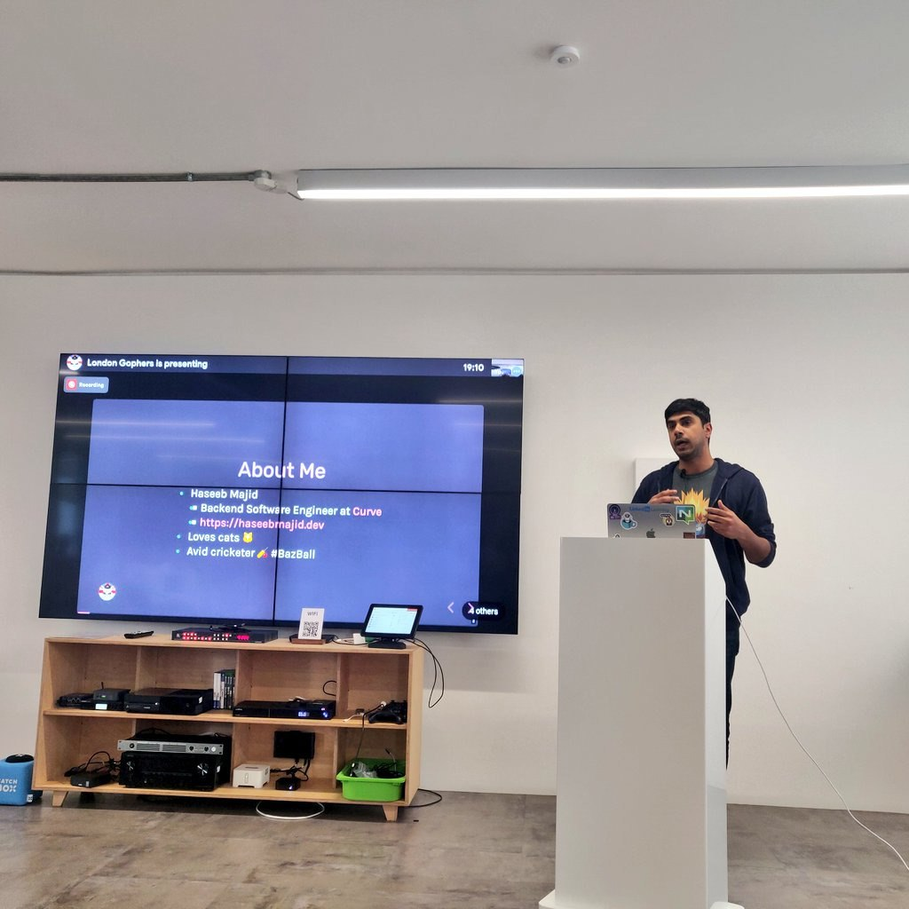



- [Abstract](https://www.meetup.com/londongophers/events/292486307/)
- [Related Code](https://gitlab.com/hmajid2301/talks/-/tree/main/an-intro-to-pocketbase)
- [Slides](https://haseebmajid.dev//slides/an-intro-to-pocketbase/)
- [PDF](https://gitlab.com/hmajid2301/blog/-/blob/main/content/slides/an-intro-to-pocketbase/slides.pdf)

## Photo from meetup

