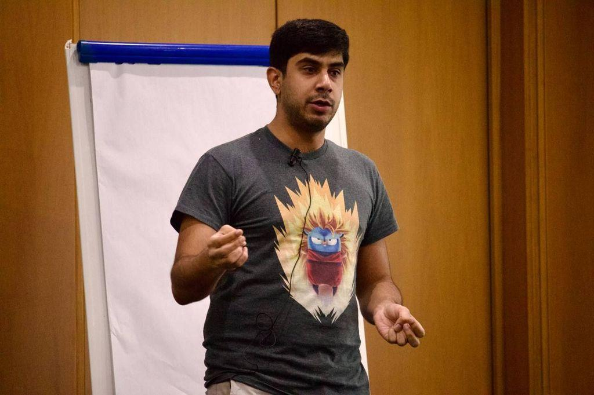
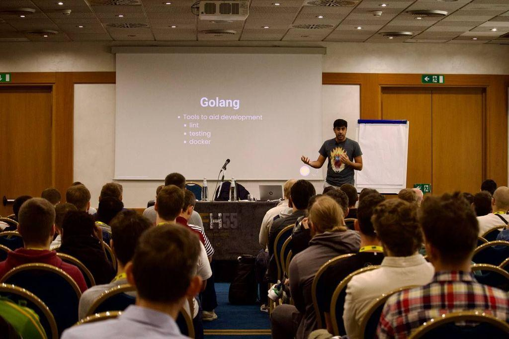
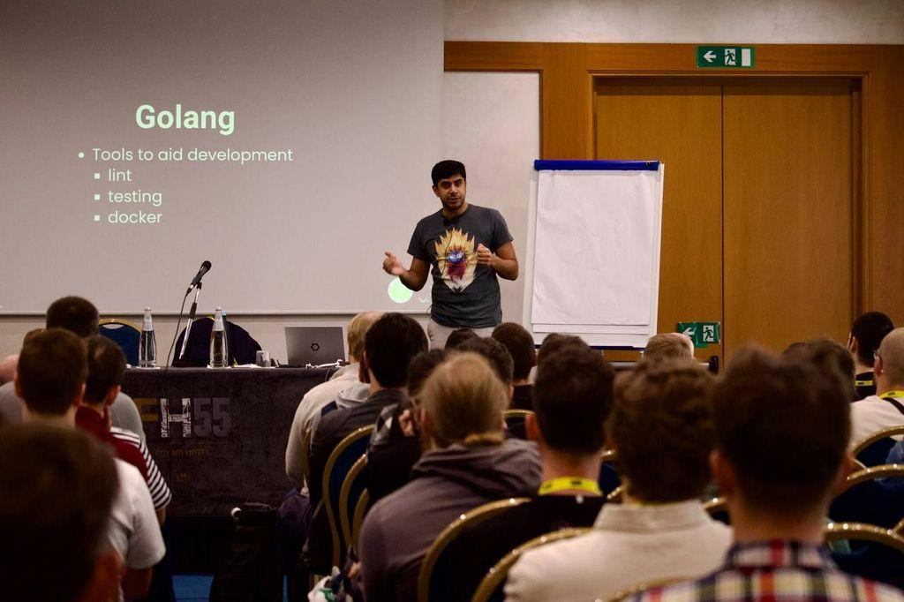



- [Abstract](https://golab.io/talks/using-nix-to-create-reproducible-go-development-environments)
- [Example Project](https://gitlab.com/hmajid2301/banterbus)
- [Slides](/slides/go-labs-reproducible-envs-with-nix)
- [PDF](https://gitlab.com/hmajid2301/blog/-/blob/main/content/slides/go-labs-reproducible-envs-with-nix/slides.pdf)

## Photo from conference

