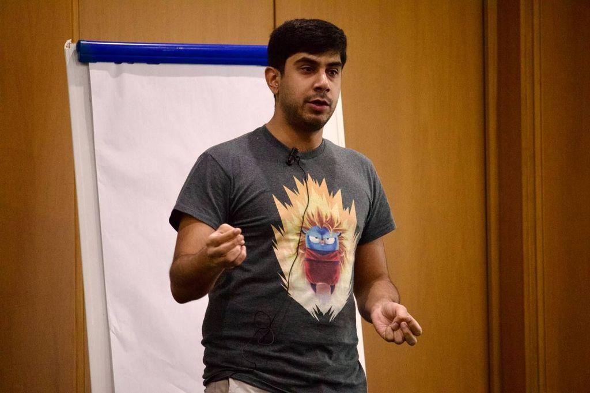
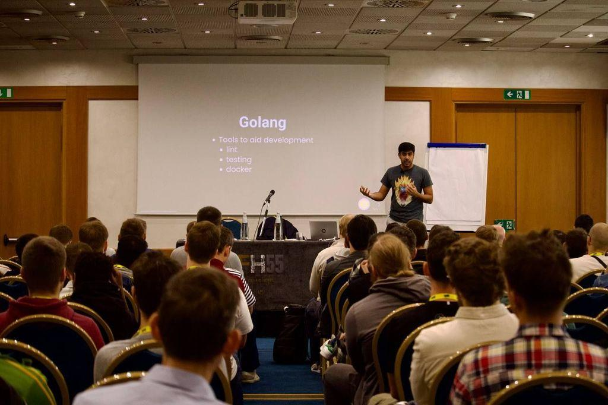
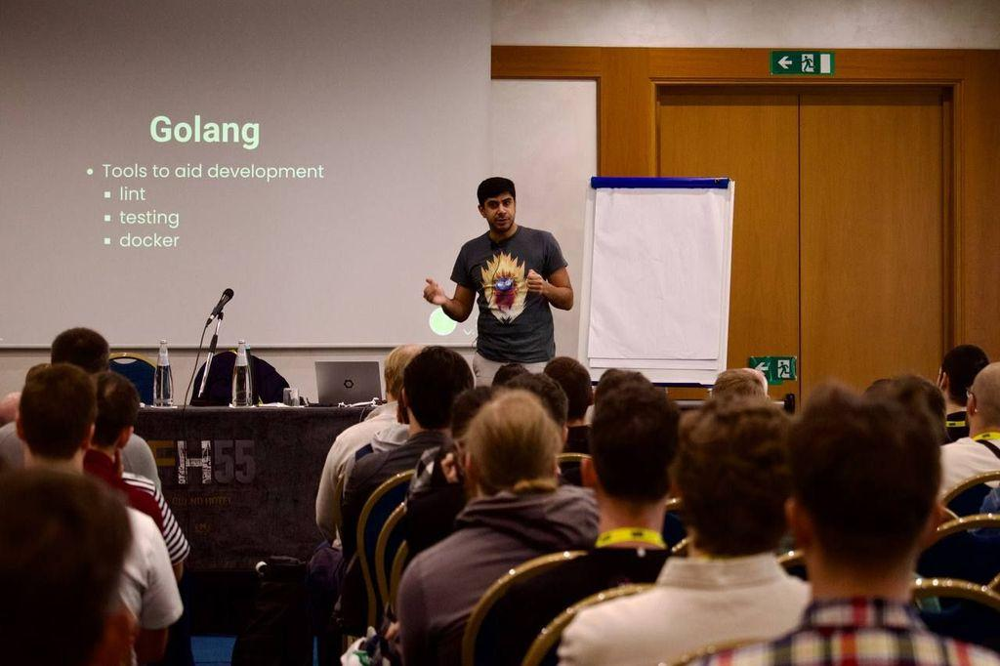

How I use Nix to give Go projects consistent, reproducible development
environments. Starting with the basics of Nix, I show how to pin development tools
so a project still works when another developer opens it or returns to it later.

- [Abstract](https://golab.io/talks/using-nix-to-create-reproducible-go-development-environments)
- [Example Project](https://gitlab.com/hmajid2301/banterbus)
- [Slides](https://slides.haseebmajid.dev/reproducible-envs-with-nix/2024-11-13-golab/)
- [PDF](https://slides.haseebmajid.dev/reproducible-envs-with-nix/2024-11-13-golab/slides.pdf)
- [Recording](https://www.youtube.com/watch?v=bdGfn_ihHOk)



## Photo from conference

