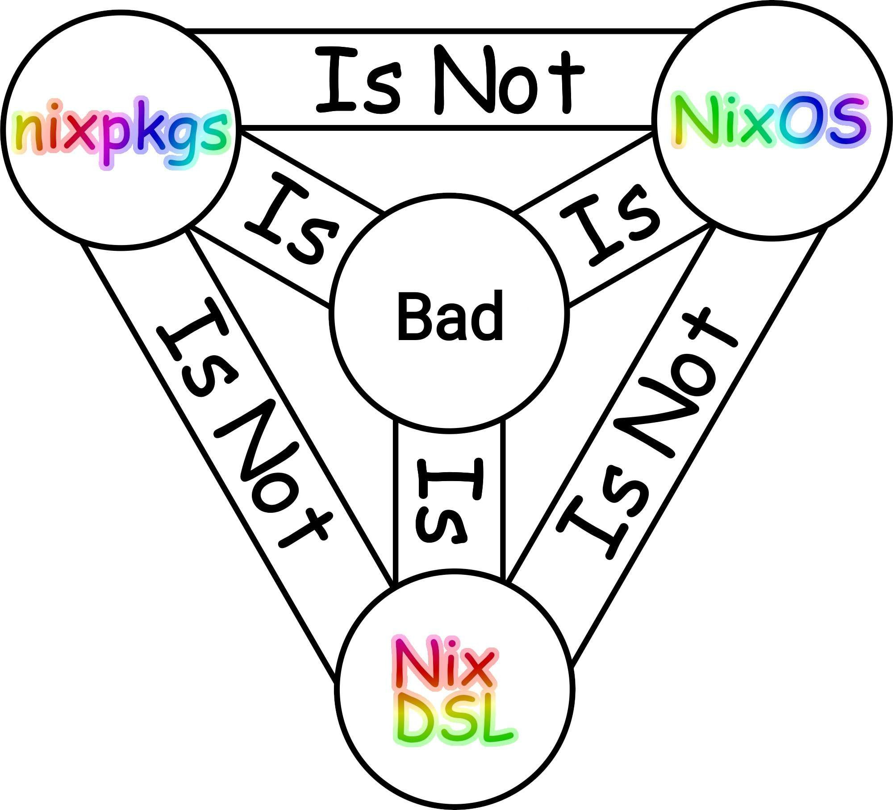

+++
title = "Reproducible Development Environments with Nix"
outputs = ["Reveal"]
layout = "bundle"

[reveal_hugo]
custom_theme = "stylesheets/reveal/catppuccin.css"
slide_number = true
+++

# Reproducible Development Environments with Nix

By Haseeb Majid

---

## Introduction

- Haseeb Majid
  - Backend Software Engineer at [Curve](https://www.curve.com/en-gb/)
  - https://haseebmajid.dev
- Loves cats 🐱
- Avid cricketer 🏏 #BazBall

---

## Why should I care?

- Want to get new developers onboarded ASAP
- "It works on my machine"
  - Fails on CI
- Scared to re-run it will break
  - Old `Dockerfile`

---

## What is Nix?

- Nix is a declarative package manager
- Nixlang the programming language that powers Nix
  - Pure, functional and lazyly evaluated
- NixOS: A Linux distribution that can be configured using Nixlang
  - Allows you to configure most of your device using Nixlang
- nixpkgs: Largest repository of Nix packages maintained by the community
  - Over 80k supported packages
  - You can think of it like AUR on Arch Linux

---



---

## Declarative vs Imperative

```bash
sudo apt install golang-go

brew install golangci-lint
```

```nix
# shell.nix

{pkgs, ...}: {
  pkgs.mkShell {
    packages = with pkgs; [
      go_1_22
      golangci-lint
    ];
  }
}
```

---

## Nix Modules & Options

```nix
# git/default.nix

{
    programs.git = {
      enable = true;
      userName = "Haseeb Majid";
      userEmail = "hello@haseebmajid.dev";

      signing = {
        signByDefault = true;
        key = "D528 BD50 F4E9 F031 AACB 1F7A 9833 E49C 848D 6C90";
      };
    };
}
```

---

```
# ~/.config/git/config

[commit]
	gpgSign = true

[gpg]
	program = "/nix/store/4x8gd05ld93qf021f7ksws7iy3m2xlz2-gnupg-2.4.4/bin/gpg2"

[user]
	email = "hello@haseebmajid.dev"
	name = "Haseeb Majid"
	signingKey = "D528 BD50 F4E9 F031 AACB 1F7A 9833 E49C 848D 6C90"
```

---


---

## What are the issues with our current system?

When you see a path like `/bin/go`:

- What’s the version of the package it came from?
- What are the libraries it uses?
- What configure flags were enabled during the build?

What if you want two versions of the same package, say MySQL 5.2 and 5.5 ?

---

There are various other packaging solutions that try to fix this issue

- Snap
- Flatpak
- Docker
- virtualenv

For example, two people using the same docker image will always get the same results, but two people building the
same Dockerfile can (and often do) end up with two different images.

---

## How does Nix work?

- Create derivations in `/nix/store`
  - May look like: `/nix/store/zg65r8ys8y5865lcwmmybrq5gn30n1az-go-1.21.6`
  - In the form `/nix/store/<hash>-<name>-<version>`
  - A derivation is immutable
- Symlink
- Atomic updates
- Binary cache

---

- Forces us to make our dependency tree explicit

```bash
❯ nix-store -q --tree /nix/store/cvq0087d1qc5vn0x691zmifdrqxmwyg0-golangci-lint-1.56.2
/nix/store/cvq0087d1qc5vn0x691zmifdrqxmwyg0-golangci-lint-1.56.2
├───/nix/store/cyrrf49i2hm1w7vn2j945ic3rrzgxbqs-glibc-2.38-44
│   ├───/nix/store/83p2f8svzmaq38xy1al0issan2ww1wb9-libidn2-2.3.7
│   │   ├───/nix/store/8xqsi87qd3p2hxrm0jmha03b9bxinlil-libunistring-1.1
│   │   │   └───/nix/store/8xqsi87qd3p2hxrm0jmha03b9bxinlil-libunistring-1.1 [...]
│   │   └───/nix/store/83p2f8svzmaq38xy1al0issan2ww1wb9-libidn2-2.3.7 [...]
│   ├───/nix/store/f5my15qww10swmf66ns13l24yp6j5dmq-xgcc-13.2.0-libgcc
│   └───/nix/store/cyrrf49i2hm1w7vn2j945ic3rrzgxbqs-glibc-2.38-44 [...]
├───/nix/store/dwfm7k4s037k0v9zljabzdmndmsfgy84-tzdata-2024a
├───/nix/store/m2bqpb4ll2lysz13vmkkdgxsn1kxr8ii-iana-etc-20231227
│   └───/nix/store/m2bqpb4ll2lysz13vmkkdgxsn1kxr8ii-iana-etc-20231227 [...]
└───/nix/store/wavqqr4b009s7nfjk9jykbg3b83j4ghz-mailcap-2.1.53
```

---

```bash
# ls ~/.nix-profile/bin

```bash
lrwxrwxrwx - root  1 Jan  1970 , -> /nix/store/09irdfc2nqr6plb0gcf684k7h3fsk4mr-home-manager-path/bin/,
lrwxrwxrwx - root  1 Jan  1970 accessdb -> /nix/store/09irdfc2nqr6plb0gcf684k7h3fsk4mr-home-manager-path/bin/accessdb
lrwxrwxrwx - root  1 Jan  1970 addgnupghome -> /nix/store/09irdfc2nqr6plb0gcf684k7h3fsk4mr-home-manager-path/bin/addgnupghome
lrwxrwxrwx - root  1 Jan  1970 ag -> /nix/store/09irdfc2nqr6plb0gcf684k7h3fsk4mr-home-manager-path/bin/ag
lrwxrwxrwx - root  1 Jan  1970 animate -> /nix/store/09irdfc2nqr6plb0gcf684k7h3fsk4mr-home-manager-path/bin/animate
lrwxrwxrwx - root  1 Jan  1970 applygnupgdefaults -> /nix/store/09irdfc2nqr6plb0gcf684k7h3fsk4mr-home-manager-path/bin/applygnupgdefaults
lrwxrwxrwx - root  1 Jan  1970 apropos -> /nix/store/09irdfc2nqr6plb0gcf684k7h3fsk4mr-home-manager-path/bin/apropos
lrwxrwxrwx - root  1 Jan  1970 atuin -> /nix/store/09irdfc2nqr6plb0gcf684k7h3fsk4mr-home-manager-path/bin/atuin
```

---

## So what are Nix flakes ?

- Generates a lock file
  - Git SHA
- Improve reproducability
- Use other Flakes as input
- Define some basic structure for our Nix config

---

- Currently an experimental feature
  - They have been adopted by a large part of the community

More about flakes:

- https://nixos.wiki/wiki/Flakes
- https://zero-to-nix.com/concepts/flakes

---

## flake.nix

```nix
{
  inputs = {
    # Aliased so we don't need full path "github:NixOS/nixpkgs";
    nixpkgs.url = "nixpkgs";
  };
}
```

---

## flake.lock

Taken from: https://zero-to-nix.com/concepts/flakes
```json
{
  "nodes": {
    "nixpkgs": {
      "locked": {
        "lastModified": 1668703332,
        // A SHA of the contents of the flake
        "narHash": "sha256-PW3vz3ODXaInogvp2IQyDG9lnwmGlf07A6OEeA1Q7sM=",
        // The GitHub org
        "owner": "NixOS",
        // The GitHub repo
        "repo": "nixpkgs",
        // The specific revision
        "rev": "de60d387a0e5737375ee61848872b1c8353f945e",
        // The type of input
        "type": "github"
      }
    },
    // Other inputs
  }
}
```

---

## flake.nix output

```nix {hl-lines=[10-14]}
{
  inputs = {
    nixpkgs.url = "nixpkgs";
  };
  {
  outputs = { self, nixpkgs, flake-utils }:
    let
      pkgs = import nixpkgs { inherit system; };
    in flake-utils.lib.eachDefaultSystem (system: {
      devShells.default = pkgs.mkShell {
        packages = with pkgs; [ 
          go_1_22
          golangci-lint
        ];
      };
    });
  };
}
```

---

```bash
which jq

nix develop

which jq
/nix/store/1kql9l6sh9qwkfac720fl9a2d4lf78r3-jq-1.7.1-bin/bin/jq
```
---

## Golang and Nix?

- Finally, how is this relevant to Go?
- How do we make sure all developers are using the same tool
  - `tools.go`
    - Only works with go dependencies
- How can we say it is the same as the version running on CI?
- Docker dev containers?

---

## Creating our first dev environment

- We already have a Go project

```bash
eza -al
.rw-r--r-- 101 haseebmajid 28 Mar 15:36 go.mod
.rw-r--r-- 191 haseebmajid 28 Mar 15:37 go.sum
.rw-r--r-- 313 haseebmajid 28 Mar 15:33 main.go
.rw-r--r--   0 haseebmajid 28 Mar 14:55 main_test.go
```

---

- First we want to create a new nix flake
- `nix flake init`
- Now we have a `flake.nix`

```nix
{
  description = "A very basic flake";

  inputs = {
    nixpkgs.url = "github:NixOS/nixpkgs/nixos-unstable";
  };

  outputs = { self, nixpkgs }: {

    packages.x86_64-linux.hello = nixpkgs.legacyPackages.x86_64-linux.hello;

    packages.x86_64-linux.default = self.packages.x86_64-linux.hello;

  };
}
```

---

# flake.nix

```nix
{
  description = "Development environment for example project";

  inputs = {
    nixpkgs.url = "github:NixOS/nixpkgs/nixos-unstable";
    flake-utils.url = "github:numtide/flake-utils";
  };

  outputs = {
    self,
    nixpkgs,
    flake-utils,
    ...
  }: (
    flake-utils.lib.eachDefaultSystem
    (system: let
      pkgs = nixpkgs.legacyPackages.${system};
    in rec {
      devShells.default = import ./shell.nix {inherit pkgs;};
    })
  );
}
```

---

# shell.nix

```nix
{pkgs, ...}:
pkgs.mkShell {
  packages = with pkgs; [
    go_1_22
    golangci-lint
    gotools
    go-junit-report
    gocover-cobertura
    go-task
    goreleaser
    sqlc
    docker-compose
  ];
}
```

---

- To start the devshell `nix develop`
  - Will also create the `flake.lock` file if it does not exist
  - Inputs are now locked, so anyone running the shell should get the same versions of the tools

---

## direnv

- Allows us to automatically activate the devshell when we go to a folder
- Create a `.envrc`
  - `use flake`

- `direnv allow` the first time
- You can install `nix-direnv`, so your env are not GC
- Can even use remote environments
  - `use flake "github:the-nix-way/dev-templates?dir=node"`

---

## pre-commit

- Run actions before committing

```nix {hl_lines=[7,14,21]}
{
  description = "Development environment for example project";

  inputs = {
    nixpkgs.url = "github:NixOS/nixpkgs/nixos-unstable";
    flake-utils.url = "github:numtide/flake-utils";
    pre-commit-hooks.url = "github:cachix/pre-commit-hooks.nix";
  };

  outputs = {
    self,
    nixpkgs,
    flake-utils,
    pre-commit-hooks,
    ...
  }: (
    flake-utils.lib.eachDefaultSystem
    (system: let
      pkgs = nixpkgs.legacyPackages.${system};
    in rec {
      devShells.default = import ./shell.nix {inherit pkgs pre-commit-hooks;};
    })
  );
}
```

---

## Demo


---

## Build Go using Nix

---

`nix build`

---

## Why not Docker?

- Great for package and deploying your service(s)
- Docker is imperative
  - Set of instructions to run
- Repeatable not reproducible

---

## dev containers

- Develop inside a Docker image
  - You specify a `.devcontainer/devcontainer.json`

```json
{
    "dockerFile": "Dockerfile",
    "appPort": [
        "8000:8000"
    ],
    "extensions": [
        "ms-vscode.go"
    ]
}

```

---

## Dockerfile

```Dockerfile
FROM golang

ENV DEBIAN_FRONTEND=noninteractive
RUN apt-get update \
    && apt-get -y install --no-install-recommends apt-utils 2>&1

# Install Go tools.
RUN apt-get update \
    # Install gocode-gomod.
    && go get -x -d github.com/stamblerre/gocode 2>&1 \
    && go build -o gocode-gomod github.com/stamblerre/gocode \
    && mv gocode-gomod $GOPATH/bin/ \
    # Install other tools.
    && go get -u -v \
        golang.org/x/tools/cmd/gopls \
        github.com/mdempsky/gocode \
        github.com/uudashr/gopkgs/cmd/gopkgs \
        github.com/ramya-rao-a/go-outline \
        github.com/acroca/go-symbols \
        golang.org/x/tools/cmd/guru \
        golang.org/x/tools/cmd/gorename \
        github.com/go-delve/delve/cmd/dlv \
        github.com/stamblerre/gocode \
        github.com/rogpeppe/godef \
        golang.org/x/tools/cmd/goimports \
        golang.org/x/lint/golint 2>&1 \
    # Clean up.
    && apt-get autoremove -y \
    && apt-get clean -y \
    && rm -rf /var/lib/apt/lists/*

# Revert workaround at top layer.
ENV DEBIAN_FRONTEND=dialog

# Expose service ports.
EXPOSE 8000
```
---

- Repeatable but not reproducible
- Lose your shell
  - bash vs fish vs zsh
- Specific tooling, hard to personalise
- Can be slow to set up

---

## CI

```yml
include:
  - 'https://gitlab.com/Cynerd/gitlab-ci-nix/-/raw/master/template.yml'

.task:
  stage: test
  extends: .nix
  only:
    - merge_request

stages:
  - pre
  - test
  - release

install:deps:
  stage: pre
  extends: .nix
  only:
    - merge_request
  script:
    - nix develop

lint:
  extends:
    - .task
  script:
    - nix develop -c task lint

tests:
  extends:
    - .task
  script:
    - nix develop -c task tests

release:
  stage: release
  image:
    name: goreleaser/goreleaser
    entrypoint: ['']
  only:
    - tags
  variables:
    GIT_DEPTH: 0
  script:
    - goreleaser release --clean
```

---

# CI Logs

```
copying path '/nix/store/3qnm3nwjajgqa771dmi2dnwxrw0kzq5m-stdenv-linux' from 'file:///builds/hmajid2301/optinix/.nix-cache'...
copying path '/nix/store/df2j8zxx6g5gnzmvy3brfvgvhxfjrc12-gomod2nix-dev' from 'file:///builds/hmajid2301/optinix/.nix-cache'...
copying path '/nix/store/9q141bdiaynr8yvjp678jxwwivggcz13-precommit-gotest' from 'file:///builds/hmajid2301/optinix/.nix-cache'...
copying path '/nix/store/cj6525cakc6vbqiiid74zkir3162wd4d-pre-commit-config.json' from 'file:///builds/hmajid2301/optinix/.nix-cache'...
copying path '/nix/store/19bdm5c4p9l28nszifm8gw0sz257ia2v-optinix-env' from 'file:///builds/hmajid2301/optinix/.nix-cache'...
copying path '/nix/store/4vhcj8nx4lvqgjc449shdkja4cmdhps8-nix-shell-env' from 'file:///builds/hmajid2301/optinix/.nix-cache'...
these 4 paths will be fetched (1.79 MiB download, 10.97 MiB unpacked):
  /nix/store/vmgwn3xsbyj860z2bazvg4n10c4kp3xk-bash-interactive-5.2p26
  /nix/store/sbgq69ls47c0d9si99wyj1n6230rz9gg-bash-interactive-5.2p26-man
  /nix/store/5sqn9ipaj6zm26pypl6l748ahw9n6i3f-ncurses-6.4
  /nix/store/d48gzzk85sjwxgdrnannajrg3inzmv64-readline-8.2p10
copying path '/nix/store/sbgq69ls47c0d9si99wyj1n6230rz9gg-bash-interactive-5.2p26-man' from 'file:///builds/hmajid2301/optinix/.nix-cache'...
copying path '/nix/store/5sqn9ipaj6zm26pypl6l748ahw9n6i3f-ncurses-6.4' from 'file:///builds/hmajid2301/optinix/.nix-cache'...
copying path '/nix/store/d48gzzk85sjwxgdrnannajrg3inzmv64-readline-8.2p10' from 'file:///builds/hmajid2301/optinix/.nix-cache'...
copying path '/nix/store/vmgwn3xsbyj860z2bazvg4n10c4kp3xk-bash-interactive-5.2p26' from 'file:///builds/hmajid2301/optinix/.nix-cache'...
section_end:1711368078:step_script
section_start:1711368078:after_script
Running after_script
Running after script...
$ gitlab-ci-nix-cache-after
copying 1 paths...
copying path '/nix/store/4sx2n8c1hzhsqb93lgv7l516gcz08g6p-source' to 'file:///builds/hmajid2301/optinix/.nix-cache'...
section_end:1711368079:after_script
```

---

## Future

- gomod2nix: Build go binaries using Nix tool chain
  - https://www.tweag.io/blog/2021-03-04-gomod2nix/
- Build Docker image: Using Nix `packages.container`
  - https://jameswillia.ms/posts/go-nix-containers.html

---

## Slides

- Slides: https://haseebmajid.dev/talks/gitlab-runners-and-dind/slides
- Code Examples: 

---

## Appendix

- Useful Articles:

  - https://serokell.io/blog/what-is-nix
  - https://shopify.engineering/what-is-nix

- Get started with Nix

  - https://nixos.org/guides/nix-pills/why-you-should-give-it-a-try

- Useful Channels/Videos

  - https://www.youtube.com/@vimjoyer
