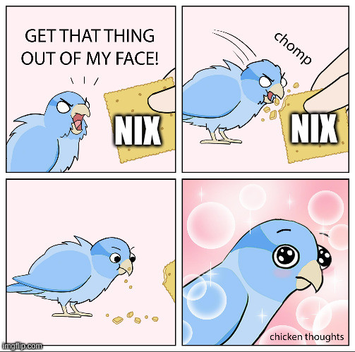

+++
title = "Reproducible & Ephemeral Development Environments with Nix"
outputs = ["Reveal"]
layout = "bundle"
[logo]
src = "images/logo.png"
diag = "90%"
width = "3%"
[reveal_hugo]
custom_theme = "stylesheets/reveal/catppuccin.css"
slide_number = true
+++

# Reproducible & Ephemeral Development Environments with Nix

---

{}

## Introduction

- Haseeb Majid
  - Backend Software Engineer at [Curve](https://www.curve.com/en-gb/)
  - https://haseebmajid.dev
- Loves cats 🐱
- Avid cricketer 🏏 #BazBall

---

## My Nix Experience

- Been daily driving NixOS for about a year
- Using Nix on all of my machines
- Using Nix with personal Golang project(s)

{}
- Using Nix on all of my machines
  - Even non NixOS OS's
- Using Nix with personal Golang project(s)
  - Since last November
{}

---

<section>
  
</section>

{}

---

{}

## Why should I care?

- Want to get new developers onboarded ASAP
- "It works on my machine"
  - Fails on CI
- Scared to re-run it will break
  - Old `Dockerfile`

{}
Don't forget to thank the audience.
{}

---

<section>
  
</section>

{}

---

## Our Goal

---

{}
## What is Nix?

- Nix is a declarative package manager
- Nixlang the programming language that powers Nix
  - Pure, functional and lazyily evaluated

{}
- Nixlang the programming language that powers Nix
  - Pure, functional and lazyily evaluated
{}

---

- NixOS: A Linux distribution that can be configured using Nixlang
- nixpkgs: Largest repository of Nix packages maintained by the community

{}
- NixOS: A Linux distribution that can be configured using Nixlang
  - Allows you to configure most of your device using Nixlang

- nixpkgs: Largest repository of Nix packages maintained by the community
  - Over 80k supported packages
  - You can think of it like AUR on Arch Linux
{}

---

<section>
  
</section>

---

<section>
  
</section>

---

## Declarative vs Imperative


```bash
sudo apt install golang-go

brew install golangci-lint
```

```nix{}
{pkgs, ...}: {
  pkgs.mkShell {
    packages = with pkgs; [
      go_1_22
      golangci-lint
    ];
  }
}
```

{}
- Declarative is what to do not how to do it
The main advantage of declarative package managers is that they are more predictable and reproducible. Since you're describing what you want rather than how to get it, you can be sure that you'll get the same result every time
{}

---

> In simple terms, "declarative configuration" means that users only need to declare the desired outcome. For instance, if you declare that you want to replace the i3 window manager with sway, Nix will assist you in achieving that goal. You don't have to worry about the underlying details, such as which packages sway requires for installation, which i3-related packages need to be uninstalled, or the necessary adjustments to system configuration and environment variables for sway. Nix automatically handles these details for the user (provided that the Nix packages related to sway and i3 are properly designed). - https://nixos-and-flakes.thiscute.world/introduction

---

<section>
  
</section>

{}

---

{}

## What is the problem?

- Binary `/bin/golangci-lint`
- What’s the version of the package it came from?
- What are the libraries it uses?

---

- What configure flags were enabled during the build?
- What if you want two versions of the same package, say MySQL 5.2 and 5.5 ?

---

There are various other packaging solutions that try to fix these issues:

- Snap
- Flatpak
- Docker
- virtualenv

{}
For example, two people using the same docker image will always get the same results, but two people building the
same Dockerfile can (and often do) end up with two different images.
{}

---

## Summary
- We want reproducibility and ephemeral environments
- Nix is an ecosystem of tools
- Our current packaging system all have various different flaws

{}
- Nix is an ecosystem of tools
  - Not just a package manager
- Our current packaging system all have various different flaws
  - Nix can be very complicated
  - Allows us to maintain multiple versions of the same tool
{}

{}

---

{}

## How does Nix work?
- Derivation build instructions
  - in `/nix/store`
- Builds the derivation, by realising it
  - in `/nix/store`

---
## Derivations


```
/nix/store/<hash>-<name>-<version>.drv
/nix/store/zg65r8ys8y5865lcwmmybrq5gn30n1az-go-1.21.8.drv
```

---

```json{3|8|53|109}
nix derivation show nixpkgs#go_1_21
{
  "/nix/store/gccilxhvxkbhm79hkmcczn0vxbb7dl20-go-1.21.8.drv": {
    "args": [
      "-e",
      "/nix/store/v6x3cs394jgqfbi0a42pam708flxaphh-default-builder.sh"
    ],
    "builder": "/nix/store/5lr5n3qa4day8l1ivbwlcby2nknczqkq-bash-5.2p26/bin/bash",
    "env": {
      "CGO_ENABLED": "1",
      "GO386": "softfloat",
      "GOARCH": "amd64",
      "GOARM": "",
      "GOHOSTARCH": "amd64",
      "GOHOSTOS": "linux",
      "GOOS": "linux",
      "GOROOT_BOOTSTRAP": "/nix/store/zx73644vwvd8h3vx1x84pwy9gqb9x58c-go-1.21.0-linux-amd64-bootstrap/share/go",
      "__structuredAttrs": "",
      "buildInputs": "/nix/store/1rm6sr6ixxzipv5358x0cmaw8rs84g2j-glibc-2.38-44 /nix/store/gnamly9z9ni53d0c2fllvkm510h3v0y0-glibc-2.38-44-static",
      "buildPhase": "runHook preBuild\nexport GOCACHE=$TMPDIR/go-cache\n# this is compiled into the binary\nexport GOROOT_FINAL=$out/share/go\n\nexport PATH=$(pwd)/bin:$PATH\n\n\nulimit -a\n\npushd src\n./make.bash\npopd\nrunHook postBuild\n",
      "builder": "/nix/store/5lr5n3qa4day8l1ivbwlcby2nknczqkq-bash-5.2p26/bin/bash",
      "cmakeFlags": "",
      "configureFlags": "",
      "depsBuildBuild": "",
      "depsBuildBuildPropagated": "",
      "depsBuildTarget": "",
      "depsBuildTargetPropagated": "",
      "depsHostHost": "",
      "depsHostHostPropagated": "",
      "depsTargetTarget": "",
      "depsTargetTargetPropagated": "",
      "disallowedReferences": "/nix/store/zx73644vwvd8h3vx1x84pwy9gqb9x58c-go-1.21.0-linux-amd64-bootstrap",
      "doCheck": "",
      "doInstallCheck": "",
      "installPhase": "runHook preInstall\nmkdir -p $GOROOT_FINAL\ncp -a bin pkg src lib misc api doc go.env $GOROOT_FINAL\nmkdir -p $out/bin\nln -s $GOROOT_FINAL/bin/* $out/bin\nrunHook postInstall\n",
      "mesonFlags": "",
      "name": "go-1.21.8",
      "nativeBuildInputs": "",
      "out": "/nix/store/afv3zwqxyw062vg2j220658jq0g1yadv-go-1.21.8",
      "outputs": "out",
      "patches": "/nix/store/6h8v8058468bgvnc8yi9z6gq99aw2vk3-iana-etc-1.17.patch /nix/store/za75y1m01nql7xv3hvw1g9m5dsrza56y-mailcap-1.17.patch /nix/store/94vcyjc4hjf0172lnddnfscrbp1kxzx6-tzdata-1.19.patch /nix/store/x48d0s4gns4jrck6qkwrpqn7nh9ygpx6-remove-tools-1.11.patch /nix/store/m88mg4d43hwkkbip6dha7p858c0vm5c1-go_no_vendor_checks-1.21.patch",
      "pname": "go",
      "postPatch": "patchShebangs .\n",
      "preInstall": "# Contains the wrong perl shebang when cross compiling,\n# since it is not used for anything we can deleted as well.\nrm src/regexp/syntax/make_perl_groups.pl\n",
      "propagatedBuildInputs": "",
      "propagatedNativeBuildInputs": "",
      "src": "/nix/store/p81s0316n7snx40fwkhda4p5jczf2pff-go1.21.8.src.tar.gz",
      "stdenv": "/nix/store/c8dj731bkcdzhgrpawhc8qvdgls4xfjv-stdenv-linux",
      "strictDeps": "1",
      "system": "x86_64-linux",
      "version": "1.21.8"
    },
    "inputDrvs": {
      "/nix/store/17gdfyx2nzzcbhh8c2fm6zm8973nnrsd-stdenv-linux.drv": {
        "dynamicOutputs": {},
        "outputs": [
          "out"
        ]
      },
      "/nix/store/9j2pqjj8j88az2qysmsvljx8xksvljyd-mailcap-1.17.patch.drv": {
        "dynamicOutputs": {},
        "outputs": [
          "out"
        ]
      },
      "/nix/store/g5k51ksq5z01wshg1s3aw4q4iqkcvhrh-tzdata-1.19.patch.drv": {
        "dynamicOutputs": {},
        "outputs": [
          "out"
        ]
      },
      "/nix/store/jdz6mf99da6hs2afsnjmkcbrffamdyw0-glibc-2.38-44.drv": {
        "dynamicOutputs": {},
        "outputs": [
          "out",
          "static"
        ]
      },
      "/nix/store/mp2cripvy09y12ym8ph30wx6r9n193mz-iana-etc-1.17.patch.drv": {
        "dynamicOutputs": {},
        "outputs": [
          "out"
        ]
      },
      "/nix/store/vkz515grgl3dakz3n8qc7zz2ww3yaljk-bash-5.2p26.drv": {
        "dynamicOutputs": {},
        "outputs": [
          "out"
        ]
      },
      "/nix/store/xb2mgwjdfy92q985imns28hpaqff0218-go1.21.8.src.tar.gz.drv": {
        "dynamicOutputs": {},
        "outputs": [
          "out"
        ]
      },
      "/nix/store/zl2wlcnqi9sg6b7i3ghgr6zxq0890s1h-go-1.21.0-linux-amd64-bootstrap.drv": {
        "dynamicOutputs": {},
        "outputs": [
          "out"
        ]
      }
    },
    "inputSrcs": [
      "/nix/store/m88mg4d43hwkkbip6dha7p858c0vm5c1-go_no_vendor_checks-1.21.patch",
      "/nix/store/v6x3cs394jgqfbi0a42pam708flxaphh-default-builder.sh",
      "/nix/store/x48d0s4gns4jrck6qkwrpqn7nh9ygpx6-remove-tools-1.11.patch"
    ],
    "name": "go-1.21.8",
    "outputs": {
      "out": {
        "path": "/nix/store/afv3zwqxyw062vg2j220658jq0g1yadv-go-1.21.8"
      }
    },
    "system": "x86_64-linux"
  }
}
```

---

<section>
  
</section>

---

```bash
/nix/store/afv3zwqxyw062vg2j220658jq0g1yadv-go-1.21.8
├── bin
│  ├── go -> ../share/go/bin/go
│  └── gofmt -> ../share/go/bin/gofmt
└── share
   └── go
      ├── api
      ├── bin
      ├── doc
      ├── go.env
      ├── lib
      ├── misc
      ├── pkg
      └── src
```

---

## Advantages

- A derivation is immutable
- Symlink
- Atomic updates
- Binary cache
- Forces us to make our dependency tree explicit

---

```bash
❯ nix-store -q --tree /nix/store/cvq0087d1qc5vn0x691zmifdrqxmwyg0-golangci-lint-1.56.2
/nix/store/cvq0087d1qc5vn0x691zmifdrqxmwyg0-golangci-lint-1.56.2
├───/nix/store/cyrrf49i2hm1w7vn2j945ic3rrzgxbqs-glibc-2.38-44
│   ├───/nix/store/83p2f8svzmaq38xy1al0issan2ww1wb9-libidn2-2.3.7
│   │   ├───/nix/store/8xqsi87qd3p2hxrm0jmha03b9bxinlil-libunistring-1.1
│   │   │   └───/nix/store/8xqsi87qd3p2hxrm0jmha03b9bxinlil-libunistring-1.1 [...]
│   │   └───/nix/store/83p2f8svzmaq38xy1al0issan2ww1wb9-libidn2-2.3.7 [...]
│   ├───/nix/store/f5my15qww10swmf66ns13l24yp6j5dmq-xgcc-13.2.0-libgcc
│   └───/nix/store/cyrrf49i2hm1w7vn2j945ic3rrzgxbqs-glibc-2.38-44 [...]
├───/nix/store/dwfm7k4s037k0v9zljabzdmndmsfgy84-tzdata-2024a
├───/nix/store/m2bqpb4ll2lysz13vmkkdgxsn1kxr8ii-iana-etc-20231227
│   └───/nix/store/m2bqpb4ll2lysz13vmkkdgxsn1kxr8ii-iana-etc-20231227 [...]
└───/nix/store/wavqqr4b009s7nfjk9jykbg3b83j4ghz-mailcap-2.1.53
```

---

```bash
# ls ~/.nix-profile/bin

lrwxrwxrwx - root  1 Jan  1970 , -> /nix/store/09irdfc2nqr6plb0gcf684k7h3fsk4mr-home-manager-path/bin/,
lrwxrwxrwx - root  1 Jan  1970 accessdb -> /nix/store/09irdfc2nqr6plb0gcf684k7h3fsk4mr-home-manager-path/bin/accessdb
lrwxrwxrwx - root  1 Jan  1970 addgnupghome -> /nix/store/09irdfc2nqr6plb0gcf684k7h3fsk4mr-home-manager-path/bin/addgnupghome
lrwxrwxrwx - root  1 Jan  1970 ag -> /nix/store/09irdfc2nqr6plb0gcf684k7h3fsk4mr-home-manager-path/bin/ag
lrwxrwxrwx - root  1 Jan  1970 animate -> /nix/store/09irdfc2nqr6plb0gcf684k7h3fsk4mr-home-manager-path/bin/animate
lrwxrwxrwx - root  1 Jan  1970 applygnupgdefaults -> /nix/store/09irdfc2nqr6plb0gcf684k7h3fsk4mr-home-manager-path/bin/applygnupgdefaults
lrwxrwxrwx - root  1 Jan  1970 apropos -> /nix/store/09irdfc2nqr6plb0gcf684k7h3fsk4mr-home-manager-path/bin/apropos
lrwxrwxrwx - root  1 Jan  1970 atuin -> /nix/store/09irdfc2nqr6plb0gcf684k7h3fsk4mr-home-manager-path/bin/atuin
```

{}

---

{}

## So what are Nix flakes ?

- Generates a lock file
- Improve reproducibility
- Use other Flakes/git repositories as input(s)
- Define some a structure

---

## Warning!

- Currently, an experimental feature
  - They have been adopted by a large part of the community

---

## flake.nix

```nix
{
  inputs = {
    # Aliased to "nixpkgs";
    nixpkgs.url = "github:NixOS/nixpkgs";
  };
}
```

---

## flake.lock

```json
{
  "nodes": {
    "nixpkgs": {
      "locked": {
        "lastModified": 1668703332,
        // A SHA of the contents of the flake
        "narHash": "sha256-PW3vz3ODXaInogvp2IQyDG9lnwmGlf07A6OEeA1Q7sM=",
        // The GitHub org
        "owner": "NixOS",
        // The GitHub repo
        "repo": "nixpkgs",
        // The specific revision
        "rev": "de60d387a0e5737375ee61848872b1c8353f945e",
        // The type of input
        "type": "github"
      }
    },
    // Other inputs
  }
}
```

---

## flake.nix output

```nix {hl-lines=[10-14]}
{
  inputs = {
    nixpkgs.url = "nixpkgs";
  };
  {
  outputs = { self, nixpkgs, flake-utils }:
    let
      pkgs = import nixpkgs { inherit system; };
    in flake-utils.lib.eachDefaultSystem (system: {
      devShells.default = pkgs.mkShell {
        packages = with pkgs; [
          go_1_22
          golangci-lint
        ];
      };
    });
  };
}
```

---

```bash
which hugo

nix develop

which hugo
/nix/store/50snjqlhsc7jwqv2l07s7w22m09k4q55-hugo-0.123.7/bin/hugo
```

{}

---

{}

## Golang and Nix?

- Finally, how is this relevant to Go?
- How do we make sure all developers are using the same tool
- How can we say it is the same as the version running on CI?

{}
  - `tools.go`
    - Only works with go dependencies
{}

{}

---

{}

## Creating our first dev environment

- We already have a Go project

```bash
eza -al
.rw-r--r-- 101 haseebmajid 28 Mar 15:36 go.mod
.rw-r--r-- 191 haseebmajid 28 Mar 15:37 go.sum
.rw-r--r-- 313 haseebmajid 28 Mar 15:33 main.go
.rw-r--r--   0 haseebmajid 28 Mar 14:55 main_test.go
```

---

- First we want to create a new nix flake
- `nix flake init`
- Now we have a `flake.nix`

---

# flake.nix

```nix{19}
{
  description = "Development environment for example project";

  inputs = {
    nixpkgs.url = "github:NixOS/nixpkgs/nixos-unstable";
    flake-utils.url = "github:numtide/flake-utils";
  };

  outputs = {
    self,
    nixpkgs,
    flake-utils,
    ...
  }: (
    flake-utils.lib.eachDefaultSystem
    (system: let
      pkgs = nixpkgs.legacyPackages.${system};
    in rec {
      devShells.default = import ./shell.nix {inherit pkgs;};
    })
  );
}
```

---

# shell.nix

```nix
{pkgs, ...}:
pkgs.mkShell {
  packages = with pkgs; [
    go_1_22
    golangci-lint
    gotools
    go-junit-report
    gocover-cobertura
    go-task
    goreleaser
    sqlc
    docker-compose
  ];
}
```

---

- Run `nix develop`
  - Will also create the `flake.lock` file if it does not exist

{}

---

{}

## direnv

- Allows us to automatically activate the devshell when we go to a folder
- Create a `.envrc`
  - `use flake`

---

## Usage

- `direnv allow` the first time
- You can install `nix-direnv`, so your env are not GC
- Can even use remote environments
  - `use flake "github:the-nix-way/dev-templates?dir=node"`

---

## pre-commit

- Run actions before committing

```nix{hl_lines=[7,14,21]}
{
  description = "Development environment for example project";

  inputs = {
    nixpkgs.url = "github:NixOS/nixpkgs/nixos-unstable";
    flake-utils.url = "github:numtide/flake-utils";
    pre-commit-hooks.url = "github:cachix/pre-commit-hooks.nix";
  };

  outputs = {
    self,
    nixpkgs,
    flake-utils,
    pre-commit-hooks,
    ...
  }: (
    flake-utils.lib.eachDefaultSystem
    (system: let
      pkgs = nixpkgs.legacyPackages.${system};
    in rec {
      devShells.default = import ./shell.nix {inherit pkgs pre-commit-hooks;};
    })
  );
}
```

---

## Demo

<!--  -->

{}

---

{}

## Why not Docker?

- Great for package and deploying your service(s)
- Docker is imperative
  - Set of instructions to run
- Repeatable not reproducible

---

## dev containers

```json
{
    "dockerFile": "Dockerfile",
    "appPort": [
        "8000:8000"
    ],
    "extensions": [
        "ms-vscode.go"
    ]
}
```

---

## Dockerfile

```Dockerfile{4-5}
FROM golang

ENV DEBIAN_FRONTEND=noninteractive
RUN apt-get update \
    && apt-get -y install --no-install-recommends apt-utils 2>&1

# Install Go tools.
RUN go get -x -d github.com/stamblerre/gocode 2>&1 \
    && go build -o gocode-gomod github.com/stamblerre/gocode \
    && mv gocode-gomod $GOPATH/bin/ \
    # Install other tools.
    && go get -u -v \
        golang.org/x/tools/cmd/gopls \
        github.com/mdempsky/gocode \
        github.com/uudashr/gopkgs/cmd/gopkgs \
        github.com/ramya-rao-a/go-outline \
        github.com/acroca/go-symbols \
        golang.org/x/tools/cmd/guru \
        golang.org/x/tools/cmd/gorename \
        github.com/go-delve/delve/cmd/dlv \
        github.com/stamblerre/gocode \
        github.com/rogpeppe/godef \
        golang.org/x/tools/cmd/goimports \
        golang.org/x/lint/golint 2>&1 \
    # Clean up.
    && apt-get autoremove -y \
    && apt-get clean -y \
    && rm -rf /var/lib/apt/lists/*

# Revert workaround at top layer.
ENV DEBIAN_FRONTEND=dialog

# Expose service ports.
EXPOSE 8000
```
---

- Repeatable but not reproducible
- Lose your shell
  - bash vs fish vs zsh
- Specific tooling, hard to personalise
- Can be slow to set up

{}

---

{}

## CI

```yml{15-21|23-27}
include:
  - 'https://gitlab.com/Cynerd/gitlab-ci-nix/-/raw/master/template.yml'

.task:
  stage: test
  extends: .nix
  only:
    - merge_request

stages:
  - pre
  - test
  - release

install:deps:
  stage: pre
  extends: .nix
  only:
    - merge_request
  script:
    - nix develop

lint:
  extends:
    - .task
  script:
    - nix develop -c task lint

tests:
  extends:
    - .task
  script:
    - nix develop -c task tests

release:
  stage: release
  image:
    name: goreleaser/goreleaser
    entrypoint: ['']
  only:
    - tags
  variables:
    GIT_DEPTH: 0
  script:
    - goreleaser release --clean
```


---

```yml{9-12}
.nix:
  image: registry.gitlab.com/cynerd/gitlab-ci-nix
  tags:
    - docker
  cache:
    key: "nix"
    paths:
      - ".nix-cache"
  before_script:
    - gitlab-ci-nix-cache-before
  after_script:
    - gitlab-ci-nix-cache-after
```

---

# CI Logs

```
copying path '/nix/store/4vhcj8nx4lvqgjc449shdkja4cmdhps8-nix-shell-env' from 'file:///builds/hmajid2301/optinix/.nix-cache'...
these 4 paths will be fetched (1.79 MiB download, 10.97 MiB unpacked):
  /nix/store/vmgwn3xsbyj860z2bazvg4n10c4kp3xk-bash-interactive-5.2p26
  /nix/store/sbgq69ls47c0d9si99wyj1n6230rz9gg-bash-interactive-5.2p26-man
  /nix/store/5sqn9ipaj6zm26pypl6l748ahw9n6i3f-ncurses-6.4
  /nix/store/d48gzzk85sjwxgdrnannajrg3inzmv64-readline-8.2p10
copying path '/nix/store/sbgq69ls47c0d9si99wyj1n6230rz9gg-bash-interactive-5.2p26-man' from 'file:///builds/hmajid2301/optinix/.nix-cache'...
section_end:1711368078:step_script
section_start:1711368078:after_script
Running after_script
Running after script...
$ gitlab-ci-nix-cache-after
copying 1 paths...
copying path '/nix/store/4sx2n8c1hzhsqb93lgv7l516gcz08g6p-source' to 'file:///builds/hmajid2301/optinix/.nix-cache'...
section_end:1711368079:after_script
```

{}

---

## Further

- gomod2nix: Build go binaries using Nix tool chain
  - https://www.tweag.io/blog/2021-03-04-gomod2nix/
- Build Docker image: Using Nix `packages.container`
  - https://jameswillia.ms/posts/go-nix-containers.html
- Arion: Manage docker-compose with nix

---

<section>
  
</section>

---

{}

## Slides

- Slides: https://haseebmajid.dev/talks/gitlab-runners-and-dind/slides
- Code Examples: https://gitlab.com/hmajid2301/blog/-/tree/main/content/talks/reproducible-envs-with-nix/example

---

## My Links

- [My Dotfiles Configured Using Nix](https://gitlab.com/hmajid2301/dotfiles)
- [Project using Nix Development Env](https://gitlab.com/hmajid2301/optinix)
- [Raspberry PI Cluster Deployed using Nix](https://gitlab.com/hmajid2301/rpi-lab-k3s-config)

---

## Appendix

- Useful Articles:

  - https://serokell.io/blog/what-is-nix
  - https://shopify.engineering/what-is-nix

---

- Get started with Nix

  - https://zero-to-nix.com/
  - https://nixos.org/guides/nix-pills/why-you-should-give-it-a-try
  - https://nixos-and-flakes.thiscute.world/introduction/

---

More about flakes:

- https://nixos.wiki/wiki/Flakes
- https://zero-to-nix.com/concepts/flakes

---

- Useful Channels/Videos

  - https://www.youtube.com/@vimjoyer
  - Docker and Nix (Dockercon 2023): https://www.youtube.com/watch?v=l17oRkhgqHE

---

## References & Thanks

- GIFs made with [vhs](https://github.com/charmbracelet/vhs)
- All my friends who took time to give me feedback on this talk

{}

